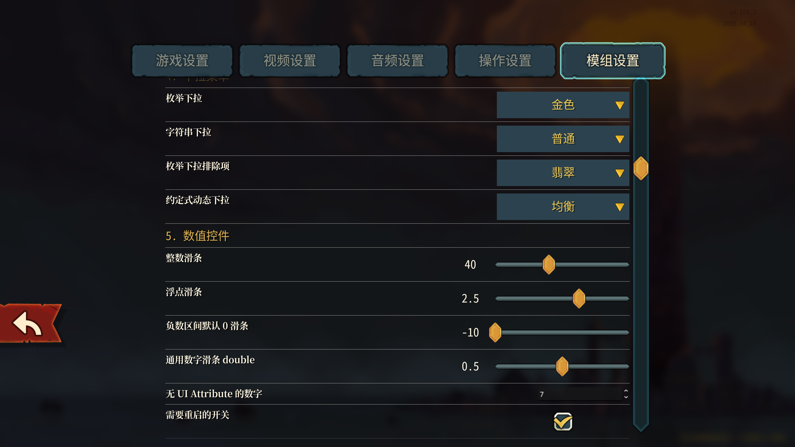
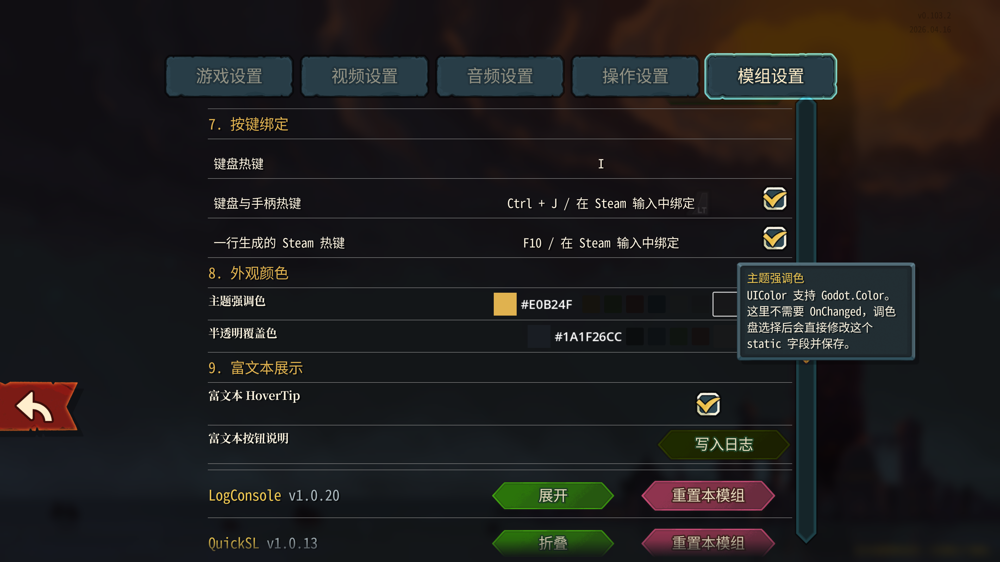
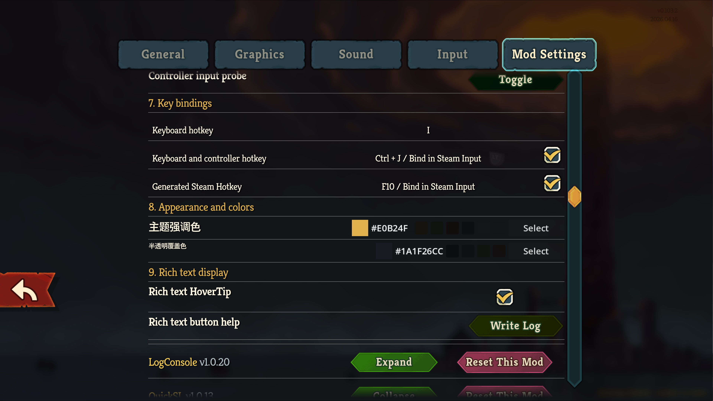
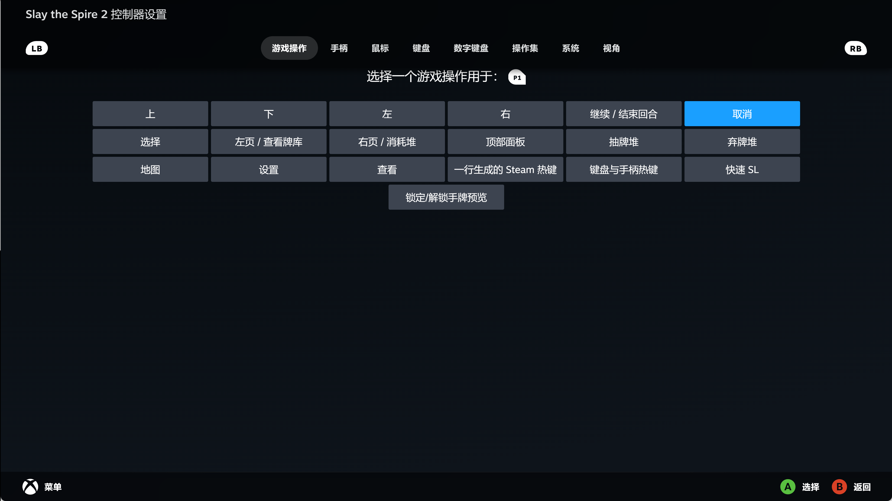
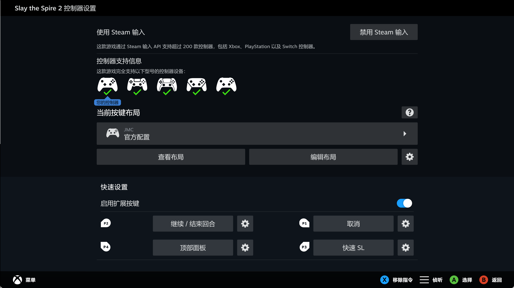
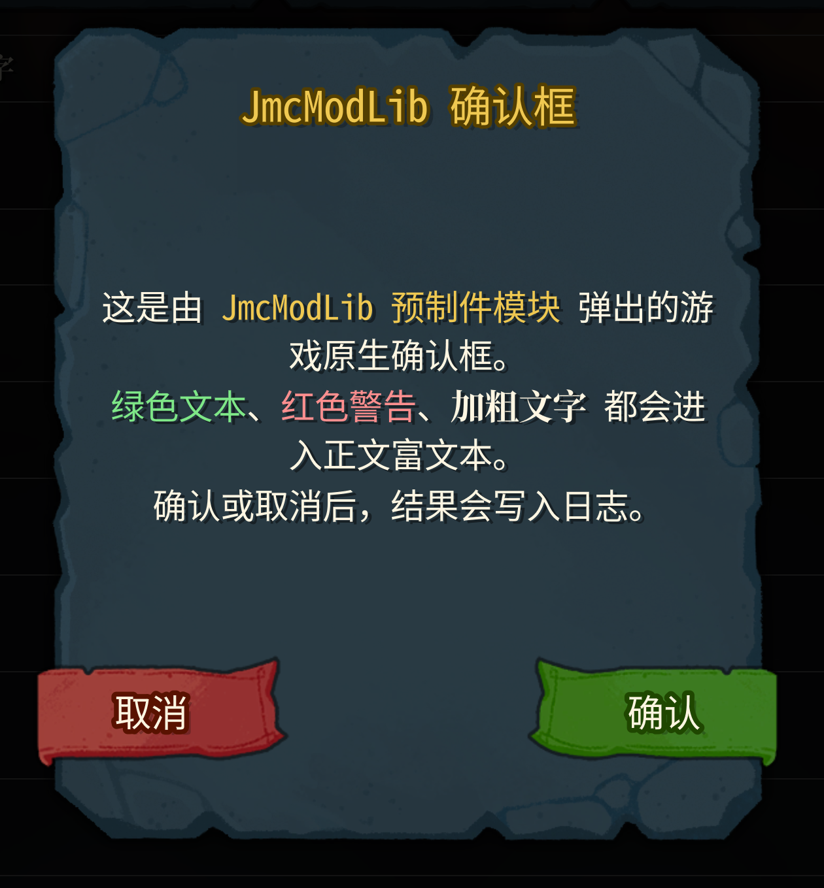

**🌐[ 中文 | [English](README_en.md) ]**

[📝更新日志](CHANGELOG.md)

[📦 Releases](https://github.com/JMC2002/SlayTheSpire2_JmcModLib/releases)

# JmcModLib
##  0. 安装

### Mod本体安装
Steam版本直接在创意工坊订阅即可（暂未开放）

其他版本可以自行编译，或者在[📦 Releases](https://github.com/JMC2002/SlayTheSpire2_JmcModLib/releases)界面下载.zip后解压到游戏安装目录下的Mods
目录下（没有就新建一个）

安装完成后的目录结构如下：

```sh
-- Slay the Spire 2
    |-- SlayTheSpire2.exe
        |-- mods
             |-- JmcModLib
```

### 存档迁移
> 当你第一次安装MOD，游戏会默认将开启Mod的存档与没开启的隔离，可以按下面的方法迁移存档：

在安装好MOD后第一次打开游戏会询问是否启用MOD，启用并再次打开游戏一次后，切换存档位置，将`%appdata%\SlayTheSpire2\steam\`下面的数字文件夹下的你对应的存档文件粘贴到该文件夹的`modded`文件夹中，以同步使用MOD前后的存档

迁移完成后的目录结构如下：

```sh
-- %appdata%\SlayTheSpire2
    |-- logs                                # 日志文件夹
    |-- steam
        |-- <steamId>
             |-- profile1
             |-- profile2
             |-- profile3
             |-- modded
                  |-- profile1
                  |-- profile2
                  |-- profile3
```
---
## 🧠 1. 简介
这个Mod主体部分来自我在逃离鸭科夫的[同名前置](https://github.com/JMC2002/JmcModLib)，主要由配置库、反射库、日志库封装、本地化库封装几个部分组成

[演示视频（B站）（还没发）]()

[Github仓库](https://github.com/JMC2002/SlayTheSpire2_JmcModLib)
## ⚙️ 2. 功能
- 提供融入游戏本身风格的设置界面与配置项（包括支持富文本的悬浮提示框），原生支持手柄操作


- 只需要提供`setting_ui.json`文件，即可自动扫描构建本地化配置项

- 将按键标记为支持手柄后，会自动注册一个Steam输入事件（第一次打开需要重启），相关本地化文本与配置项规则相同


- 提供一些游戏原生的预制件

- 一个自带缓存的反射库
- 日志库封装
- 本地化库封装
 

## 🔔 3. 其他
- 如果有人想使用这个Mod，可以先查看[快速上手](./docs/JML_QuickStart.md)与[API参考文档](./docs/JML_API_Reference.md)，配合[Demo](https://github.com/JMC2002/SlayTheSpire2_JmcModLibDemo)使用
- Mod目前还处于建设阶段，建议如果想要使用这个MOD，加入[Discord服务器](https://discord.gg/peRD8SUxXg)或QQ群（617674584）
- 本Mod主体部分来自[JmcModLib](https://github.com/JMC2002/JmcModLib)，使用CodeX辅助开发
- 本Mod文档、本地化文本依赖AI生成，如果你觉得哪些翻译得不好，欢迎提出建议

## 🧩 4. 兼容性与依赖
- 本Mod依赖`Newtonsoft.Json 13.0.4`与`Harmony`，前者已发布在发布菜单
- 由于游戏处于EA阶段，可能会随着游戏版本更新而失效

## 🧭 5. TODO
- 文档建设中

**如果你喜欢这个 Mod 的话，希望可以点一个star~**

如果你真的很有钱，可以考虑给我赞助，给我赞助你得不到任何东西，但是可以吓我一跳。


