# JmcModLib STS2 API 文档

源码基准：JML `1.0.99`。本文按源码重新整理，不以旧文档为准。命名空间常用组合：

```csharp
using JmcModLib.Core;
using JmcModLib.Config;
using JmcModLib.Config.UI;
using JmcModLib.Config.Storage;
using JmcModLib.Reflection;
using JmcModLib.Utils;
using JmcModLib.Prefabs;
```

注意：`ExprHelper` 当前源码中没有命名空间，实际使用时位于全局命名空间；建议后续移动到 `JmcModLib.Utils` 或 `JmcModLib.Reflection`。

---

## 1. JML 整体生命周期

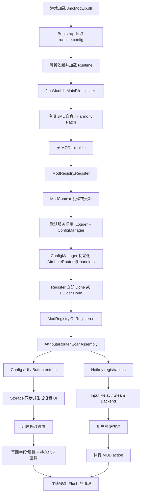

---

## 2. Core：注册、上下文、运行时信息

### 2.1 生命周期流程图

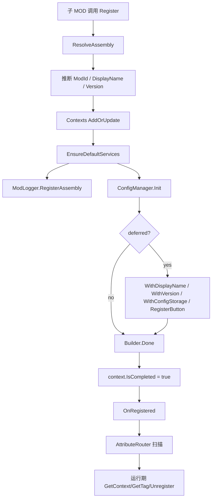

### 2.2 `VersionInfo`

命名空间：`JmcModLib.Core`

| 成员 | 说明 |
|---|---|
| `const string Name = "JmcModLib"` | JML 名称 |
| `const string Version = "1.0.99"` | JML 版本 |
| `string Tag` | `"[JmcModLib v1.0.99]"` |
| `GetName(Assembly? assembly = null)` | 获取指定程序集名称，JML 自身返回固定名称 |
| `GetVersion(Assembly? assembly = null)` | 获取指定程序集版本，JML 自身返回固定版本 |
| `GetTag(Assembly? assembly = null)` | 生成日志标签 |

### 2.3 `ModContext`

命名空间：`JmcModLib.Core`

| 属性 | 类型 | 说明 |
|---|---|---|
| `Assembly` | `Assembly` | 当前 MOD 托管程序集 |
| `ModId` | `string` | 稳定 ID，通常等于 manifest `id` |
| `DisplayName` | `string` | UI 与日志显示名 |
| `Version` | `string` | 当前注册版本 |
| `IsCompleted` | `bool` | 是否已触发 `Done()` 完成注册 |
| `LoggerContext` | `string` | 传给 STS2 日志的上下文 |
| `Tag` | `string` | 形如 `[DisplayName v1.0.0]` |

### 2.4 `ModRegistry`

命名空间：`JmcModLib.Core`

| 成员 | 签名 / 默认参数 | 说明 |
|---|---|---|
| `OnRegistered` | `event Action<ModContext>?` | MOD 完成注册后触发，AttributeRouter 依赖此事件 |
| `OnUnregistered` | `event Action<ModContext>?` | MOD 注销后触发 |
| `Register` | `Register(string modId, string? displayName = null, string? version = null, Assembly? assembly = null)` | 手动 ID 注册，返回 builder |
| `Register` | `Register(bool deferredCompletion, string modId, string? displayName = null, string? version = null, Assembly? assembly = null)` | bool 控制是否延迟 Done |
| `Register` | `Register(bool deferredCompletion, object? modInfo, string? displayName = null, string? version = null, Assembly? assembly = null)` | 从匿名对象/元数据对象读取 id/name/version |
| `Register<T>` | `void Register<T>()` | 推荐入口，立即完成注册 |
| `Register<T>` | `RegistryBuilder? Register<T>(bool deferredCompletion)` | 泛型入口，支持延迟 builder |
| `Register<T>` | `RegistryBuilder Register<T>(string modId, string? displayName = null, string? version = null)` | 指定 ID 的泛型入口 |
| `Register<T>` | `RegistryBuilder? Register<T>(bool deferredCompletion, string modId, string? displayName = null, string? version = null)` | 指定 ID 且可延迟 |
| `IsRegistered` | `bool IsRegistered(Assembly? assembly = null)` | 判断 Assembly 是否注册 |
| `TryGetContext` | `bool TryGetContext(out ModContext? context, Assembly? assembly = null)` | 尝试获取上下文 |
| `GetContext` | `ModContext? GetContext(Assembly? assembly = null)` | 获取上下文 |
| `GetModId` | `string GetModId(Assembly? assembly = null)` | 获取 ID，未注册时回退 Assembly |
| `GetDisplayName` | `string GetDisplayName(Assembly? assembly = null)` | 获取显示名 |
| `GetVersion` | `string GetVersion(Assembly? assembly = null)` | 获取版本 |
| `GetTag` | `string GetTag(Assembly? assembly = null)` | 获取日志标签 |
| `Unregister` | `bool Unregister(Assembly? assembly = null)` | 注销上下文，并触发清理 |

推荐：普通子 MOD 使用 `Register<MainFile>()`；共享 helper 或跨 Assembly 操作时显式传 `Assembly`。

### 2.5 `RegistryBuilder`

命名空间：`JmcModLib.Core`

| 方法 | 默认参数 | 说明 |
|---|---|---|
| `WithDisplayName(string displayName)` | 无 | 覆盖显示名 |
| `WithVersion(string version)` | 无 | 覆盖版本 |
| `WithConfigStorage(IConfigStorage storage)` | 无 | 在扫描前设置自定义存储 |
| `RegisterButton(out string key, string description, Action action, string buttonText = "按钮", string group = ConfigAttribute.DefaultGroup, string? storageKey = null, string? helpText = null, string? locTable = null, string? displayNameKey = null, string? helpTextKey = null, string? buttonTextKey = null, string? groupKey = null, int order = 0, UIButtonColor color = UIButtonColor.Default)` | 见签名 | 注册手动按钮并返回 key |
| `RegisterButton(string description, Action action, ...)` | 同上 | 注册手动按钮，不取 key |
| `Done()` | 无 | 完成注册并触发 Attribute 扫描 |

`Done()` 可重复调用，第一次触发生命周期，之后只返回现有 context。

### 2.6 `ModRuntime`

命名空间：`JmcModLib.Core`

| 方法 | 说明 |
|---|---|
| `TryGetLoadedMod(Assembly? assembly = null)` | 查找 STS2 已加载的 `Mod` |
| `TryGetManifest(Assembly? assembly = null)` | 查找当前 Assembly 对应 manifest |
| `GetManifestId(Assembly? assembly = null)` | manifest `id` |
| `GetPckName(Assembly? assembly = null)` | pck 名，失败回退 Assembly 名 |
| `GetDisplayName(Assembly? assembly = null)` | manifest name 或 Assembly 名 |
| `GetLoadedVersion(Assembly? assembly = null)` | manifest version 或 Assembly version |
| `FindModById(string modId)` | 按 manifest id 精确查找 |
| `FindLoadedMod(string modId)` | 按 id/pck/name/assembly 名查找 |

---

## 3. Bootstrap / Runtime 加载

### 3.1 生命周期流程图

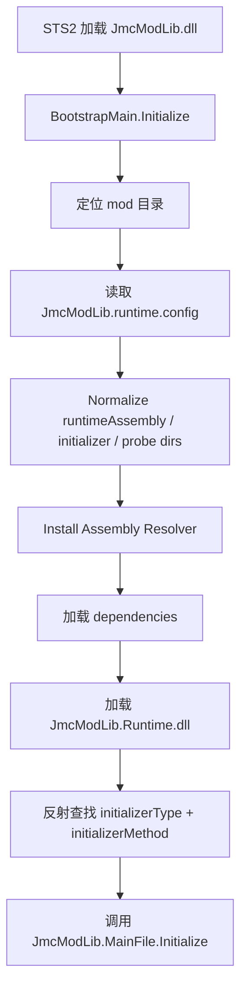

### 3.2 `BootstrapMain`

命名空间：Bootstrap 项目中独立 assembly。对普通子 MOD 来说不需要直接调用。

| 方法 | 说明 |
|---|---|
| `Initialize()` | 游戏加载 JML Bootstrap 后调用，负责加载 Runtime |

发布目录关键文件：

```text
JmcModLib.dll                 # Bootstrap，游戏 manifest 的 dll
JmcModLib.Runtime.dll         # 子 MOD 引用的 Runtime
JmcModLib.Runtime.xml         # IntelliSense XML
JmcModLib.Sts2.props          # 子 MOD MSBuild 引用入口
JmcModLib.runtime.config      # Runtime 加载描述
Newtonsoft.Json.dll           # 依赖
JmcModLib.pck                 # Godot 资源包
JmcModLib.json                # JML manifest
```

`JmcModLib.runtime.config` 当前核心字段：

```json
{
  "runtimeAssembly": "JmcModLib.Runtime.dll",
  "initializerType": "JmcModLib.MainFile",
  "initializerMethod": "Initialize",
  "probeDirectories": [".", "lib", "libs"],
  "dependencies": ["Newtonsoft.Json.dll"],
  "probeAllDlls": true
}
```

---

## 4. AttributeRouter：Attribute 扫描与扩展

### 4.1 生命周期流程图

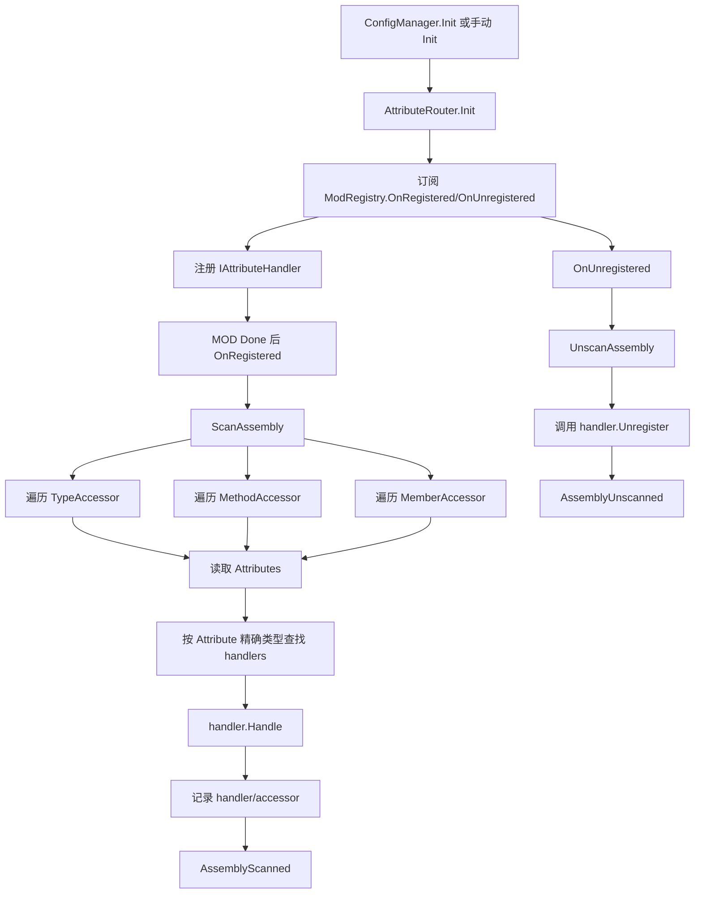

### 4.2 `AttributeRouter`

命名空间：`JmcModLib.Core.AttributeRouter`

| 成员 | 说明 |
|---|---|
| `AssemblyScanned` | 扫描完成事件 |
| `AssemblyUnscanned` | 反扫描/注销完成事件 |
| `IsInitialized` | 是否初始化 |
| `Init()` | 订阅注册生命周期 |
| `Dispose()` | 退订事件、unscan 已扫描 Assembly、清理 handlers |
| `RegisterHandler<TAttribute>(IAttributeHandler handler)` | 注册 handler |
| `RegisterHandler<TAttribute>(Action<Assembly, ReflectionAccessorBase, TAttribute> action)` | 注册简单 action handler |
| `UnregisterHandler(IAttributeHandler handler)` | 移除 handler，但不自动 unscan 既有记录 |
| `ScanAssembly(Assembly assembly)` | 扫描 Assembly |
| `UnscanAssembly(Assembly assembly)` | 执行 handler unregister 并清理记录 |

### 4.3 `IAttributeHandler`

| 成员 | 说明 |
|---|---|
| `Handle(Assembly assembly, ReflectionAccessorBase accessor, Attribute attribute)` | 处理发现的 Attribute |
| `Unregister` | 可选清理回调，参数为 Assembly 与该 handler 处理过的 accessor 列表 |

### 4.4 `SimpleAttributeHandler<TAttribute>`

构造：

```csharp
new SimpleAttributeHandler<TAttribute>(Action<Assembly, ReflectionAccessorBase, TAttribute> action)
```

它只处理注册类型 `TAttribute`，`Unregister` 当前为 `null`。适合轻量扩展，不适合需要卸载清理的扩展。

---

## 5. Config：配置、存储、配置项

### 5.1 生命周期流程图

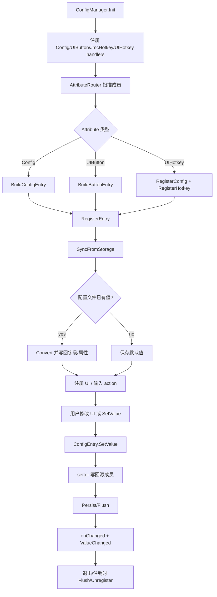

### 5.2 `ConfigAttribute`

命名空间：`JmcModLib.Config`

构造：

```csharp
[Config(string displayName, string? onChanged = null, string group = ConfigAttribute.DefaultGroup)]
```

| 成员 | 默认 | 说明 |
|---|---:|---|
| `DefaultGroup` | `"DefaultGroup"` | 默认分组常量 |
| `DisplayName` | 构造参数 | UI 回退显示名 |
| `OnChanged` | `null` | 静态回调方法名 |
| `Group` | `DefaultGroup` | 分组 |
| `Key` | `null` | 存储 key；为空时 Attribute 注册使用 `DeclaringType.FullName.MemberName` |
| `Description` | `null` | 描述回退文本 |
| `LocTable` | `null` | 本地化表，默认由 UI 层使用 `settings_ui` |
| `DisplayNameKey` | `null` | 显示名本地化 key |
| `DescriptionKey` | `null` | 描述本地化 key |
| `GroupKey` | `null` | 分组本地化 key |
| `Order` | `0` | 排序，越小越靠前 |
| `RestartRequired` | `false` | 是否提示需要重启/重进流程 |
| `IsValidMethod(MethodInfo method, Type valueType, out LogLevel? level, out string? errorMessage)` | 静态方法 | 校验 onChanged 回调 |

### 5.3 `ConfigManager`

命名空间：`JmcModLib.Config`

| 成员 | 默认 / 签名 | 说明 |
|---|---|---|
| `FlushOnSet` | `true` | 每次写入立即 flush |
| `AssemblyRegistered` | event | Assembly 配置项注册完成事件 |
| `AssemblyUnregistered` | event | Assembly 配置清理事件 |
| `EntryRegistered` | event | 单个配置项注册事件 |
| `ValueChanged` | event | 配置值变更事件 |
| `IsInitialized` | bool | 是否初始化 |
| `Init()` | 无 | 初始化 AttributeRouter 和默认 handlers |
| `Dispose()` | 无 | 清理所有配置注册 |
| `SetStorage(IConfigStorage storage, Assembly? assembly = null)` | assembly 自动推断 | 设置 Assembly 存储 |
| `GetStorage(Assembly? assembly = null)` | assembly 自动推断 | 获取存储，未设置则默认 Newtonsoft |
| `CreateStorageKey(Type declaringType, string memberName)` | 无 | 生成 `FullName.Member` |
| `CreateKey(string storageKey, string group = ConfigAttribute.DefaultGroup)` | 默认组 | 生成 `group.storageKey` |
| `Flush(Assembly? assembly = null)` | assembly 自动推断 | 刷盘 |
| `GetEntries(Assembly? assembly = null)` | assembly 自动推断 | 获取并按 order/displayName 排序 |
| `GetEntries(string group, Assembly? assembly = null)` | group 必填 | 获取指定组配置 |
| `GetGroups(Assembly? assembly = null)` | assembly 自动推断 | 获取分组名 |
| `TryGetEntry(string key, out ConfigEntry? entry, Assembly? assembly = null)` | assembly 自动推断 | 查配置项 |
| `GetValue(string key, Assembly? assembly = null)` | assembly 自动推断 | 获取值，找不到返回 null |
| `SetValue(string key, object? value, Assembly? assembly = null)` | assembly 自动推断 | 设置值，返回是否成功 |
| `ResetAssembly(Assembly? assembly = null)` | assembly 自动推断 | 重置 Assembly 全部配置到默认值 |
| `RegisterConfig<TValue>(...)` | 详见下方 | 手动注册配置 |
| `RegisterButton(...)` | 详见按钮章节 | 手动注册按钮 |
| `Unregister(Assembly? assembly = null)` | assembly 自动推断 | 清理 Assembly 配置、输入 action、存储 |

手动配置完整签名：

```csharp
string RegisterConfig<TValue>(
    string displayName,
    Func<TValue> getter,
    Action<TValue> setter,
    string group = ConfigAttribute.DefaultGroup,
    Action<TValue>? onChanged = null,
    UIConfigAttribute? uiAttribute = null,
    string? storageKey = null,
    string? locTable = null,
    string? displayNameKey = null,
    string? groupKey = null,
    string? description = null,
    string? descriptionKey = null,
    int order = 0,
    bool restartRequired = false,
    Assembly? assembly = null)
```

手动注册适合动态配置。正式 MOD 建议显式传 `storageKey`。

### 5.4 `ConfigEntry` / `ConfigEntry<TValue>`

命名空间：`JmcModLib.Config.Entry`

| 成员 | 说明 |
|---|---|
| `Assembly` | 所属 Assembly |
| `StorageKey` | 持久化 key，不含 group |
| `Group` | 分组 |
| `DisplayName` | 回退显示名 |
| `Key` | `CreateKey(StorageKey, Group)` |
| `Attribute` | 配置元数据 |
| `UIAttribute` | UI 元数据，可为空 |
| `SourceDeclaringType` | Attribute 来源类型，可为空 |
| `SourceMemberName` | Attribute 来源成员名，可为空 |
| `ValueType` | 值类型 |
| `DefaultValue` | 默认值 |
| `GetValue()` | 读取当前源值 |
| `SetValue(object? value)` | 转换并设置值 |
| `Reset()` | 重置默认值 |
| `ValueChanged` | entry 层变更事件 |
| `CreateStorageKey(Type declaringType, string memberName)` | 静态 key 生成 |
| `CreateKey(string storageKey, string group = DefaultGroup)` | 完整 key 生成 |

`ConfigEntry<TValue>` 额外成员：

| 成员 | 说明 |
|---|---|
| `DefaultValueTyped` | 强类型默认值 |
| `GetTypedValue()` | 强类型读取 |
| `SetTypedValue(TValue value)` | 强类型设置 |

### 5.5 `IConfigStorage`

命名空间：`JmcModLib.Config.Storage`

| 方法 | 说明 |
|---|---|
| `GetFileName(Assembly? assembly = null)` | 获取文件名 |
| `GetFilePath(Assembly? assembly = null)` | 获取完整路径 |
| `Exists(Assembly? assembly = null)` | 文件是否存在 |
| `Save(string key, string group, object? value, Assembly? assembly = null)` | 保存到缓存并标记 dirty |
| `TryLoad(string key, string group, Type valueType, out object? value, Assembly? assembly = null)` | 尝试读取并反序列化 |
| `Flush(Assembly? assembly = null)` | 写入磁盘 |

### 5.6 `NewtonsoftConfigStorage` / `JsonConfigStorage`

构造：

```csharp
new NewtonsoftConfigStorage(string? rootDirectory = null)
new JsonConfigStorage(string? rootDirectory = null)
```

两者都实现 `IConfigStorage`。默认 root 为空时会使用 `OS.GetUserDataDir()/mods/config`。默认存储是 `NewtonsoftConfigStorage`，对复杂类型更宽容；`JsonConfigStorage` 更轻，但复杂类型兼容性需要额外验证。

---

## 6. Config UI：设置界面 Attribute

### 6.1 生命周期流程图

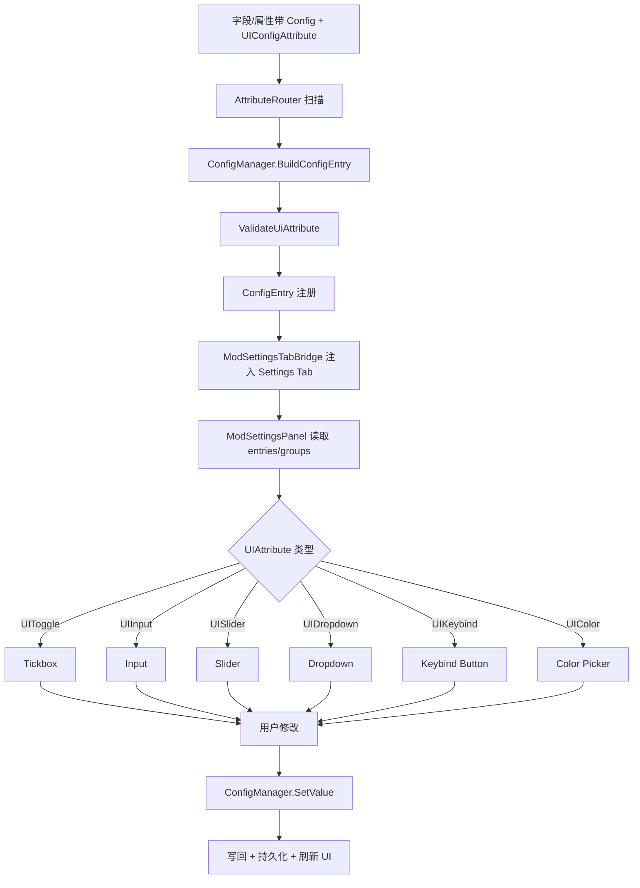

### 6.2 `UIButtonAttribute`

构造：

```csharp
[UIButton(string description, string buttonText = "按钮", string group = ConfigAttribute.DefaultGroup)]
```

| 属性 | 默认 | 说明 |
|---|---:|---|
| `Description` | 构造参数 | 行显示名/描述 |
| `ButtonText` | `"按钮"` | 按钮文本 |
| `Group` | `DefaultGroup` | 分组 |
| `Key` | `null` | 存储 key，空时从方法名推导 |
| `LocTable` | `null` | 本地化表 |
| `DisplayNameKey` | `null` | 显示名 key |
| `DescriptionKey` | `null` | 帮助文本 key |
| `ButtonTextKey` | `null` | 按钮文本 key |
| `GroupKey` | `null` | 分组 key |
| `Color` | `UIButtonColor.Default` | 按钮颜色 |
| `Order` | `0` | 排序 |
| `HelpText` | `null` | 悬停帮助文本 |
| `IsValidMethod` | 静态 | 要求静态无参；返回值非 void 会警告 |

### 6.3 UI Attribute 总表

| Attribute | 构造 / 默认 | 支持类型 | 说明 |
|---|---|---|---|
| `UIConfigAttribute` | 抽象基类 | 任意 | UI 元数据基类 |
| `UIConfigAttribute<TValue>` | 抽象泛型基类 | 精确 `TValue` | 自动校验值类型 |
| `UIToggleAttribute` | 无 | `bool` | 勾选框 |
| `UIKeybindAttribute` | `(bool allowController = false, bool allowKeyboard = true)` | `Godot.Key` 或 `JmcKeyBinding` | 按键绑定；手柄要求 `JmcKeyBinding` |
| `UIInputAttribute` | `(int characterLimit = 0, bool multiline = false)` | `string` | 文本输入 |
| `UIColorAttribute` | `(params string[] presets)` | `Godot.Color` | 颜色选择，默认 `Palette=Game`、`AllowCustom=true`、`AllowAlpha=true` |
| `UISliderAttribute` | `(double min, double max, double step = 1.0)` | 数字类型 | 通用数字滑条 |
| `UIIntSliderAttribute` | `(int min, int max, int characterLimit = 5)` | `int` | int 滑条 |
| `UIFloatSliderAttribute` | `(float min, float max, int decimalPlaces = 1, int characterLimit = 5)` | `float` | float 滑条，step = `10^-decimalPlaces` |
| `UIDropdownAttribute` | `(params string[]? exclude)` | `string` 或 enum | string 用作选项；enum 用作排除项 |

枚举：

```csharp
public enum UIButtonColor { Default, Green, Red, Gold, Blue, Reset }
public enum UIColorPalette { None, Basic, Game, CardRarity, Rainbow }
```

接口：

```csharp
public interface ISliderConfigAttribute
{
    double Min { get; }
    double Max { get; }
    double Step { get; }
}
```

---

## 7. Hotkey / Input：热键与输入

### 7.1 生命周期流程图

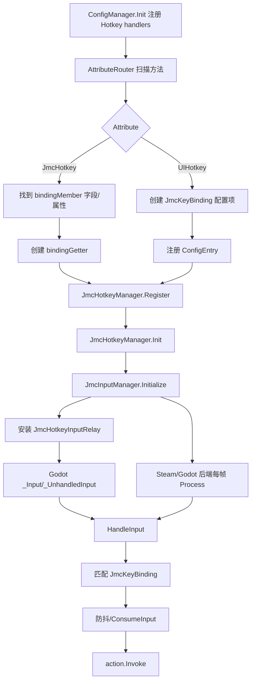

### 7.2 `JmcKeyModifiers`

命名空间：`JmcModLib.Config.UI`

```csharp
[Flags]
public enum JmcKeyModifiers
{
    None = 0,
    Ctrl = 1,
    Shift = 2,
    Alt = 4,
    Meta = 8
}
```

### 7.3 `JmcKeyBinding`

命名空间：`JmcModLib.Config.UI`

构造：

```csharp
new JmcKeyBinding()
new JmcKeyBinding(Key keyboard)
new JmcKeyBinding(Key keyboard = Key.None, string controller = "", JmcKeyModifiers modifiers = JmcKeyModifiers.None, bool enabled = true)
new JmcKeyBinding(Key keyboard, string controller, JmcKeyModifiers modifiers)
new JmcKeyBinding(Key keyboard, JmcKeyModifiers modifiers, bool enabled = true)
```

| 成员 | 说明 |
|---|---|
| `Keyboard` | 键盘按键，`Key.None` 表示无键盘绑定 |
| `Controller` | 手柄 action 名称 |
| `Modifiers` | 修饰键组合 |
| `Enabled` | 是否启用；默认 struct 也会视为启用 |
| `HasKeyboard` | 是否有键盘 |
| `HasModifiers` | 是否有修饰键 |
| `HasController` | 是否有手柄 action |
| `WithKeyboard(Key keyboard)` | 替换键盘并清空修饰键 |
| `WithKeyboard(Key keyboard, JmcKeyModifiers modifiers)` | 替换键盘与修饰键 |
| `WithController(string? controller)` | 替换手柄 action |
| `WithEnabled(bool enabled)` | 修改启用状态 |
| `IsPressed(InputEvent inputEvent, bool allowEcho = false, bool exactModifiers = true)` | 判断输入事件是否触发 |
| `IsReleased(InputEvent inputEvent)` | 判断释放 |
| `IsDown(bool exactModifiers = true)` | 当前是否按下 |
| `implicit operator JmcKeyBinding(Key keyboard)` | 从 Key 隐式创建 |
| `static IsPressed(Key keyboard, InputEvent inputEvent, bool allowEcho = false)` | 静态便捷方法 |
| `static IsReleased(Key keyboard, InputEvent inputEvent)` | 静态便捷方法 |
| `ToKeyboardText()` | 键盘绑定可读文本 |
| `ToString()` | 键盘/手柄组合文本 |
| `ReadModifiers(InputEventKey keyEvent)` | 从事件读取修饰键 |
| `ReadCurrentModifiers()` | 读取当前按下的修饰键 |
| `IsModifierKey(Key key)` | 是否修饰键 |
| `ReadKey(InputEventKey keyEvent)` | 读取实际 keycode |

### 7.4 `JmcHotkeyAttribute`

```csharp
[JmcHotkey(string bindingMember)]
```

| 属性 | 默认 | 说明 |
|---|---:|---|
| `BindingMember` | 构造参数 | 保存 `Key` 或 `JmcKeyBinding` 的静态字段/属性名 |
| `Key` | `null` | 热键注册 key；空时按方法名推导 |
| `ConsumeInput` | `true` | 触发后吃输入 |
| `ExactModifiers` | `true` | 修饰键必须完全一致 |
| `AllowEcho` | `false` | 是否允许键盘 echo |
| `DebounceMs` | `150` | 防抖毫秒 |

方法必须是静态无参；返回值会被忽略。

### 7.5 `UIHotkeyAttribute`

```csharp
[UIHotkey(string displayName, string group = ConfigAttribute.DefaultGroup)]
```

| 属性 | 默认 | 说明 |
|---|---:|---|
| `DisplayName` | 构造参数 | 设置 UI 显示名 |
| `Group` | `DefaultGroup` | 分组 |
| `Key` | `null` | 配置 key / 热键 key 基础 |
| `Description` | `null` | 描述 |
| `LocTable` | `null` | 本地化表 |
| `DisplayNameKey` | `null` | 显示名 key |
| `DescriptionKey` | `null` | 描述 key |
| `GroupKey` | `null` | 分组 key |
| `Order` | `0` | 排序 |
| `RestartRequired` | `false` | 是否提示需要重启 |
| `DefaultKeyboard` | `Key.None` | 默认键盘 |
| `DefaultModifiers` | `None` | 默认修饰键 |
| `DefaultController` | `""` | 默认手柄 action |
| `AllowKeyboard` | `true` | 允许键盘绑定 |
| `AllowController` | `false` | 允许手柄绑定 |
| `ConsumeInput` | `true` | 触发后吃输入 |
| `ExactModifiers` | `true` | 精确修饰键 |
| `AllowEcho` | `false` | 允许 echo |
| `DebounceMs` | `150` | 防抖 |

### 7.6 `JmcHotkeyManager`

| 成员 | 说明 |
|---|---|
| `IsInitialized` | 热键系统是否初始化 |
| `Init()` | 初始化输入后端和注销事件 |
| `Register(string key, Func<JmcKeyBinding> bindingGetter, Action action, bool consumeInput = true, bool exactModifiers = true, bool allowEcho = false, ulong debounceMs = 150, Assembly? assembly = null)` | 注册动态绑定热键 |
| `Register(string key, Func<Key> keyGetter, Action action, bool consumeInput = true, bool exactModifiers = true, bool allowEcho = false, ulong debounceMs = 150, Assembly? assembly = null)` | 注册键盘热键 |
| `Unregister(string key, Assembly? assembly = null)` | 注销单个热键 |
| `UnregisterAssembly(Assembly? assembly = null)` | 注销 Assembly 下全部热键 |

### 7.7 `HotkeyOptions`

```csharp
public readonly record struct HotkeyOptions(
    bool ConsumeInput = true,
    bool ExactModifiers = true,
    bool AllowEcho = false,
    ulong DebounceMs = 150);
```

---

## 8. Steam Input 集成

### 8.1 生命周期流程图

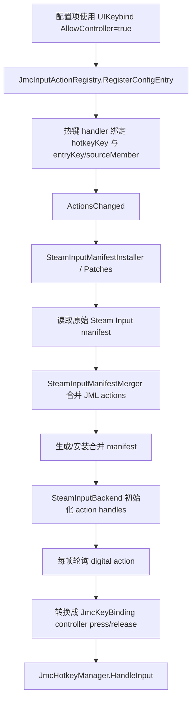

Steam Input 相关类型大多是 internal，公共 API 主要通过 `UIKeybind(allowController: true)`、`JmcKeyBinding.Controller` 与 `UIHotkey.AllowController` 间接暴露。子 MOD 不应直接依赖内部 installer/merger。

---

## 9. Logger：日志

### 9.1 生命周期流程图

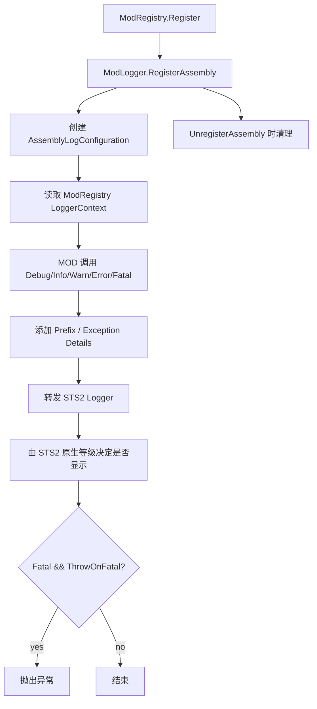

JML 不维护最低显示等级。需要调整日志显示时，使用 STS2 开发者控制台的原生命令，例如 `log Debug` 或 `log Generic Debug`。

### 9.2 类型与成员

命名空间：`JmcModLib.Utils`

```csharp
[Flags]
public enum LogPrefixFlags
{
    None = 0,
    Timestamp = 1,
    Default = Timestamp
}
```

`AssemblyLogConfiguration`：

| 属性 | 默认 |
|---|---:|
| `LogType` | `LogType.Generic` |
| `PrefixFlags` | `LogPrefixFlags.Default` |
| `ThrowOnFatal` | `true` |
| `IncludeExceptionDetails` | `true` |

`LoggerSnapshot`：

```csharp
public readonly record struct LoggerSnapshot(
    LogType LogType,
    LogPrefixFlags PrefixFlags,
    bool ThrowOnFatal,
    bool IncludeExceptionDetails,
    string Context);
```

`ModLogger`：

| 成员 | 说明 |
|---|---|
| `DefaultLogType` | 默认 Generic |
| `DefaultPrefixFlags` | 默认 Timestamp |
| `DefaultThrowOnFatal` | 默认 true |
| `DefaultIncludeExceptionDetails` | 默认 true |
| `RegisterAssembly(Assembly? assembly = null, LogPrefixFlags prefixFlags = LogPrefixFlags.Default, bool throwOnFatal = true, LogType logType = LogType.Generic, bool includeExceptionDetails = true)` | 注册 Assembly 日志配置 |
| `UnregisterAssembly(Assembly? assembly = null)` | 清理日志配置 |
| `GetLogType/SetLogType` | 读取/设置 STS2 日志类型 |
| `GetPrefixFlags/SetPrefixFlags` | 读取/设置前缀 |
| `HasPrefixFlag/TogglePrefixFlag` | 检查/切换前缀 flag |
| `GetSnapshot` | 获取当前配置快照 |
| `Load/Trace/Debug/Info/Warn/Error/Fatal` | 日志输出方法 |
| `Warn(string message, Exception exception, Assembly? assembly = null)` | 带异常 warn |
| `Error(string message, Exception exception, Assembly? assembly = null)` | 带异常 error |
| `Fatal(Exception exception, string? message = null, Assembly? assembly = null)` | fatal，可能抛出 |

---

## 10. L10n：本地化

### 10.1 生命周期流程图

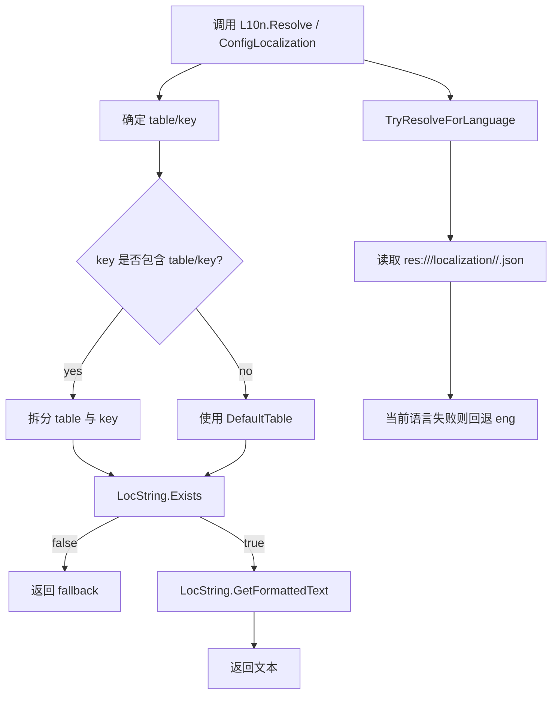

### 10.2 `L10n`

命名空间：`JmcModLib.Utils`

| 成员 | 说明 |
|---|---|
| `FallbackLanguage = "eng"` | 回退语言 |
| `DefaultTable = "settings_ui"` | 默认表 |
| `SupportedLanguages` | STS2 支持语言列表 |
| `CurrentLanguage` | 当前语言，失败回退 `eng` |
| `GetModLocalizationRoot(Assembly? assembly = null)` | `res://<pck>/localization` |
| `GetModLocalizationDirectory(string? language = null, Assembly? assembly = null)` | 指定语言目录 |
| `GetModTablePath(string fileName, string? language = null, Assembly? assembly = null)` | 表文件路径，自动补 `.json` |
| `HasModTable(string fileName, string? language = null, Assembly? assembly = null)` | 资源是否存在 |
| `EnumerateExistingModTablePaths(string fileName, Assembly? assembly = null)` | 当前语言与 fallback 路径 |
| `Create(string table, string key, Action<LocString>? configure = null)` | 创建 `LocString` |
| `CreateIfExists(string table, string key, Action<LocString>? configure = null)` | 存在则创建 |
| `Exists(string table, string key)` | key 是否存在 |
| `TryGetFormattedText(string table, string key, out string? text, Action<LocString>? configure = null, Assembly? assembly = null)` | 尝试格式化 |
| `Resolve(string? key, string? fallback = null, string? table = null, Assembly? assembly = null, Action<LocString>? configure = null)` | 解析文本，失败返回 fallback/空串 |
| `ResolveAny(IEnumerable<string?> keys, string? fallback = null, string? table = null, Assembly? assembly = null, Action<LocString>? configure = null)` | 多 key fallback |
| `ResolvePath(string? path, string? fallback = null, Assembly? assembly = null, Action<LocString>? configure = null)` | 使用默认表解析 |
| `TryResolve(string? key, out string text, string? table = null, Assembly? assembly = null, Action<LocString>? configure = null)` | 尝试解析 |
| `GetFormattedText(string table, string key, Action<LocString>? configure = null)` | 直接格式化 |
| `GetRawText(string table, string key)` | 原始文本 |
| `SubscribeToLocaleChange(LocManager.LocaleChangeCallback callback)` | 订阅语言切换 |
| `UnsubscribeToLocaleChange(LocManager.LocaleChangeCallback callback)` | 取消订阅 |

---

## 11. Reflection：反射访问器

### 11.1 生命周期流程图

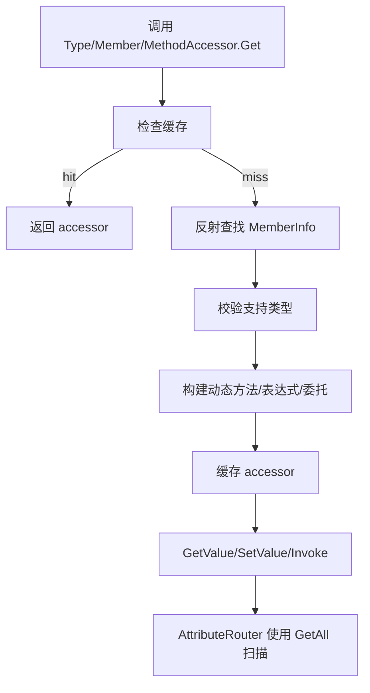

### 11.2 `ReflectionAccessorBase`

命名空间：`JmcModLib.Reflection`

| 成员 | 说明 |
|---|---|
| `DefaultFlags` | `Instance | Static | Public | NonPublic` |
| `Name` | 成员名 |
| `DeclaringType` | 声明类型 |
| `IsStatic` | 是否静态 |
| `IsSaveOwner(Type? declaringType)` | 判断类型是否适合作为 owner |
| `GetAttribute<T>()` | 获取单个 Attribute |
| `HasAttribute<T>()` | 是否有 Attribute |
| `GetAttributes(Type? type = null)` | 获取 Attribute |
| `GetAllAttributes()` | 获取全部 Attribute |

泛型基类 `ReflectionAccessorBase<TMemberInfo,TAccessor>`：

| 成员 | 说明 |
|---|---|
| `CacheCount` | 缓存数量 |
| `ClearCache()` | 清理缓存 |
| `MemberInfo` | 原始 `MemberInfo` |

### 11.3 `TypeAccessor`

| 成员 | 说明 |
|---|---|
| `Type` | 原始 `Type` |
| `new TypeAccessor(Type type)` | 构造并判断静态类 |
| `Get(Type type)` | 缓存获取 |
| `Get<T>()` | 泛型获取 |
| `GetAll(Assembly asm)` | 获取 Assembly 中所有安全类型 |
| `CreateInstance()` | 无参构造实例，失败返回 null 并日志 |
| `CreateInstance(params object?[] args)` | 带参构造 |
| `CreateInstance<T>() where T : class` | 泛型创建 |

### 11.4 `MemberAccessor`

| 成员 | 说明 |
|---|---|
| `CanRead` / `CanWrite` | 是否可读/写 |
| `ValueType` | 字段/属性类型 |
| `MemberType` | Field/Property |
| `TypedGetter` / `TypedSetter` | 强类型委托，索引器/ref-like 等可能为空 |
| `GetValue(object? target)` | 读非索引成员 |
| `SetValue(object? target, object? value)` | 写非索引成员 |
| `GetValue(object? target, params object?[] indexArgs)` | 读索引器 |
| `SetValue(object? target, object? value, params object?[] indexArgs)` | 写索引器 |
| `GetValue<TTarget,TValue>(TTarget target)` | 泛型实例读取 |
| `SetValue<TTarget,TValue>(TTarget target, TValue value)` | 泛型实例写入 |
| `GetValue<TValue>()` | 静态读取 |
| `SetValue<TValue>(TValue value)` | 静态写入 |
| `Get(Type type, string memberName)` | 按名查字段/属性 |
| `GetIndexer(Type type, params Type[] parameterTypes)` | 按索引参数查索引器 |
| `Get(MemberInfo member)` | 按 MemberInfo 获取 |
| `GetAll(Type type, BindingFlags flags = DefaultFlags)` | 获取全部字段/属性 |
| `GetAll<T>(BindingFlags flags = DefaultFlags)` | 泛型获取全部 |

### 11.5 `MethodAccessor`

| 成员 | 说明 |
|---|---|
| `IsStatic` | 是否静态 |
| `TypedDelegate` | 强类型委托，部分复杂方法可能为空 |
| `Get(MethodInfo method)` | 获取 accessor |
| `GetTypedDelegate(MethodInfo method)` | 获取强类型委托 |
| `GetAll(Type type, BindingFlags flags = DefaultFlags)` | 获取全部方法 |
| `GetAll<T>(BindingFlags flags = DefaultFlags)` | 泛型获取全部方法 |
| `Get(Type type, string methodName, Type[]? parameterTypes = null)` | 按名/参数查方法 |
| `MakeGeneric(params Type[] genericTypes)` | 构造泛型方法 accessor |
| `Invoke(object? instance, params object?[] args)` | 通用调用 |
| `Invoke(object? instance)` / `Invoke(instance, a0/a1/a2)` | 0-3 参数快捷调用 |
| `Invoke<TTarget,TResult>(TTarget instance)` | 泛型实例调用 |
| `Invoke<TTarget,T1,TResult>(...)` | 1 参数泛型实例调用 |
| `Invoke<TTarget,T1,T2,TResult>(...)` | 2 参数泛型实例调用 |
| `Invoke<TTarget,T1,T2,T3,TResult>(...)` | 3 参数泛型实例调用 |
| `InvokeVoid<TTarget>(...)` | void 实例调用 |
| `InvokeVoid<TTarget,T1/T2/T3>(...)` | 1-3 参数 void 实例调用 |
| `InvokeStatic<TResult>()` | 静态返回值调用 |
| `InvokeStatic<T1,TResult>(...)` | 1 参数静态返回值调用 |
| `InvokeStatic<T1,T2,TResult>(...)` | 2 参数静态返回值调用 |
| `InvokeStatic<T1,T2,T3,TResult>(...)` | 3 参数静态返回值调用 |
| `InvokeStaticVoid()` | 静态 void 调用 |
| `InvokeStaticVoid<T1/T2/T3>(...)` | 1-3 参数静态 void 调用 |

### 11.6 `ExprHelper`

当前位于全局命名空间。

| 成员 | 说明 |
|---|---|
| `EnableCache` | 是否启用缓存，默认 true |
| `AccessMode` | 访问器生成模式，默认 `MemberAccessMode.Default` |
| `MemberAccessMode` | `Reflection` / `ExpressionTree` / `Emit` / `Default=Emit` |
| `MemberAccessors(Delegate Getter, Delegate Setter)` | 访问器 record |
| `GetOrCreateAccessors<T>(Expression<Func<T>> expr, Assembly? assembly = null)` | 从表达式获取 getter/setter |
| `GetOrCreateAccessors<T>(Expression<Func<T>> expr, out bool cacheHit, Assembly? assembly = null)` | 带 cache hit 输出 |
| `ClearAssemblyCache(Assembly? assembly = null)` | 清理指定 Assembly 缓存 |

---

## 12. Prefabs：弹窗

### 12.1 生命周期流程图

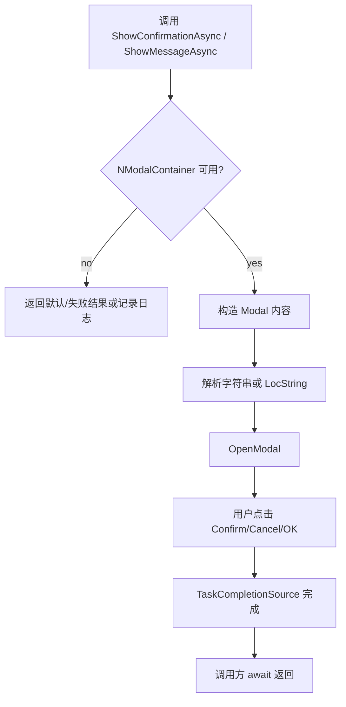

### 12.2 `JmcConfirmationPopup`

命名空间：`JmcModLib.Prefabs`。源码文件在 `Prefabs/`。

| 成员 | 说明 |
|---|---|
| `IsAvailable` | 当前是否可显示 modal |
| `ShowConfirmationAsync(string title, string body, string? confirmText = null, string? cancelText = null, bool showBackstop = true, Assembly? assembly = null)` | 确认/取消弹窗，返回 bool |
| `ShowMessageAsync(string title, string body, string? okText = null, bool showBackstop = true, Assembly? assembly = null)` | OK 消息弹窗 |
| `LocString` overloads | 支持本地化字符串参数 |

---

## 13. Build / Deploy 与子 MOD props

### 13.1 生命周期流程图

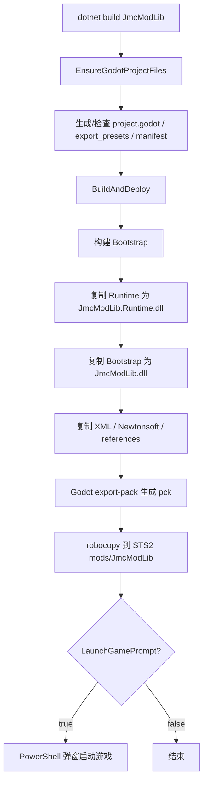

### 13.2 当前 MSBuild 关键点

JML 主项目：

- `TargetFramework=net9.0`
- `GenerateDocumentationFile=true`
- 默认本地路径是 Windows 个人路径，建议本地化到 user props。
- `BuildAndDeploy` 会同时构建 Bootstrap 与 Runtime。
- Runtime 被复制为 `JmcModLib.Runtime.dll`，Bootstrap 被复制为 `JmcModLib.dll`。

子 MOD props：

```xml
<Project>
  <PropertyGroup>
    <JmcModLibPublishDir Condition="'$(JmcModLibPublishDir)' == ''">$(MSBuildThisFileDirectory)</JmcModLibPublishDir>
    <JmcModLibRoot Condition="'$(JmcModLibRoot)' == ''">$(JmcModLibPublishDir)</JmcModLibRoot>
    <JmcModLibRuntimePath Condition="'$(JmcModLibRuntimePath)' == ''">$(JmcModLibPublishDir)JmcModLib.Runtime.dll</JmcModLibRuntimePath>
  </PropertyGroup>

  <ItemGroup>
    <Reference Include="JmcModLib">
      <HintPath>$(JmcModLibRuntimePath)</HintPath>
      <Private>false</Private>
    </Reference>
  </ItemGroup>
</Project>
```

---

## 14. 默认参数语义索引

| 默认参数 | 所在 API | 语义 | 文档建议 |
|---|---|---|---|
| `assembly = null` | 多数 API | 通过调用栈解析调用方 Assembly | 入口可省略；helper 中显式传 |
| `displayName/version = null` | `ModRegistry.Register` | 从 manifest / Assembly 回退 | 普通 MOD 省略 |
| `deferredCompletion = bool` | `Register<T>(bool)` | true 返回 builder，false 立即 Done | 建议新增语义化 overload |
| `group = DefaultGroup` | Config/UI/Button | 默认分组 | UI 层最好本地化为常规 |
| `storageKey = null` | 手动 config/button | 用显示文本派生 | 正式 MOD 不建议省略 |
| `Key = null` | Attribute config/button/hotkey | 从类型/成员/方法推导 | 发布后建议显式稳定 key |
| `buttonText = "按钮"` | Button | 按钮回退文本 | 建议本地化或中性英文默认 |
| `FlushOnSet = true` | ConfigManager | 每次 SetValue 落盘 | 滑条高频可考虑 debounce |
| `allowKeyboard = true` | UIKeybind/UIHotkey | 默认键盘绑定 | 合理 |
| `allowController = false` | UIKeybind/UIHotkey | 默认不开手柄 | 合理 |
| `ConsumeInput = true` | Hotkey | 触发后吃输入 | 动作热键合理；调试热键设 false |
| `ExactModifiers = true` | Hotkey | 修饰键完全一致 | 合理 |
| `AllowEcho = false` | Hotkey | 不响应长按 echo | 合理 |
| `DebounceMs = 150` | Hotkey | 防抖 150ms | 合理 |
| `FallbackLanguage = eng` | L10n | 英文回退 | 合理 |
| `DefaultTable = settings_ui` | L10n | 默认设置表 | 合理 |

---

## 15. 模块间依赖概览

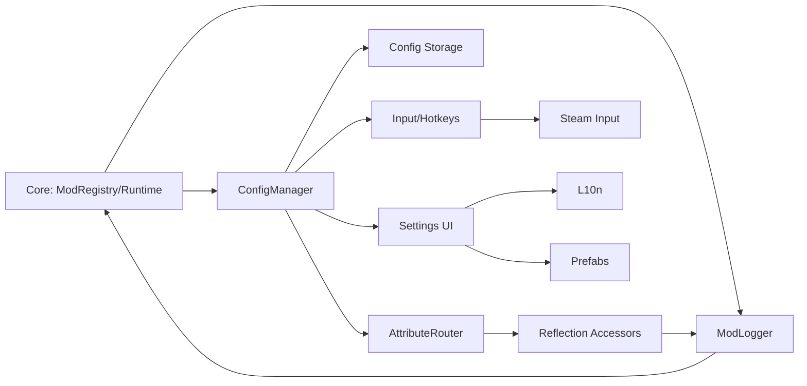

架构上最重要的方向是保持 `Core` 轻、`Config` 稳、`Input/UI` 可替换。游戏 UI 和 Steam Input 都属于外部易变区域，应把硬编码选择器和 manifest 合并逻辑隔离在内部层。
