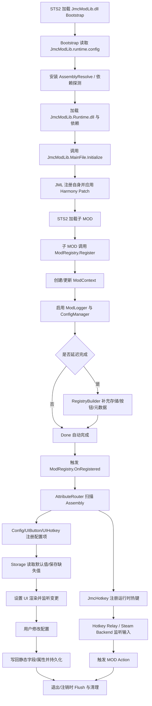

# JmcModLib STS2 项目审阅报告

源码基准：`JmcModLib_STS2`，JML 本体版本以源码 `Core/VersionInfo.cs` 与发布 manifest 为准：`1.0.104`。现有 `docs/` 中的文档标注为 `1.0.96`，存在版本漂移。本报告主要根据源码、项目文件与发布目录反推，不把既有文档作为事实来源。

分析范围包括 JML 本体、Bootstrap、发布 props/runtime 配置、Demo 的接入方式。未在沙盒内执行完整构建与游戏内运行验证，因为环境缺少 STS2/Godot 运行时 DLL 与本地 Steam/Godot 路径；以下结论是静态源码审阅结论。

---

## 1. 总体评价

JML 的整体方向是正确的：它把 STS2 子 MOD 的常见需求收敛到“入口注册 → Attribute 扫描 → 配置/设置 UI/热键自动生效”的心智模型中，`ModRegistry.Register<MainFile>()`、`[Config]`、`[UIToggle]`、`[UIHotkey]` 这些入口已经很接近“默认参数自动推导”的理想用法。

最有价值的设计点有四个：第一，JML 自身用 Bootstrap 和 Runtime 双 DLL 隔离，子 MOD 通过 `JmcModLib.Sts2.props` 引用 Runtime，避免直接引用游戏加载的 Bootstrap；第二，配置系统以 Assembly 为隔离边界，可以支持多个子 MOD 共存；第三，AttributeRouter 把配置、按钮、热键等能力统一为扫描管线，后续扩展新 Attribute 的成本较低；第四，反射访问器、日志、本地化、弹窗等工具补齐了 STS2 MOD 开发常见基础设施。

主要风险不在架构方向，而在“公共 API 边界、默认参数的稳定性、配置写入事务性、发布产物与源码混放、缺少测试与文档生成约束”。这些问题会随着子 MOD 数量增加而放大，建议优先处理。

---

## 2. 当前文件组织架构观察

当前 JML 本体的主目录大致如下：

```text
JmcModLib_STS2/
├─ Bootstrap/                  # 游戏实际加载的轻量外壳 DLL
├─ Config/                     # 配置、持久化、设置 UI、配置 Attribute
│  ├─ Entry/                   # ConfigEntry / ButtonEntry
│  ├─ Serialization/           # 颜色等配置值转换
│  ├─ Storage/                 # Newtonsoft / System.Text.Json 存储实现
│  └─ UI/                      # Attribute、Bridge、Controls、Panels、State 等
├─ Core/                       # ModRegistry、AttributeRouter、Runtime、VersionInfo
├─ Input/                      # Hotkey、Godot Action、Steam Input 集成
├─ Prefabs/                    # JmcConfirmationPopup
├─ Reflection/                 # Type/Member/Method Accessor
├─ Utils/                      # L10n、Logger、ExprHelper
├─ JmcModLib/                  # Godot 暂存/发布目录，含 modPublish 与 .godot
├─ docs/                       # 现有文档
├─ MainFile.cs                 # JML Runtime 初始化入口
├─ GlobalUsings.cs
└─ JmcModLib.csproj
```

这是一个比较清晰的“按能力分层”结构：`Core` 管生命周期，`Config` 管状态与 UI，`Input` 管热键，`Reflection/Utils/Prefabs` 是横向工具层。目录边界基本符合可维护性要求。

需要调整的是仓库内容边界。`JmcModLib/modPublish` 中包含 `JmcModLib.dll`、`JmcModLib.Runtime.dll`、`JmcModLib.pck`、`Newtonsoft.Json.dll` 等发布产物，`JmcModLib/.godot/editor/*` 也属于生成/编辑器缓存。这些文件适合作为 Release Artifact 或本地构建输出，不适合长期混在源码树里。混放会导致 diff 噪声、版本追踪困难、代码审查成本上升，也容易让 Demo 或子 MOD 误引用旧产物。

推荐整理后的源码结构：

```text
JmcModLib_STS2/
├─ src/
│  ├─ JmcModLib.Runtime/       # 当前 JML 本体源码：Core/Config/Input/...
│  └─ JmcModLib.Bootstrap/     # 当前 Bootstrap
├─ samples/
│  └─ JmcModLibDemo/
├─ docs/
│  ├─ quick-start.md
│  ├─ api-reference.md
│  └─ review.md
├─ build/
│  ├─ targets/                 # props/targets 模板
│  └─ packaging/               # runtime.config 模板、manifest 模板
├─ artifacts/                  # gitignore，本地输出
└─ tests/
   ├─ JmcModLib.Tests/
   └─ JmcModLib.IntegrationTests/
```

短期不必大迁移，也可以先做更小的调整：把 `modPublish/`、`.godot/`、`bin/`、`obj/` 纳入 `.gitignore`，发布物改由 CI 或本地 BuildAndDeploy 产出；`JmcModLib.Sts2.props` 和 `JmcModLib.runtime.config` 作为模板保存在 `build/` 或 `packaging/` 下。

---

## 3. 代码结构与模块边界

### 3.1 Core

`ModRegistry` 是核心入口，负责按 Assembly 建立 `ModContext`，自动启用 `ModLogger` 和 `ConfigManager`，并通过 `OnRegistered` 触发 Attribute 扫描。这个设计简洁，子 MOD 的默认入口足够好：

```csharp
ModRegistry.Register<MainFile>();
```

需要注意的是 `Register<T>(bool deferredCompletion)` 这种 bool 开关 API 的可读性一般，调用处的 `true` 不直观，并且返回 `RegistryBuilder?` 需要空传播。建议保留现有 API 兼容，同时新增更语义化的入口：

```csharp
ModRegistry.RegisterDeferred<MainFile>()
    .RegisterButton(...)
    .Done();

ModRegistry.RegisterImmediate<MainFile>();
```

或者让 `Register<T>()` 始终返回 builder，并提供 `AutoDone` / `Done` 两种策略，但这会更破坏现有行为。

### 3.2 AttributeRouter

`AttributeRouter` 的扩展性不错，`IAttributeHandler` 能让新能力接入同一扫描流程。当前问题是处理器按 `attribute.GetType()` 精确匹配，注册到基类 Attribute 的 handler 不会收到派生 Attribute。若未来希望支持“某类 UI Attribute 统一处理”，可以改为 assignable dispatch：

```csharp
registeredAttributeType.IsAssignableFrom(actualAttributeType)
```

另外，`UnregisterHandler` 只是移除 handler，不会对已经扫描过的记录执行该 handler 的 `Unregister`。如果此接口对第三方开放，这会造成扩展模块卸载时残留状态。建议新增 `UnregisterHandler(handler, unscanExisting: true)` 或文档明确“只影响未来扫描”。

### 3.3 Config

配置系统是 JML 最核心的业务模块。优点是：

- Attribute 注册与手动注册并存。
- `IConfigStorage` 抽象清楚。
- 每个 Assembly 独立存储。
- 支持 `onChanged` 回调、UI Attribute、排序、本地化 key。

需要优先修正的风险在 `ConfigEntry<TValue>.ApplyValue`：当前顺序是 `setter(value)` → `Persist` → `onChanged(value)` → `RaiseValueChanged`。如果 `onChanged` 抛异常，catch 只把内部 `currentValue` 回滚到旧值，但静态字段/属性和已持久化文件可能已经是新值，UI 事件也不会触发。这会造成“内存字段、内部缓存、磁盘配置、UI”状态不同步。

建议二选一：

1. 把 `onChanged` 视为通知，不参与事务。即 setter 与 persist 成功后，即使 callback 抛异常也只记录日志，不回滚。
2. 真正做事务：callback 前不持久化，callback 抛异常时调用 setter(previousValue)，再恢复持久化文件。

对 MOD 开发者而言，第一种更容易理解：配置值已经修改，回调失败只是 MOD 自己的副作用失败。

### 3.4 Config UI

设置 UI 方向清晰，`Config/UI/Panels` 用 partial 拆分生命周期、布局、刷新、编辑器、绑定，是合理的。它降低了单文件复杂度。

但 UI Bridge 与游戏原生节点耦合较强，例如 `%SettingsTabManager`、`%InputSettings`、`"Input"`、Harmony patch 等硬编码路径。STS2 处于变动阶段时，这些选择器容易失效。建议把节点路径、Tab 名称、fallback 策略集中成常量/探测器，并把失败日志做得更精确，便于用户在游戏更新后定位失效点。

`ModConfigPopup` 与旧链接回调逻辑看起来像遗留路径：`ModConfigUiBridge.UpdateModInfoContainer` 为空实现，但仍保留 `OnMetaClicked` 等方法。建议清理死代码，或者明确保留为备用方案并补上调用链。

### 3.5 Input / Hotkey / Steam

热键模块的能力较完整：键盘、修饰键、手柄 action、Steam Input manifest 合并、UI 配置、运行时 relay 都覆盖到了。`JmcKeyBinding` 作为 value struct 的默认值启用，这是为了避免 `default(JmcKeyBinding)` 变成 disabled，设计合理但需要强文档说明。

默认 `ConsumeInput=true` 对“动作型热键”是合理的，但对“日志/调试/叠加显示”等热键可能不合理。建议文档示例明确：如果不希望阻断游戏输入，设置 `ConsumeInput=false`。

### 3.6 Reflection / Utils

反射访问器能力很强，是 JML 自动扫描与手动高级用法的重要基础。`ExprHelper` 已迁移到 `namespace JmcModLib.Utils;`，不再暴露在全局命名空间下；这与 `GlobalUsings.cs` 中的 `JmcModLib.Utils` 保持一致，也降低了与子 MOD 自定义 `ExprHelper` 冲突的概率。

迁移后的剩余风险主要是二进制/源码兼容：如果已有子 MOD 直接依赖全局 `ExprHelper`，需要改为引用 `JmcModLib.Utils.ExprHelper`，或通过 `using JmcModLib.Utils;` 引入。

### 3.7 Bootstrap / Build

Bootstrap/Runtime 双层是合理的。发布目录中 `JmcModLib.runtime.config` 明确列出 Runtime、initializer、probe directories、dependencies，这使依赖解析更透明。

项目文件中存在强本地化路径：

```xml
<SteamLibraryPath>D:\SteamLibrary\steamapps\</SteamLibraryPath>
<GodotExe>C:\Tools\Godot_v4.5.1-stable_mono_win64\...</GodotExe>
```

这对个人开发方便，但不利于团队和 CI。建议改为：默认从环境变量或 `Directory.Build.props.user` 读取，本地私有路径不入库；仓库提供 `Directory.Build.props.example`。

---

## 4. 公共 API 与可见性审阅

仓库自己的 `AGENTS.md` 明确要求“接口可见性应慎重，不应一味 public”。当前有几处需要收紧：

| 位置 | 当前状态 | 建议 |
|---|---|---|
| `ConfigEntry` / `ConfigEntry<TValue>` | 类型和主构造参数公开，外部理论上能自行 new | 构造函数改 `internal` 或 `protected internal`，公开只读视图/工厂 |
| `ButtonEntry.Create/FromMethod` | `ButtonEntry` 是 internal，因此不泄漏 | 当前可接受 |
| `AttributeRouter` | public 扩展点 | 可保留，但需补充中文 XML 注释和卸载语义 |
| `IAttributeHandler` | public 扩展点 | 可保留，建议定义稳定性等级 |
| `SimpleAttributeHandler<T>` | public 快速扩展点 | 可保留，建议支持 unregister action |
| `ConfigLocalization` | 从 grep 看 public 成员，但类型可能 internal/无显式 public | 如果不是子 MOD API，应保持 internal |
| `ExprHelper` | `JmcModLib.Utils` public | 已移入 JML 命名空间；后续视兼容需求决定是否补转发 |
| `JmcInputActionRegistry` | internal class 但 public members | 对外不会暴露，风格上建议 internal members 一致 |

此外，部分公开类型 XML 注释仍是英文或不完整，例如 `ConfigManager`、`IConfigStorage`、`NewtonsoftConfigStorage`、`AttributeRouter`。这与项目规则“对外接口 XML 注释使用中文”不一致。

---

## 5. 默认参数合理性审阅

### 5.1 合理的默认参数

| API / 参数 | 当前默认 | 评价 |
|---|---:|---|
| `ModRegistry.Register<MainFile>()` | 自动推断 Assembly / manifest ID / name / version | 非常合理，应作为首推入口 |
| `assembly = null` | 通过调用栈推断 | 对入口和直接调用友好；工具函数中应显式传 Assembly |
| `NewtonsoftConfigStorage(rootDirectory=null)` | `OS.GetUserDataDir()/mods/config` | 合理，且 Newtonsoft 对 Godot/颜色等复杂类型更稳 |
| `ConfigManager.FlushOnSet=true` | 每次变更即落盘 | 对崩溃安全友好；滑条高频变化时可能过度写盘 |
| `UIKeybind(allowController=false, allowKeyboard=true)` | 默认只键盘 | 合理，避免无 Steam Input 的手柄复杂度 |
| `JmcHotkeyAttribute.ConsumeInput=true` | 默认吃输入 | 对行动热键合理，但示例需提醒调试热键可设 false |
| `DebounceMs=150` | 150ms | 合理，避免重复触发 |
| `L10n.DefaultTable="settings_ui"` | 默认设置表 | 符合配置 UI 主场景 |

### 5.2 需要调整或加强文档的默认参数

| API / 参数 | 当前默认 | 问题 | 建议 |
|---|---:|---|---|
| `Register<T>(bool deferredCompletion)` | `true/false` 控制返回 builder | 调用处语义不明显 | 增加 `RegisterDeferred<T>()` |
| 手动 `RegisterConfig(storageKey=null)` | 用 `displayName` 派生 key | 显示名/本地化文本变化会导致配置迁移 | 文档强制建议正式 MOD 显式 `storageKey` |
| 手动 `RegisterButton(storageKey=null)` | 用描述派生 key | 同上 | 正式 MOD 显式传 `storageKey` |
| `[Config(Key=null)]` | 用 `DeclaringType.FullName.MemberName` | 比较稳定，但重命名类/字段会迁移配置 | 发布后建议显式 `Key` |
| `ConfigAttribute.DefaultGroup="DefaultGroup"` | 默认组名直显可能不友好 | UI 上可能看到内部名 | 存储键保留，显示层默认本地化为“常规/General” |
| `buttonText="按钮"` | 中文硬编码 | 英文/其他语言 MOD 默认不自然 | 改为中性 `Button` 或默认本地化 key |
| `UIDropdownAttribute(params string[]? exclude)` | 对 string 是 Options，对 enum 是 Exclude | 同一参数语义依赖类型，容易误读 | 拆成 `Options` / `Exclude` 命名属性或两个 Attribute |
| `UIInput(multiline=false)` | 支持 multiline 参数 | 如果当前桥接实际仍是单行，会形成错误承诺 | 未实现前隐藏或文档标注“暂未生效” |
| `UIColorAttribute.AllowAlpha=true` | 默认允许透明度 | 对大多数 UI 颜色不一定必要 | 视实际 UI 需求决定，至少文档说明 |

---

## 6. 可维护性与可扩展性建议

### 高优先级

1. **修复配置写入事务性/回调异常语义**。这是最容易导致用户配置损坏或状态不一致的问题。
2. **清理公共 API 可见性**。尤其是 `ConfigEntry` 构造入口等仍可能被外部误用的类型。
3. **发布产物移出源码树**。减少历史包、旧 DLL、旧文档造成的误用。
4. **为核心逻辑补测试**。至少覆盖配置转换/存储、Attribute 扫描、热键匹配、动态下拉、反射访问器。
5. **文档版本绑定构建**。构建时从 `VersionInfo.Version` 或 manifest 生成文档版本，避免文档与源码版本漂移。

### 中优先级

1. **新增语义化注册 API**：`RegisterDeferred<T>()`。
2. **为高频 UI 写入提供防抖/批量 Flush**：滑条拖拽时先更新内存，释放后或延迟 flush。
3. **抽象存储公共基类**：`NewtonsoftConfigStorage` 与 `JsonConfigStorage` 大量路径/缓存/dirty/flush 逻辑重复。
4. **UI Bridge 节点路径集中化**：减少 STS2 更新时的维护成本。
5. **AttributeRouter 支持派生 Attribute 匹配**：增强扩展能力。

### 低优先级

1. `UIButtonColor` 与 `JmcButtonColor` 命名容易混淆，建议文档区分“API 颜色枚举”和“内部 UI 样式”。
2. `ConfigManager.Init()` 同时注册配置、按钮、热键 Attribute handler，模块边界略耦合；未来可拆出 `JmlServices.Init()`。
3. `ModConfigPopup` / 旧 Link Hook 逻辑清理。
4. `ReflectionAccessorBase.IsSaveOwner` 命名疑似拼写问题，或至少文档解释“safe owner”。

---

## 7. 建议测试清单

| 模块 | 建议测试 |
|---|---|
| ConfigValueConverter | enum、nullable、Godot.Color/JmcColorValue、数字范围、字符串转换 |
| ConfigEntry | setter 抛异常、onChanged 抛异常、Reset、递归 getter/setter 防护 |
| Storage | 新文件创建、损坏 JSON 回退、flush dirty、路径 sanitize、多 Assembly 隔离 |
| AttributeRouter | 扫描字段/属性/方法、重复扫描、unscan、handler 异常不影响其他 handler |
| DropdownOptionsResolver | enum excludes、string options、`FooOptions` 属性、`GetFooOptions` 方法、非法返回类型 |
| JmcKeyBinding | 修饰键精确/非精确匹配、Echo、防抖、disabled/default struct |
| JmcHotkeyManager | 注册覆盖、注销 Assembly、输入被 UI 文本框拦截、ConsumeInput |
| Reflection | private field/property、static/instance、readonly/const、indexer、泛型方法、ref-like 跳过 |
| L10n | `table/key` 路径解析、fallback language、缺失 key fallback、格式化异常日志 |

---

## 8. JML 整体生命周期流程图



---

## 9. 结论

JML 已经具备作为 STS2 子 MOD 前置库的主体形态。继续演进时，应把重点从“增加功能”转向“稳定公共契约”：明确哪些类型是给子 MOD 用的，哪些只是内部实现；让默认参数尽量自动推导但不牺牲长期稳定 key；把配置写入、热键、UI bridge 这些高风险路径用测试固定下来；文档和 Demo 随版本自动更新。

如果只做一轮最小改进，我建议按这个顺序：修复 `ConfigEntry.ApplyValue` 异常语义 → 继续清理公共 API 可见性 → 发布产物移出源码树 → 新增核心单元测试 → 重新生成当前版本文档。
