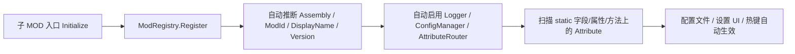

# JmcModLib STS2 快速入门

源码基准：JML `1.0.99`。本文按“默认参数尽量自动推导”的方式编写，适合子 MOD 作者快速接入。完整符号说明见 `JML_API_Reference.md`。

---

## 0. 先理解 JML 的默认工作方式

JML 推荐的模型是：



普通 MOD 入口只需要一行：

```csharp
ModRegistry.Register<MainFile>();
```

只有当你需要“在 Attribute 扫描前补充手动按钮、自定义配置存储、覆盖显示名/版本”时，才使用延迟完成的 builder。

---

## 1. 项目引用与 manifest

子 MOD 的 `.csproj` 推荐通过 JML 发布目录里的 props 引用 Runtime：

```xml
<Import Project="$(ModDir)\JmcModLib\JmcModLib.Sts2.props" />
```

这会引用：

```xml
<Reference Include="JmcModLib">
  <HintPath>$(JmcModLibRuntimePath)</HintPath>
  <Private>false</Private>
</Reference>
```

子 MOD 的 manifest 需要依赖 JML：

```json
{
  "id": "MyMod",
  "name": "My Mod",
  "author": "YourName",
  "version": "1.0.0",
  "has_pck": true,
  "has_dll": true,
  "dependencies": ["JmcModLib"],
  "affects_gameplay": false
}
```

---

## 2. 最小入口

```csharp
using Godot;
using JmcModLib.Core;
using JmcModLib.Utils;
using MegaCrit.Sts2.Core.Modding;

namespace MyMod;

[ModInitializer(nameof(Initialize))]
public partial class MainFile : Node
{
    public static void Initialize()
    {
        ModRegistry.Register<MainFile>();
        ModLogger.Info("MyMod initialized.");
    }
}
```

JML 会自动完成：

- 用 `MainFile` 推断当前 Assembly。
- 优先从 STS2 manifest 推断 MOD ID、显示名、版本。
- 注册当前 Assembly 的日志上下文。
- 初始化配置系统与 AttributeRouter。
- 扫描当前 Assembly 中的 `[Config]`、`[UIButton]`、`[JmcHotkey]`、`[UIHotkey]`。

---

## 3. 需要注册前补充内容时

如果你要在扫描 Attribute 前注册手动按钮或改配置存储，使用延迟完成：

```csharp
public static void Initialize()
{
    ModRegistry.Register<MainFile>(true)?
        .WithDisplayName("My Mod")
        .WithVersion("1.0.0")
        .RegisterButton(
            description: "刷新缓存",
            action: ReloadCache,
            buttonText: "执行",
            group: "调试",
            storageKey: "button.reload_cache")
        .Done();
}

private static void ReloadCache()
{
    ModLogger.Info("Cache reloaded.");
}
```

实践建议：正式发布的手动配置和按钮尽量显式传 `storageKey`，不要依赖显示文本派生 key。显示文本可能会本地化或修改，key 变化会导致旧配置无法读取。

---

## 4. 声明配置与设置 UI

配置应放在 `static` 字段或 `static` 属性上。最常用写法如下：

```csharp
using Godot;
using JmcModLib.Config;
using JmcModLib.Config.UI;

namespace MyMod;

public static class MySettings
{
    [UIToggle]
    [Config("启用功能", Key = "feature.enabled", Description = "是否启用 MyMod 的主要逻辑")]
    public static bool Enabled = true;

    [UIInput(characterLimit: 64)]
    [Config("显示文本", Key = "ui.display_text")]
    public static string DisplayText = "Hello JML";

    [UIIntSlider(0, 20)]
    [Config("层级", Key = "gameplay.level")]
    public static int Level = 3;

    [UIFloatSlider(0f, 2f, decimalPlaces: 2)]
    [Config("倍率", Key = "gameplay.multiplier")]
    public static float Multiplier = 1.0f;

    [UIColor]
    [Config("主题色", Key = "ui.theme_color")]
    public static Color ThemeColor = Colors.Gold;

    [UIDropdown]
    [Config("主题", Key = "ui.theme")]
    public static Theme Theme = Theme.Gold;
}

public enum Theme
{
    Gold,
    Blue,
    Red
}
```

### 默认推导规则

| 省略项 | JML 如何推导 | 建议 |
|---|---|---|
| Assembly | 从调用方或 `MainFile` 类型推断 | 入口直接省略；共享 helper 里显式传 |
| Mod ID / 名称 / 版本 | 优先从 STS2 manifest，回退到 Assembly | 普通 MOD 省略 |
| `[Config].Key` | `DeclaringType.FullName.MemberName` | 原型可省略；正式发布建议显式 key |
| Group | `DefaultGroup` | 少量配置可省略；复杂设置建议分组 |
| Storage | 默认 `NewtonsoftConfigStorage` | 普通 MOD 省略 |
| UI Attribute | 不加则只注册配置，不生成专门编辑控件 | 需要设置 UI 时加 |

---

## 5. 配置变更回调

`[Config]` 的第二个参数可以指定同类或同 Assembly 中的静态回调方法名。推荐使用 `nameof`：

```csharp
[UIToggle]
[Config("启用调试", nameof(OnDebugChanged), Key = "debug.enabled")]
public static bool DebugEnabled = false;

private static void OnDebugChanged(bool enabled)
{
    ModLogger.Info($"DebugEnabled changed: {enabled}");
}
```

回调要求：静态方法、一个参数、参数类型与配置值一致。返回值会被忽略，建议返回 `void`。

---

## 6. 下拉框

枚举下拉最简单：

```csharp
[UIDropdown]
[Config("难度预设", Key = "preset.difficulty")]
public static DifficultyPreset Difficulty = DifficultyPreset.Normal;
```

字符串下拉可以通过约定名称提供动态选项。假设成员名是 `Mode`，JML 会寻找 `ModeOptions`、`GetModeOptions` 或 `BuildModeOptions`：

```csharp
[UIDropdown]
[Config("模式", Key = "ui.mode")]
public static string Mode = "Balanced";

public static IReadOnlyList<string> ModeOptions =>
[
    "Tiny",
    "Balanced",
    "Generous"
];
```

注意：当前 `UIDropdownAttribute(params string[]? exclude)` 对 enum 更像“排除项”，对 string 更像“固定选项”。为了避免误读，复杂场景建议优先使用动态 provider。

---

## 7. 按钮

Attribute 方式：

```csharp
[UIButton(
    description: "重置缓存",
    buttonText: "重置",
    group: "调试",
    Key = "button.reset_cache",
    Color = UIButtonColor.Red)]
public static void ResetCache()
{
    ModLogger.Warn("Cache reset.");
}
```

Builder 方式适合注册期动态按钮：

```csharp
ModRegistry.Register<MainFile>(true)?
    .RegisterButton(
        description: "打开调试面板",
        action: OpenDebugPanel,
        buttonText: "打开",
        group: "调试",
        storageKey: "button.open_debug_panel")
    .Done();
```

按钮方法应是静态、无参数。返回值会被忽略。

---

## 8. 热键

### 8.1 可配置键盘热键 + 绑定方法

```csharp
using Godot;
using JmcModLib.Config;
using JmcModLib.Config.UI;

public static class MyHotkeys
{
    [UIKeybind]
    [Config("打开面板", Key = "hotkey.open_panel")]
    public static Key OpenPanelKey = Key.F8;

    [JmcHotkey(nameof(OpenPanelKey), Key = "hotkey_action.open_panel", ConsumeInput = false)]
    public static void OpenPanel()
    {
        ModLogger.Info("Panel toggled.");
    }
}
```

这里 `ConsumeInput=false` 表示触发热键后不阻断游戏自身输入。对调试/显示类热键通常更合适。

### 8.2 同时保存键盘和手柄 Action

```csharp
[UIKeybind(allowController: true)]
[Config("打开面板", Key = "hotkey.open_panel")]
public static JmcKeyBinding OpenPanelBinding =
    new(Key.F8, controller: "", JmcKeyModifiers.None);

[JmcHotkey(nameof(OpenPanelBinding), Key = "hotkey_action.open_panel")]
public static void OpenPanel()
{
    // action
}
```

`allowController: true` 时，配置类型必须是 `JmcKeyBinding`。JML 会为可绑定手柄的热键生成稳定的 Steam Input action 描述。

### 8.3 一行生成配置项和热键

```csharp
[UIHotkey("打开面板", Key = "hotkey.open_panel", DefaultKeyboard = Key.F8, ConsumeInput = false)]
public static void OpenPanel()
{
    ModLogger.Info("Panel toggled.");
}
```

`UIHotkey` 适合简单动作；如果你需要在代码中直接读取或显示当前绑定，显式声明 `JmcKeyBinding` 配置项更清楚。

---

## 9. 日志

```csharp
ModLogger.Debug("debug message");
ModLogger.Info("info message");
ModLogger.Warn("warn message");
ModLogger.Error("error message");

try
{
    DoSomething();
}
catch (Exception ex)
{
    ModLogger.Error("DoSomething failed.", ex);
}
```

日志显示等级由 STS2 原生日志系统控制。需要调整最低显示等级时，在游戏开发者控制台使用原生命令：

```text
log Debug
log Generic Debug
```

共享工具库或 helper 中建议显式传 Assembly，避免调用栈推断到错误程序集：

```csharp
ModLogger.Info("from helper", typeof(MainFile).Assembly);
```

---

## 10. 本地化

JML 默认设置表是 `settings_ui`，推荐路径：

```text
res://<你的 pck 名>/localization/eng/settings_ui.json
res://<你的 pck 名>/localization/zhs/settings_ui.json
```

配置 UI 的约定 key：

```text
EXTENSION.JMCMODLIB.CONFIG.<ModId>.<StorageKey>.NAME
EXTENSION.JMCMODLIB.CONFIG.<ModId>.<StorageKey>.DESCRIPTION
EXTENSION.JMCMODLIB.CONFIG.<ModId>.<StorageKey>.BUTTON
EXTENSION.JMCMODLIB.CONFIG.<ModId>.<StorageKey>.OPTION.<OptionValue>
EXTENSION.JMCMODLIB.CONFIG.<ModId>.GROUP.<GroupName>
```

示例：

```json
{
  "EXTENSION.JMCMODLIB.CONFIG.MyMod.feature.enabled.NAME": "Enable Feature",
  "EXTENSION.JMCMODLIB.CONFIG.MyMod.feature.enabled.DESCRIPTION": "Enable the main logic of MyMod.",
  "EXTENSION.JMCMODLIB.CONFIG.MyMod.GROUP.Debug": "Debug"
}
```

手动解析文本：

```csharp
string text = L10n.Resolve(
    key: "EXTENSION.JMCMODLIB.CONFIG.MyMod.feature.enabled.NAME",
    fallback: "Enable Feature");
```

---

## 11. 弹窗

```csharp
using JmcModLib.Prefabs;

bool ok = await JmcConfirmationPopup.ShowConfirmationAsync(
    title: "确认操作",
    body: "是否重置所有缓存？",
    confirmText: "确认",
    cancelText: "取消");

if (ok)
{
    ResetCache();
}

await JmcConfirmationPopup.ShowMessageAsync(
    title: "完成",
    body: "缓存已重置。");
```

弹窗依赖游戏当前 UI 容器可用。调用前可检查：

```csharp
if (JmcConfirmationPopup.IsAvailable)
{
    await JmcConfirmationPopup.ShowMessageAsync("JML", "Ready");
}
```

---

## 12. 配置存储

普通 MOD 不需要设置存储。默认使用 `NewtonsoftConfigStorage`，文件路径通常在：

```text
<Godot user data>/mods/config/<ModId>.json
```

需要自定义目录时：

```csharp
ModRegistry.Register<MainFile>(true)?
    .WithConfigStorage(new NewtonsoftConfigStorage(rootDirectory: customPath))
    .Done();
```

可选 `JsonConfigStorage` 不依赖 Newtonsoft，但对复杂类型的兼容性可能不如默认存储。

---

## 13. 运行时查询

```csharp
string modId = ModRegistry.GetModId();
string displayName = ModRegistry.GetDisplayName();
string version = ModRegistry.GetVersion();
string tag = ModRegistry.GetTag();

var context = ModRegistry.GetContext();
var loadedMod = ModRuntime.TryGetLoadedMod();
var manifest = ModRuntime.TryGetManifest();
```

绝大多数时候用 `ModRegistry` 即可。`ModRuntime` 更适合需要查 STS2 加载状态或 manifest 的高级场景。

---

## 14. 推荐模板

```csharp
using Godot;
using JmcModLib.Config;
using JmcModLib.Config.UI;
using JmcModLib.Core;
using JmcModLib.Utils;
using MegaCrit.Sts2.Core.Modding;

namespace MyMod;

[ModInitializer(nameof(Initialize))]
public partial class MainFile : Node
{
    public static void Initialize()
    {
        ModRegistry.Register<MainFile>();
        ModLogger.Info("MyMod loaded.");
    }
}

public static class MySettings
{
    [UIToggle]
    [Config("启用功能", Key = "feature.enabled")]
    public static bool Enabled = true;

    [UIIntSlider(0, 10)]
    [Config("数值", nameof(OnValueChanged), Key = "feature.value")]
    public static int Value = 5;

    private static void OnValueChanged(int value)
    {
        ModLogger.Info($"Value changed to {value}");
    }

    [UIHotkey("执行动作", Key = "hotkey.do_action", DefaultKeyboard = Key.F9, ConsumeInput = false)]
    public static void DoAction()
    {
        if (!Enabled)
        {
            return;
        }

        ModLogger.Info("Action triggered.");
    }

    [UIButton("重置数值", "重置", Key = "button.reset_value", Color = UIButtonColor.Reset)]
    public static void ResetValue()
    {
        Value = 5;
        ConfigManager.SetValue(ConfigManager.CreateKey("feature.value"), Value);
    }
}
```

---

## 15. 常见坑

| 现象 | 原因 | 处理 |
|---|---|---|
| `[Config]` 没生效 | 忘记 `ModRegistry.Register<MainFile>()` 或延迟 builder 没 `.Done()` | 在入口注册并完成 |
| 配置文件改名/旧值丢失 | 改了 `Key`、字段名、类名或手动配置显示名 | 发布后固定显式 `Key` |
| 热键在文本框输入时不触发 | JML 会忽略文本编辑焦点下的键盘输入 | 这是合理行为 |
| 手柄热键不出现 | `UIKeybind` 没开 `allowController` 或类型不是 `JmcKeyBinding` | 使用 `UIKeybind(allowController: true)` + `JmcKeyBinding` |
| 调试热键影响游戏操作 | `ConsumeInput` 默认 true | 设置 `ConsumeInput=false` |
| helper 里日志归属错 | `assembly=null` 通过调用栈推断到了 helper 程序集 | 显式传 `typeof(MainFile).Assembly` |
| UI 控件缺失 | 只写了 `[Config]` 没写 UI Attribute | 加 `[UIToggle]`、`[UIInput]` 等 |
