# JmcModLib STS2 快速入门

推荐配合[Demo](https://github.com/JMC2002/SlayTheSpire2_JmcModLibDemo)使用
---

## 0. 先理解 JML 的默认工作方式

JML 推荐的模型是：

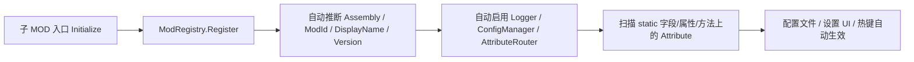

普通 MOD 入口只需要一行：

```csharp
ModRegistry.Register<MainFile>();
```

只有当你需要“在 Attribute 扫描前补充手动按钮、自定义配置存储、覆盖显示名/版本”时，才使用延迟完成的 builder。

---

## 1. 项目引用与 manifest

子 MOD 的 `.csproj` 推荐通过 JML 发布目录里的 props 引用 Runtime：

```xml
<Import Project="$(ModDir)\JmcModLib\JmcModLib.Sts2.props" />
```

这会引用：

```xml
<Reference Include="JmcModLib">
  <HintPath>$(JmcModLibRuntimePath)</HintPath>
  <Private>false</Private>
</Reference>
```

子 MOD 的 manifest 需要依赖 JML：

```json
{
  "id": "MyMod",
  "name": "My Mod",
  "author": "YourName",
  "version": "1.0.0",
  "has_pck": true,
  "has_dll": true,
  "dependencies": ["JmcModLib"],
  "affects_gameplay": false
}
```

---

## 2. 最小入口

```csharp
using Godot;
using JmcModLib.Core;
using JmcModLib.Utils;
using MegaCrit.Sts2.Core.Modding;

namespace MyMod;

[ModInitializer(nameof(Initialize))]
public partial class MainFile : Node
{
    public static void Initialize()
    {
        ModRegistry.Register<MainFile>();
        ModLogger.Info("MyMod initialized.");
    }
}
```

JML 会自动完成：

- 用 `MainFile` 推断当前 Assembly。
- 优先从 STS2 manifest 推断 MOD ID、显示名、版本。
- 注册当前 Assembly 的日志上下文。
- 初始化配置系统与 AttributeRouter。
- 扫描当前 Assembly 中的 `[Config]`、`[UIButton]`、`[JmcHotkey]`、`[UIHotkey]`。

---

## 3. 需要注册前补充内容时

如果你要在扫描 Attribute 前注册手动按钮或改配置存储，使用延迟完成：

```csharp
public static void Initialize()
{
    ModRegistry.Register<MainFile>(true)?
        .WithDisplayName("My Mod")
        .WithVersion("1.0.0")
        .RegisterButton(
            description: "刷新缓存",
            action: ReloadCache,
            buttonText: "执行",
            group: "调试",
            storageKey: "button.reload_cache")
        .Done();
}

private static void ReloadCache()
{
    ModLogger.Info("Cache reloaded.");
}
```

实践建议：正式发布的手动配置和按钮尽量显式传 `storageKey`，不要依赖显示文本派生 key。显示文本可能会本地化或修改，key 变化会导致旧配置无法读取。

---

## 4. 声明配置与设置 UI

### 约定

- 配置项一般由`[Config]`与`[UIAttr]`组成，前者标识这是一个可持久化的变量，后者表示游戏内与这个变量的交互形式（即这是个什么类型的变量）
- 所有涉及修改变量的配置，只需要把变量注册完毕即可，通常是在 `static` 字段或属性上标注 `[Config]` 和对应 UI Attribute。代码中赋的值就是默认值，通过 UI 修改后会自动反射写回原变量，不需要为了“拿到新值”专门写回调。
- `[Config]` 的 `onChanged` / `OnChanged` 只建议用于刷新缓存、重建派生 UI、重新计算一次性数据等特殊用途；配置值本身应直接读取原字段或属性。
- 正式发布的配置和按钮应显式设置稳定的 `Key`。`DisplayName`、`Description`、`Group`、`buttonText` 这类显示文本可以本地化，也可能以后改文案，不能作为长期存档 key。
- 本地化文本优先放在 MOD 自己的 `settings_ui` 表中；如果使用其他表，设置 `LocTable`。未找到本地化 key 时，JML 会回退到 Attribute 里传入的中文或英文文本。
- 本地化 key 可以显式指定，也可以使用约定 key。显式 key 优先级更高，适合已有命名规范的 MOD；约定 key 适合快速接入。
- 如果不需要本地化，不要填写 `LocTable`、`DisplayNameKey`、`DescriptionKey`、`GroupKey`、`ButtonTextKey`，也不需要创建本地化文件；直接在 `displayName`、`Description`、`group`、`buttonText`、`HelpText` 等参数里写最终显示文本即可。
- 配置文件中的 `Key` 是配置存储 key，也是约定本地化 key 的一部分；例如 `Key = "feature.enabled"` 会生成 `...feature.enabled.NAME` / `...feature.enabled.DESCRIPTION`。修改 `Key` 会同时影响旧配置读取和约定本地化 key。
- 如果希望存储 key 稳定但本地化 key 使用另一套命名，保留 `Key` 不变，并显式填写 `DisplayNameKey`、`DescriptionKey`、`GroupKey` 或 `ButtonTextKey`。这些显式本地化 key 只影响显示文本，不改变配置文件里的存储 key。
- 本段建议配合JmcModLibDemo观看

配置项约定本地化 key：

| 文本 | 显式参数 | 约定 key |
|---|---|---|
| 配置显示名 | `DisplayNameKey` | `EXTENSION.JMCMODLIB.CONFIG.<ModId>.<Key>.NAME` |
| 配置描述 | `DescriptionKey` | `EXTENSION.JMCMODLIB.CONFIG.<ModId>.<Key>.DESCRIPTION` |
| 下拉选项 | 无 | `EXTENSION.JMCMODLIB.CONFIG.<ModId>.<Key>.OPTION.<Option>` |
| 分组名 | `GroupKey` | `EXTENSION.JMCMODLIB.CONFIG.<ModId>.GROUP.<Group>` |
| 按钮文本 | `ButtonTextKey` | `EXTENSION.JMCMODLIB.CONFIG.<ModId>.<Key>.BUTTON` |

常用参数含义：

| 参数 | 适用对象 | 含义 |
|---|---|---|
| `Key` | `[Config]` / `[UIButton]` / `[JmcHotkey]` / `[UIHotkey]` | 稳定存储或运行时注册 key；建议正式发布时显式填写 |
| `bindingMember` | `[JmcHotkey]` | 保存热键值的静态字段或属性名，类型必须是 `Key` 或 `JmcKeyBinding` |
| `Group` / `group` | `[Config]` / `[UIButton]` / `[UIHotkey]` | 设置页分组，同时参与配置存储分组 |
| `Description` | `[Config]` / `[UIHotkey]` | 配置项悬停说明的回退文本 |
| `HelpText` | `[UIButton]` | 按钮悬停说明的回退文本 |
| `Order` | `[Config]` / `[UIButton]` / `[UIHotkey]` | 同组内排序，越小越靠前 |
| `RestartRequired` | `[Config]` / `[UIHotkey]` | 在 UI 中提示该项需要重启或重进流程才完全生效 |
| `LocTable` | `[Config]` / `[UIButton]` / `[UIHotkey]` | 本地化表名；为空时使用 `settings_ui` |
| `characterLimit` | `UIInput` / 数值滑条 | 输入框字符上限，`0` 表示不限制 |
| `min` / `max` / `step` | `UISlider` | 滑条范围与实际步进；浮点数建议直接用 `step` 表达粒度，例如 `0.01` |
| `allowKeyboard` / `allowController` | `UIKeybind` / `UIHotkey` | 是否允许键盘或手柄绑定；允许手柄时通常使用 `JmcKeyBinding` |
| `DefaultKeyboard` | `UIHotkey` | 自动创建热键配置项时使用的默认键盘按键 |
| `DefaultModifiers` | `UIHotkey` | 自动创建热键配置项时使用的默认键盘修饰键 |
| `DefaultController` | `UIHotkey` | 自动创建热键配置项时使用的默认手柄 action；Steam Input 场景通常留空 |
| `ConsumeInput` | `JmcHotkey` / `UIHotkey` | 触发热键后是否吃掉本次输入；调试/显示类热键通常设为 `false` |
| `ExactModifiers` | `JmcHotkey` / `UIHotkey` | 是否禁止额外修饰键；`true` 表示修饰键必须完全一致，`false` 表示只要求包含配置的修饰键 |
| `AllowEcho` | `JmcHotkey` / `UIHotkey` | 是否允许键盘长按产生的 echo 输入重复触发；普通动作热键通常保持 `false` |
| `DebounceMs` | `JmcHotkey` / `UIHotkey` | 热键防抖时间，单位为毫秒，默认 `150` |
| `Palette` / `AllowCustom` / `AllowAlpha` | `UIColor` | 颜色预设、自定义颜色和透明度开关 |
| `Color` | `UIButton` | 按钮强调色 |

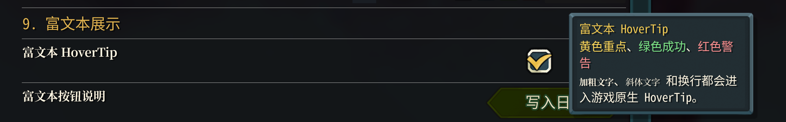

配置应放在 `static` 字段或 `static` 属性上。最常用写法如下：

```csharp
using Godot;
using JmcModLib.Config;
using JmcModLib.Config.UI;

namespace MyMod;

public static class MySettings
{
    [UIToggle]
    [Config("启用功能", Key = "feature.enabled", Description = "是否启用 MyMod 的主要逻辑")]
    public static bool Enabled = true;

    [UIInput(characterLimit: 64)]
    [Config("显示文本", Key = "ui.display_text")]
    public static string DisplayText = "Hello JML";

    [UIIntSlider(0, 20)]
    [Config("层级", Key = "gameplay.level")]
    public static int Level = 3;

    [UISlider(0.0, 2.0, 0.01)]
    [Config("倍率", Key = "gameplay.multiplier")]
    public static float Multiplier = 1.0f;

    [UIColor]
    [Config("主题色", Key = "ui.theme_color")]
    public static Color ThemeColor = Colors.Gold;

    [UIDropdown]
    [Config("主题", Key = "ui.theme")]
    public static Theme Theme = Theme.Gold;
}

public enum Theme
{
    Gold,
    Blue,
    Red
}
```

### 默认推导规则

| 省略项 | JML 如何推导 | 建议 |
|---|---|---|
| Assembly | 从调用方或 `MainFile` 类型推断 | 入口直接省略；共享 helper 里显式传 |
| Mod ID / 名称 / 版本 | 优先从 STS2 manifest，回退到 Assembly | 普通 MOD 省略 |
| `[Config].Key` | `DeclaringType.FullName.MemberName` | 原型可省略；正式发布建议显式 key |
| Group | `DefaultGroup` | 少量配置可省略；复杂设置建议分组 |

---

## 5. 配置变更回调
> 一般不需要使用回调，UI界面修改值会直接通过反射修改原来的变量值

`[Config]` 的第二个参数可以指定同类或同 Assembly 中的静态回调方法名。推荐使用 `nameof`：

```csharp
[UIToggle]
[Config("启用调试", nameof(OnDebugChanged), Key = "debug.enabled")]
public static bool DebugEnabled = false;

private static void OnDebugChanged(bool enabled)
{
    ModLogger.Info($"DebugEnabled changed: {enabled}");
}
```

回调要求：静态方法、一个参数、参数类型与配置值一致。返回值会被忽略，建议返回 `void`。

---

## 6. 下拉框

枚举下拉最简单：

```csharp
[UIDropdown]
[Config("难度预设", Key = "preset.difficulty")]
public static DifficultyPreset Difficulty = DifficultyPreset.Normal;
```
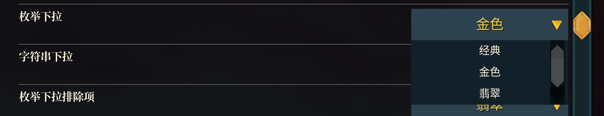

字符串下拉:
```cs
[UIDropdown("Compact", "Normal", "Large")]
[Config(
    "字符串下拉",
    group: DropdownGroup,
    Description = "字符串下拉需要在 UIDropdown 里列出候选项。",
    Key = "dropdown.string_size",
    Order = 20)]
public static string StringDropdown = "Normal";

```

不在 UIDropdown 里写候选项，也不显式指定 Key。JML会通过约定名称提供动态选项。假设成员名是 `Mode`，JML 会寻找 `ModeOptions`、`GetModeOptions` 或 `BuildModeOptions`：

```csharp
[UIDropdown]
[Config("模式", Key = "ui.mode")]
public static string Mode = "Balanced";

public static IReadOnlyList<string> ModeOptions =>
[
    "Tiny",
    "Balanced",
    "Generous"
];
```

还可以更动态：
```cs
public static IReadOnlyList<string> DynamicProviderDropdownOptions =>
    DirectBoolField
    ? ["Tiny", "Balanced", "Generous", "FeatureEnabled"]
    : ["Tiny", "Balanced", "Generous", "FeatureDisabled"];
```
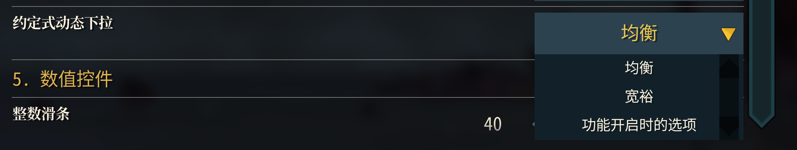


---

## 7. 按钮

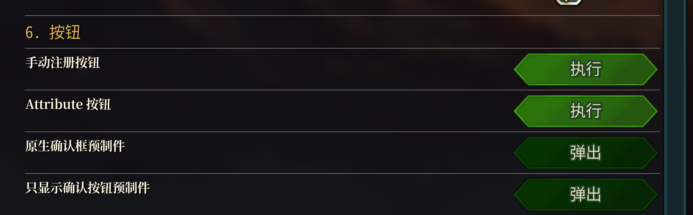
通常直接使用Attribute 方式注册：

```csharp
[UIButton(
    description: "重置缓存",
    buttonText: "重置",
    group: "调试",
    Key = "button.reset_cache",
    Color = UIButtonColor.Red)]
public static void ResetCache()
{
    ModLogger.Warn("Cache reset.");
}
```

Builder 方式适合注册期动态按钮：

```csharp
ModRegistry.Register<MainFile>(true)?
    .RegisterButton(
        description: "打开调试面板",
        action: OpenDebugPanel,
        buttonText: "打开",
        group: "调试",
        storageKey: "button.open_debug_panel")
    .Done();
```

按钮方法应是静态、无参数。返回值会被忽略。

## 8. 滑动条
```cs
[UIIntSlider(0, 100)]
[Config(
    "整数滑条",
    group: NumericGroup,
    Description = "UIIntSlider 只支持 int。",
    Key = "numeric.int_slider",
    Order = 10)]
public static int IntSlider = 40;

[UISlider(-10.0, 10.0, 0.1)]
[Config(
    "浮点滑条",
    group: NumericGroup,
    Description = "UISlider 可用于 float，step 控制实际步进。",
    Key = "numeric.float_slider",
    Order = 20)]
public static float FloatSlider = 2.5f;
```
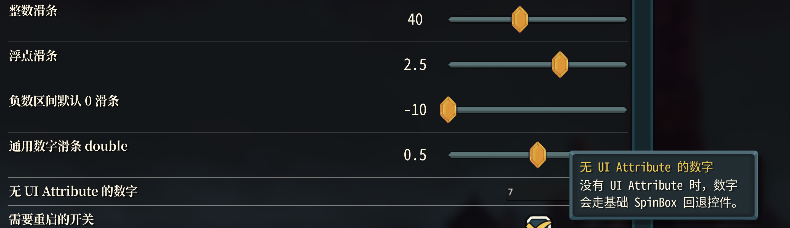

## 9. bool复选框
```cs
[UIToggle]
[Config(
    "直接修改 bool 字段",
    group: DirectWriteGroup,
    Description = "不写 onChanged。开关变化后，这个 static 字段会被 JmcModLib 直接改掉并保存。",
    Key = "direct.enable_feature",
    Order = 10)]
public static bool DirectBoolField = true;
```


## 10. 文本输入
```cs
[UIInput(32)]
[Config(
    "单行文本输入",
    group: TextGroup,
    Description = "UIInput 目前会渲染为文本输入框，提交或失焦时保存。",
    Key = "text.single_line",
    Order = 10)]
public static string SingleLineText = "Hello JmcModLib";
```


---

## 11. 调色盘
定义一个`Godot.Color`变量即可绑定调色盘，可以决定是否打开alpha通道：
```cs
[UIColor(AllowAlpha = false)]
[Config(
    "主题强调色",
    group: AppearanceGroup,
    Description = "UIColor 支持 Godot.Color。这里不需要 OnChanged，调色盘选择后会直接修改这个 static 字段并保存。",
    Key = "appearance.accent_color",
    Order = 10)]
public static Color AccentColor = new("E0B24F");

[UIColor("#1A1D22CC", "#3C6F8FCC", "#65A83ACC", "#B94A3FCC", Palette = UIColorPalette.None, AllowAlpha = true)]
[Config(
    "半透明覆盖色",
    group: AppearanceGroup,
    Description = "这个示例允许 Alpha，配置文件里会保存为 #RRGGBBAA，方便人眼检查。",
    Key = "appearance.overlay_color",
    Order = 20)]
public static Color OverlayColor = new Color(0.1f, 0.12f, 0.15f, 0.8f);
```

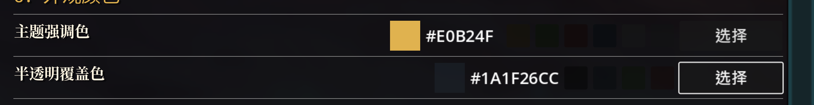
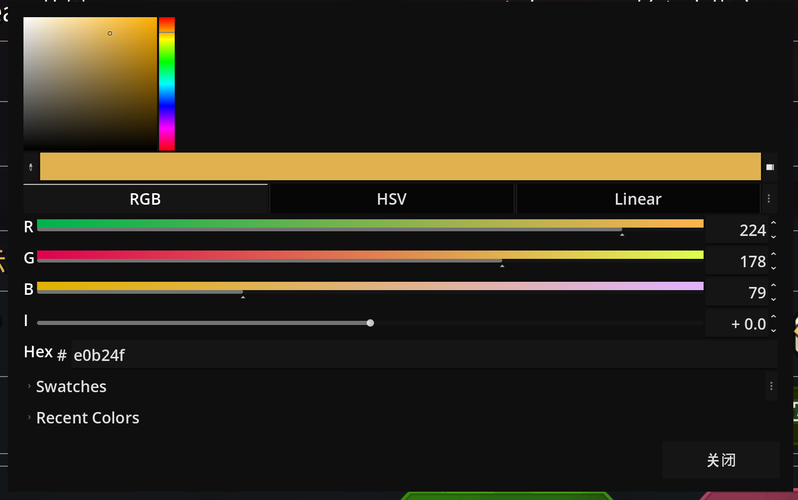


---

## 12. 热键
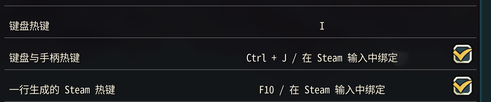

### UIHotkey

将`[UIHotkey]`标记在一个静态无参方法上即可完成绑定，绑定完成后，你将直接获取一个可配置的热键
```csharp
[UIHotkey(
    "一行生成的 Steam 热键",
    KeybindGroup,
    Key = "keybind.generated_ui_hotkey",
    Description = "UIHotkey 会自动生成配置项，并由 JML 额外生成 Steam Input 动作。",
    DefaultKeyboard = Key.F10,
    DefaultController = "controller_right_trigger",
    AllowController = true,
    ConsumeInput = false,
    Order = 30)]
public static void LogGeneratedUiHotkey()
{
    ModLogger.Info("[DemoHotkey] UIHotkey 自动生成热键触发：此项应同时出现在 JML 设置 UI 和 Steam Input 动作列表。");
}
```

### 键值变量 + UIKeybind
如果你需要单独处理按键值，可以在定义一个键值变量（`Godot.Key`或者`JmcKeyBinding`类型，除了特殊兼容情况，一般推荐使用后者，后者支持组合键）后通过`[UIKeybind]`标记，得到一个可修改的按键值
```cs
[UIKeybind]
[Config(
    "键盘热键",
    group: KeybindGroup,
    Description = "字段类型是 Godot.Key。点击这一行后按下新的键，会直接修改这个 static 字段并保存。",
    Key = "keybind.keyboard_only",
    Order = 10)]
public static Key KeyboardOnlyHotkey = Key.F8;

[UIKeybind(allowController: true)]
[Config(
    "键盘与手柄热键",
    group: KeybindGroup,
    Description = "字段类型是 JmcKeyBinding。它同时保存键盘组合键和手柄输入，仍然不需要 OnChanged。",
    Key = "keybind.keyboard_and_controller",
    Order = 20)]
public static JmcKeyBinding KeyboardAndControllerHotkey = new(
    Key.F9,
    Controller.leftTrigger.ToString(),
    JmcKeyModifiers.Ctrl);
```

在定义好后，你可以借助`[JmcHotKey]`把一个函数注册到这个按键上，由JML内部代为监听处理
```cs
[JmcHotkey(nameof(KeyboardOnlyHotkey), ConsumeInput = false)]
public static void LogKeyboardOnlyHotkey()
{
    ModLogger.Info($"[DemoHotkey] 键盘单键热键触发：{KeyboardOnlyHotkey}");
}

[JmcHotkey(nameof(KeyboardAndControllerHotkey), ConsumeInput = false)]
public static void LogKeyboardAndControllerHotkey()
{
    ModLogger.Info($"[DemoHotkey] 键盘组合/手柄热键触发：{KeyboardAndControllerHotkey}");
}
```
这里 `ConsumeInput=false` 表示触发热键后不阻断游戏自身输入。对调试/显示类热键通常更合适。

`ExactModifiers` 控制修饰键匹配方式。假设热键绑定为 `Ctrl + F8`，`ExactModifiers=true` 时只有 `Ctrl + F8` 会触发，`Ctrl + Shift + F8` 不会触发；`ExactModifiers=false` 时只要按下的修饰键包含 `Ctrl` 就会触发。如果热键本身没有修饰键，`ExactModifiers=true` 可以避免 `Ctrl + F8` 误触发一个单独的 `F8` 热键。

`AllowEcho` 控制是否响应键盘长按产生的重复输入事件。保持 `false` 时，一次按住通常只触发一次，适合打开面板、切换开关、执行命令；设为 `true` 时，长按会在防抖限制下重复触发，适合连续增加数值、滚动或连发类操作。

同时，若`AllowController `项为`true`，配置类型必须是 `JmcKeyBinding`，会自动注册Steam Input事件，本地化规则与游戏设置页相同：
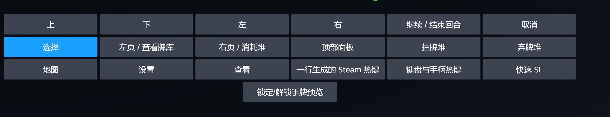

---

## 13. 日志

```csharp
ModLogger.Trace("trace message");
ModLogger.Debug("debug message");
ModLogger.Info("info message");
ModLogger.Warn("warn message");
ModLogger.Error("error message");

try
{
    DoSomething();
}
catch (Exception ex)
{
    ModLogger.Error("DoSomething failed.", ex);
}
```

日志显示等级由 STS2 原生日志系统控制。需要调整最低显示等级时，在游戏开发者控制台使用原生命令：

```text
log Debug
log Generic Debug
```

共享工具库或 helper 中建议显式传 Assembly，避免调用栈推断到错误程序集：

```csharp
ModLogger.Info("from helper", typeof(MainFile).Assembly);
```

---

## 14. 本地化

JML 默认设置表是 `settings_ui`，推荐路径：

```text
res://<你的 pck 名>/localization/eng/settings_ui.json
res://<你的 pck 名>/localization/zhs/settings_ui.json
```

STS2 主本地化流程会按官方已有表文件名枚举，并合并 MOD 中同名的 `localization/<language>/<table>.json`。因此，通用设置、弹窗和非原生数据的文案优先放在 MOD 自己的 `settings_ui` 表；只有当你的内容确实接入了卡牌、遗物、事件等原生系统时，才跟随对应官方表。

以下清单基于本地游戏 `v0.103.2` 的 `SlayTheSpire2.pck` 中 `localization/eng/*.json`：

| 表名 | 主要功能 | MOD 建议 |
|---|---|---|
| `achievements` | 成就标题与描述 | 仅在接入成就或模拟成就展示时使用 |
| `acts` | Act 名称 | 新增或替换 Act 时使用 |
| `afflictions` | Affliction 名称、描述、额外卡牌文本 | 自定义 Affliction 跟随此表 |
| `ancients` | Ancients 相关称号、对话与选项文本 | 仅在接入 Ancients 内容时使用 |
| `ascension` | 进阶等级标题与描述 | 通常不要用于普通 MOD 文案 |
| `badges` | 徽章、画像奖励等标题与描述 | 接入 badge/画像奖励时使用 |
| `bestiary` | 图鉴界面标签与动作名称 | 只放图鉴相关文本 |
| `card_keywords` | 卡牌关键词标题与说明 | 新机制关键词优先放这里 |
| `card_library` | 卡牌图鉴筛选、计数与提示 | 卡牌库界面扩展时使用 |
| `card_reward_ui` | 卡牌奖励界面选项 | 奖励选项按钮文本使用 |
| `card_selection` | 选牌/移除/变化等通用选择提示 | 复用原生选择流程时使用 |
| `cards` | 卡牌标题、描述、选择提示 | 自定义卡牌跟随此表 |
| `characters` | 角色名称、描述、banter、卡池说明 | 自定义角色跟随此表 |
| `combat_messages` | 战斗即时提示 | 只放短战斗反馈文本 |
| `credits` | 制作人员名单 | 通常不要用于普通 MOD 文案 |
| `enchantments` | 附魔名称、描述、额外卡牌文本 | 自定义附魔跟随此表 |
| `encounters` | 遭遇标题与失败文本 | 自定义遭遇跟随此表 |
| `epochs` | Epoch 标题、描述与解锁文本 | 接入时间线/Epoch 内容时使用 |
| `eras` | Era 名称与年份文本 | 仅在扩展 Era 相关内容时使用 |
| `events` | 事件页面、选项与结果文本 | 自定义事件跟随此表 |
| `extensions` | 官方扩展/通用扩展文本 | 不建议当作 MOD 设置或杂项表 |
| `ftues` | 首次教学弹窗标题与说明 | 新手引导文本使用 |
| `game_modes` | 游戏模式标题与描述 | 自定义模式时使用 |
| `game_over_screen` | 结算界面标题、按钮与统计标签 | 结算界面扩展时使用 |
| `gameplay_ui` | 运行中通用 UI、稀有度、状态标签 | 可复用原生 UI 词条，避免放大量 MOD 私有文案 |
| `inspect_relic_screen` | 遗物检查界面锁定/未发现文本 | 只放遗物检查界面相关文本 |
| `intents` | 敌人意图标题与说明 | 自定义意图时使用 |
| `main_menu_ui` | 主菜单、设置页、存档页等界面文本 | 复用原生菜单词条可以用，MOD 设置仍推荐 `settings_ui` |
| `map` | 地图、绘图与节点提示 | 地图界面扩展时使用 |
| `merchant_room` | 商人服务与商人对话 | 商店/商人内容使用 |
| `modifiers` | 运行修饰符标题与描述 | 自定义 modifier 跟随此表 |
| `monsters` | 怪物名称、招式名与相关文本 | 自定义怪物跟随此表 |
| `orbs` | Orb 标题、描述与智能描述 | 自定义 Orb 跟随此表 |
| `potion_lab` | 药水实验室分类文本 | 只放药水实验室相关文本 |
| `potions` | 药水标题、描述与选择提示 | 自定义药水跟随此表 |
| `powers` | Power 标题、描述与智能描述 | 自定义 Power 跟随此表 |
| `relic_collection` | 遗物收藏界面分类文本 | 只放收藏界面分类文本 |
| `relics` | 遗物标题、描述、flavor 与事件文本 | 自定义遗物跟随此表 |
| `rest_site_ui` | 休息点选项标题与说明 | 休息点操作扩展时使用 |
| `rich_presence` | 平台在线状态文本 | 一般不需要改 |
| `run_history` | 运行历史界面文本 | 历史记录扩展时使用 |
| `settings_ui` | 设置界面文本 | JML 配置 UI、通用 MOD UI、弹窗和杂项文本的默认推荐表 |
| `static_hover_tips` | 固定悬停提示与关键词式说明 | 通用 hover tip 或机制说明使用 |
| `stats_screen` | 统计界面条目文本 | 统计界面扩展时使用 |
| `timeline` | 时间线与 Epoch 检查界面文本 | 时间线界面扩展时使用 |
| `vfx` | 漂字/视觉反馈短文本 | 只放短视觉反馈文本 |

建议用表原则：

- 接入原生模型的数据跟随官方表，例如卡牌用 `cards`，遗物用 `relics`，事件用 `events`，Power 用 `powers`。
- JML 设置 UI、配置分组、按钮、普通弹窗和 MOD 私有界面文本使用 `settings_ui`，并使用 `EXTENSION.<MODID>...` 或 JML 约定 key 避免和官方 key 冲突。
- 不要因为官方有表就把无关文本塞进去；表名本身也是语义边界，乱放会让后续维护和翻译协作变难。

配置 UI 的约定 key：

```text
EXTENSION.JMCMODLIB.CONFIG.<ModId>.<StorageKey>.NAME
EXTENSION.JMCMODLIB.CONFIG.<ModId>.<StorageKey>.DESCRIPTION
EXTENSION.JMCMODLIB.CONFIG.<ModId>.<StorageKey>.BUTTON
EXTENSION.JMCMODLIB.CONFIG.<ModId>.<StorageKey>.OPTION.<OptionValue>
EXTENSION.JMCMODLIB.CONFIG.<ModId>.GROUP.<GroupName>
```

示例：

```json
{
  "EXTENSION.JMCMODLIB.CONFIG.MyMod.feature.enabled.NAME": "Enable Feature",
  "EXTENSION.JMCMODLIB.CONFIG.MyMod.feature.enabled.DESCRIPTION": "Enable the main logic of MyMod.",
  "EXTENSION.JMCMODLIB.CONFIG.MyMod.GROUP.Debug": "Debug"
}
```

手动解析文本：

```csharp
string text = L10n.Resolve(
    key: "EXTENSION.JMCMODLIB.CONFIG.MyMod.feature.enabled.NAME",
    fallback: "Enable Feature");
```

---

## 15. 预制件
JML复用了一些游戏原生的UI素材，提供了一些预制件：

### 确认弹窗与消息弹窗

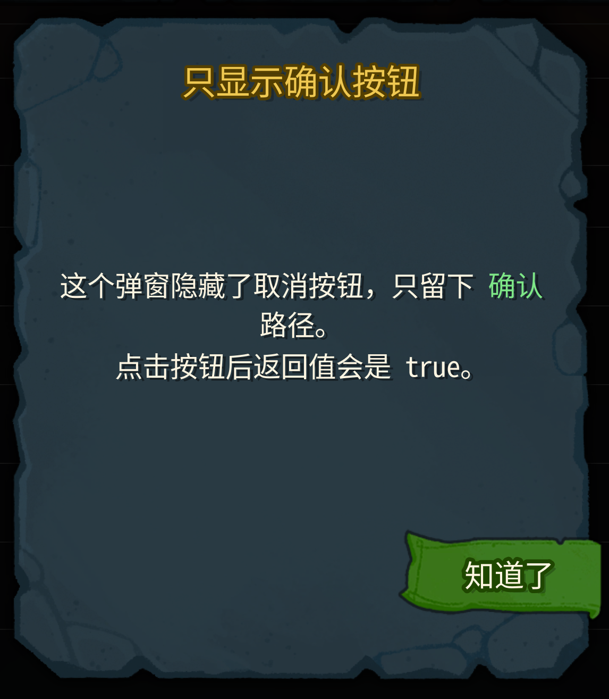
```csharp
using JmcModLib.Prefabs;

bool ok = await JmcConfirmationPopup.ShowConfirmationAsync(
    title: "确认操作",
    body: "是否重置所有缓存？",
    confirmText: "确认",
    cancelText: "取消");

if (ok)
{
    ResetCache();
}

await JmcConfirmationPopup.ShowMessageAsync(
    title: "完成",
    body: "缓存已重置。");
```

弹窗依赖游戏当前 UI 容器可用。调用前可检查：

```csharp
if (JmcConfirmationPopup.IsAvailable)
{
    await JmcConfirmationPopup.ShowMessageAsync("JML", "Ready");
}
```

---

## 16. 配置存储

普通 MOD 不需要设置存储。默认使用 `NewtonsoftConfigStorage`，文件路径通常在：

```text
<Godot user data>/mods/config/<ModId>.json
```

需要自定义目录时：

```csharp
ModRegistry.Register<MainFile>(true)?
    .WithConfigStorage(new NewtonsoftConfigStorage(rootDirectory: customPath))
    .Done();
```

可选 `JsonConfigStorage` 不依赖 Newtonsoft，但对复杂类型的兼容性可能不如默认存储。

---

## 17. 运行时查询

```csharp
string modId = ModRegistry.GetModId();
string displayName = ModRegistry.GetDisplayName();
string version = ModRegistry.GetVersion();
string tag = ModRegistry.GetTag();

var context = ModRegistry.GetContext();
var loadedMod = ModRuntime.TryGetLoadedMod();
var manifest = ModRuntime.TryGetManifest();
```

绝大多数时候用 `ModRegistry` 即可。`ModRuntime` 更适合需要查 STS2 加载状态或 manifest 的高级场景。

---

## 18. 推荐模板

```csharp
using Godot;
using JmcModLib.Config;
using JmcModLib.Config.UI;
using JmcModLib.Core;
using JmcModLib.Utils;
using MegaCrit.Sts2.Core.Modding;

namespace MyMod;

[ModInitializer(nameof(Initialize))]
public partial class MainFile : Node
{
    public static void Initialize()
    {
        ModRegistry.Register<MainFile>();
        ModLogger.Info("MyMod loaded.");
    }
}

public static class MySettings
{
    [UIToggle]
    [Config("启用功能", Key = "feature.enabled")]
    public static bool Enabled = true;

    [UIIntSlider(0, 10)]
    [Config("数值", nameof(OnValueChanged), Key = "feature.value")]
    public static int Value = 5;

    private static void OnValueChanged(int value)
    {
        ModLogger.Info($"Value changed to {value}");
    }

    [UIHotkey("执行动作", Key = "hotkey.do_action", DefaultKeyboard = Key.F9, ConsumeInput = false)]
    public static void DoAction()
    {
        if (!Enabled)
        {
            return;
        }

        ModLogger.Info("Action triggered.");
    }

    [UIButton("重置数值", "重置", Key = "button.reset_value", Color = UIButtonColor.Reset)]
    public static void ResetValue()
    {
        Value = 5;
        ConfigManager.SetValue(ConfigManager.CreateKey("feature.value"), Value);
    }
}
```

---

## 19. 常见坑

| 现象 | 原因 | 处理 |
|---|---|---|
| `[Config]` 没生效 | 忘记 `ModRegistry.Register<MainFile>()` 或延迟 builder 没 `.Done()` | 在入口注册并完成 |
| 配置文件改名/旧值丢失 | 改了 `Key`、字段名、类名或手动配置显示名 | 发布后固定显式 `Key` |
| 热键在文本框输入时不触发 | JML 会忽略文本编辑焦点下的键盘输入 | 这是合理行为 |
| 手柄热键不出现 | `UIKeybind` 没开 `allowController` 或类型不是 `JmcKeyBinding` | 使用 `UIKeybind(allowController: true)` + `JmcKeyBinding` |
| 调试热键影响游戏操作 | `ConsumeInput` 默认 true | 设置 `ConsumeInput=false` |
| helper 里日志归属错 | `assembly=null` 通过调用栈推断到了 helper 程序集 | 显式传 `typeof(MainFile).Assembly` |
| UI 控件缺失 | 只写了 `[Config]` 没写 UI Attribute | 加 `[UIToggle]`、`[UIInput]` 等 |
