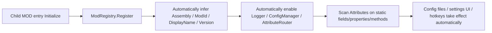

**🌐[ [中文](JML_QuickStart.md) | English ]**

# JmcModLib STS2 Quick Start

Recommended for use together with the [Demo](https://github.com/JMC2002/SlayTheSpire2_JmcModLibDemo).
---

## 0. Understand JML's Default Workflow First

JML's recommended model is:



A normal MOD entry only needs one line:

```csharp
ModRegistry.Register<MainFile>();
```

Use the delayed builder only when you need to "add manual buttons before Attribute scanning, customize config storage, or override the display name/version".

---

## 1. Project Reference and Manifest

For child MOD `.csproj` files, it is recommended to reference the Runtime through the props file in the JML publish directory:

```xml
<Import Project="$(ModDir)\JmcModLib\JmcModLib.Sts2.props" />
```

This references:

```xml
<Reference Include="JmcModLib">
  <HintPath>$(JmcModLibRuntimePath)</HintPath>
  <Private>false</Private>
</Reference>
```

The child MOD manifest must depend on JML:

```json
{
  "id": "MyMod",
  "name": "My Mod",
  "author": "YourName",
  "version": "1.0.0",
  "has_pck": true,
  "has_dll": true,
  "dependencies": ["JmcModLib"],
  "affects_gameplay": false
}
```

---

## 2. Minimal Entry

```csharp
using Godot;
using JmcModLib.Core;
using JmcModLib.Utils;
using MegaCrit.Sts2.Core.Modding;

namespace MyMod;

[ModInitializer(nameof(Initialize))]
public partial class MainFile : Node
{
    public static void Initialize()
    {
        ModRegistry.Register<MainFile>();
        ModLogger.Info("MyMod initialized.");
    }
}
```

JML automatically:

- Infers the current Assembly from `MainFile`.
- Infers the MOD ID, display name, and version from the STS2 manifest first.
- Registers the logging context for the current Assembly.
- Initializes the config system and AttributeRouter.
- Scans `[Config]`, `[UIButton]`, `[JmcHotkey]`, and `[UIHotkey]` in the current Assembly.

---

## 3. Adding Content Before Registration Completes

If you need to register manual buttons or change config storage before Attribute scanning, use delayed completion:

```csharp
public static void Initialize()
{
    ModRegistry.Register<MainFile>(true)?
        .WithDisplayName("My Mod")
        .WithVersion("1.0.0")
        .RegisterButton(
            description: "Refresh cache",
            action: ReloadCache,
            buttonText: "Run",
            group: "Debug",
            storageKey: "button.reload_cache")
        .Done();
}

private static void ReloadCache()
{
    ModLogger.Info("Cache reloaded.");
}
```

Practical advice: for manually registered configs and buttons in release builds, explicitly pass `storageKey` whenever possible. Do not rely on display text to derive keys. Display text may be localized or changed later, and key changes make old config values unreadable.

---

## 4. Declaring Configs and Settings UI

### Conventions

- Config items are usually made of `[Config]` and `[UIAttr]`: the former marks a persistable variable, and the latter describes how the game UI interacts with that variable, namely what type of variable it is.
- For every config that changes a variable, simply register the variable. Usually this means marking a `static` field or property with `[Config]` and the corresponding UI Attribute. The value assigned in code is the default value. After the UI changes it, JML automatically writes the value back to the original variable through reflection, so you do not need a callback just to "get the new value".
- `[Config]`'s `onChanged` / `OnChanged` is only recommended for special cases such as refreshing caches, rebuilding derived UI, or recalculating one-off data. The config value itself should be read directly from the original field or property.
- Release configs and buttons should explicitly set a stable `Key`. Display text such as `DisplayName`, `Description`, `Group`, and `buttonText` may be localized or rewritten later, so it must not be used as a long-term save key.
- Localization text should preferably live in the MOD's own `settings_ui` table. If you use another table, set `LocTable`. When a localization key is not found, JML falls back to the Chinese or English text passed into the Attribute.
- Localization keys can be specified explicitly or generated by convention. Explicit keys have higher priority and are suitable for MODs with an existing naming scheme. Convention keys are convenient for quick integration.
- If localization is not needed, do not fill `LocTable`, `DisplayNameKey`, `DescriptionKey`, `GroupKey`, or `ButtonTextKey`, and you do not need to create localization files. Write the final display text directly in parameters such as `displayName`, `Description`, `group`, `buttonText`, and `HelpText`.
- The `Key` in a config file is the config storage key and also part of the convention-based localization key. For example, `Key = "feature.enabled"` generates `...feature.enabled.NAME` / `...feature.enabled.DESCRIPTION`. Changing `Key` affects both reading old config values and convention-based localization keys.
- If you want the storage key to remain stable but localization keys to follow another naming scheme, keep `Key` unchanged and explicitly fill `DisplayNameKey`, `DescriptionKey`, `GroupKey`, or `ButtonTextKey`. These explicit localization keys only affect display text and do not change the storage key in the config file.
- This section is best read together with JmcModLibDemo.

Convention-based localization keys for config items:

| Text | Explicit parameter | Convention key |
|---|---|---|
| Config display name | `DisplayNameKey` | `EXTENSION.JMCMODLIB.CONFIG.<ModId>.<Key>.NAME` |
| Config description | `DescriptionKey` | `EXTENSION.JMCMODLIB.CONFIG.<ModId>.<Key>.DESCRIPTION` |
| Dropdown option | None | `EXTENSION.JMCMODLIB.CONFIG.<ModId>.<Key>.OPTION.<Option>` |
| Group name | `GroupKey` | `EXTENSION.JMCMODLIB.CONFIG.<ModId>.GROUP.<Group>` |
| Button text | `ButtonTextKey` | `EXTENSION.JMCMODLIB.CONFIG.<ModId>.<Key>.BUTTON` |

Common parameter meanings:

| Parameter | Applies to | Meaning |
|---|---|---|
| `Key` | `[Config]` / `[UIButton]` / `[JmcHotkey]` / `[UIHotkey]` | Stable storage key or runtime registration key; recommended to set explicitly before release |
| `bindingMember` | `[JmcHotkey]` | Name of the static field or property that stores the hotkey value; its type must be `Key` or `JmcKeyBinding` |
| `Group` / `group` | `[Config]` / `[UIButton]` / `[UIHotkey]` | Settings page group, also participates in config storage grouping |
| `Description` | `[Config]` / `[UIHotkey]` | Fallback text for the config item's hover description |
| `HelpText` | `[UIButton]` | Fallback text for the button's hover description |
| `Order` | `[Config]` / `[UIButton]` / `[UIHotkey]` | Sort order within the same group; smaller values appear earlier |
| `RestartRequired` | `[Config]` / `[UIHotkey]` | Indicates in the UI that the item needs a restart or flow re-entry to take full effect |
| `LocTable` | `[Config]` / `[UIButton]` / `[UIHotkey]` | Localization table name; uses `settings_ui` when empty |
| `characterLimit` | `UIInput` / numeric sliders | Input character limit; `0` means unlimited |
| `min` / `max` / `step` | `UISlider` | Slider range and actual step size; for floating-point values, express the granularity directly with `step`, such as `0.01` |
| `allowKeyboard` / `allowController` | `UIKeybind` / `UIHotkey` | Whether keyboard or controller binding is allowed; when controller binding is allowed, `JmcKeyBinding` is usually used |
| `DefaultKeyboard` | `UIHotkey` | Default keyboard key used when automatically creating a hotkey config item |
| `DefaultModifiers` | `UIHotkey` | Default keyboard modifiers used when automatically creating a hotkey config item |
| `DefaultController` | `UIHotkey` | Default controller action used when automatically creating a hotkey config item; usually left empty for Steam Input scenarios |
| `ConsumeInput` | `JmcHotkey` / `UIHotkey` | Whether to consume the input after the hotkey triggers; debug/display hotkeys usually set this to `false` |
| `ExactModifiers` | `JmcHotkey` / `UIHotkey` | Whether extra modifiers are forbidden; `true` means modifiers must match exactly, `false` means the pressed modifiers only need to include the configured ones |
| `AllowEcho` | `JmcHotkey` / `UIHotkey` | Whether keyboard echo input generated by holding a key may trigger repeatedly; normal action hotkeys usually keep this `false` |
| `DebounceMs` | `JmcHotkey` / `UIHotkey` | Hotkey debounce time in milliseconds, default `150` |
| `Palette` / `AllowCustom` / `AllowAlpha` | `UIColor` | Color presets, custom color, and alpha switches |
| `Color` | `UIButton` | Button accent color |


Configs should be placed on `static` fields or `static` properties. The most common pattern is:

```csharp
using Godot;
using JmcModLib.Config;
using JmcModLib.Config.UI;

namespace MyMod;

public static class MySettings
{
    [UIToggle]
    [Config("Enable Feature", Key = "feature.enabled", Description = "Whether to enable MyMod's main logic")]
    public static bool Enabled = true;

    [UIInput(characterLimit: 64)]
    [Config("Display Text", Key = "ui.display_text")]
    public static string DisplayText = "Hello JML";

    [UIIntSlider(0, 20)]
    [Config("Level", Key = "gameplay.level")]
    public static int Level = 3;

    [UISlider(0.0, 2.0, 0.01)]
    [Config("Multiplier", Key = "gameplay.multiplier")]
    public static float Multiplier = 1.0f;

    [UIColor]
    [Config("Theme Color", Key = "ui.theme_color")]
    public static Color ThemeColor = Colors.Gold;

    [UIDropdown]
    [Config("Theme", Key = "ui.theme")]
    public static Theme Theme = Theme.Gold;
}

public enum Theme
{
    Gold,
    Blue,
    Red
}
```

### Default Inference Rules

| Omitted item | How JML infers it | Recommendation |
|---|---|---|
| Assembly | From the caller or the `MainFile` type | Omit it in the entry; pass it explicitly in shared helpers |
| Mod ID / name / version | From the STS2 manifest first, then Assembly fallback | Omit them for normal MODs |
| `[Config].Key` | `DeclaringType.FullName.MemberName` | Can be omitted for prototypes; explicit keys are recommended before release |
| Group | `DefaultGroup` | Can be omitted for a few configs; group complex settings |

---

## 5. Config Change Callbacks
> Usually you do not need callbacks. Values changed in the UI are written directly back to the original variables through reflection.

The second parameter of `[Config]` can specify the name of a static callback method in the same type or same Assembly. `nameof` is recommended:

```csharp
[UIToggle]
[Config("Enable Debug", nameof(OnDebugChanged), Key = "debug.enabled")]
public static bool DebugEnabled = false;

private static void OnDebugChanged(bool enabled)
{
    ModLogger.Info($"DebugEnabled changed: {enabled}");
}
```

Callback requirements: static method, one parameter, and the parameter type must match the config value. The return value is ignored; `void` is recommended.

---

## 6. Dropdowns

Enum dropdowns are the simplest:

```csharp
[UIDropdown]
[Config("Difficulty Preset", Key = "preset.difficulty")]
public static DifficultyPreset Difficulty = DifficultyPreset.Normal;
```


String dropdown:
```cs
[UIDropdown("Compact", "Normal", "Large")]
[Config(
    "String Dropdown",
    group: DropdownGroup,
    Description = "String dropdowns need to list candidate items in UIDropdown.",
    Key = "dropdown.string_size",
    Order = 20)]
public static string StringDropdown = "Normal";

```

If you do not write candidates in UIDropdown and do not explicitly specify a Key, JML provides dynamic options through convention names. Suppose the member name is `Mode`; JML looks for `ModeOptions`, `GetModeOptions`, or `BuildModeOptions`:

```csharp
[UIDropdown]
[Config("Mode", Key = "ui.mode")]
public static string Mode = "Balanced";

public static IReadOnlyList<string> ModeOptions =>
[
    "Tiny",
    "Balanced",
    "Generous"
];
```

It can also be more dynamic:
```cs
public static IReadOnlyList<string> DynamicProviderDropdownOptions =>
    DirectBoolField
    ? ["Tiny", "Balanced", "Generous", "FeatureEnabled"]
    : ["Tiny", "Balanced", "Generous", "FeatureDisabled"];
```


---

## 7. Buttons


Usually register buttons directly with the Attribute style:

```csharp
[UIButton(
    description: "Reset cache",
    buttonText: "Reset",
    group: "Debug",
    Key = "button.reset_cache",
    Color = UIButtonColor.Red)]
public static void ResetCache()
{
    ModLogger.Warn("Cache reset.");
}
```

The Builder style is suitable for dynamic buttons during registration:

```csharp
ModRegistry.Register<MainFile>(true)?
    .RegisterButton(
        description: "Open debug panel",
        action: OpenDebugPanel,
        buttonText: "Open",
        group: "Debug",
        storageKey: "button.open_debug_panel")
    .Done();
```

Button methods should be static and parameterless. Return values are ignored.

## 8. Sliders
```cs
[UIIntSlider(0, 100)]
[Config(
    "Integer Slider",
    group: NumericGroup,
    Description = "UIIntSlider only supports int.",
    Key = "numeric.int_slider",
    Order = 10)]
public static int IntSlider = 40;

[UISlider(-10.0, 10.0, 0.1)]
[Config(
    "Float Slider",
    group: NumericGroup,
    Description = "UISlider can be used for float, and step controls the actual increment.",
    Key = "numeric.float_slider",
    Order = 20)]
public static float FloatSlider = 2.5f;
```


## 9. bool Checkboxes
```cs
[UIToggle]
[Config(
    "Directly Modify bool Field",
    group: DirectWriteGroup,
    Description = "No onChanged is written. After the toggle changes, this static field is directly changed and saved by JmcModLib.",
    Key = "direct.enable_feature",
    Order = 10)]
public static bool DirectBoolField = true;
```


## 10. Text Input
```cs
[UIInput(32)]
[Config(
    "Single-Line Text Input",
    group: TextGroup,
    Description = "UIInput currently renders as a text input box and saves on submit or focus loss.",
    Key = "text.single_line",
    Order = 10)]
public static string SingleLineText = "Hello JmcModLib";
```


---

## 11. Color Palette
Define a `Godot.Color` variable to bind a color palette. You can decide whether to enable the alpha channel:
```cs
[UIColor(AllowAlpha = false)]
[Config(
    "Theme Accent Color",
    group: AppearanceGroup,
    Description = "UIColor supports Godot.Color. No OnChanged is needed here; after a color is selected from the palette, this static field is directly changed and saved.",
    Key = "appearance.accent_color",
    Order = 10)]
public static Color AccentColor = new("E0B24F");

[UIColor("#1A1D22CC", "#3C6F8FCC", "#65A83ACC", "#B94A3FCC", Palette = UIColorPalette.None, AllowAlpha = true)]
[Config(
    "Translucent Overlay Color",
    group: AppearanceGroup,
    Description = "This example allows Alpha. The config file saves it as #RRGGBBAA, which is easy to inspect by eye.",
    Key = "appearance.overlay_color",
    Order = 20)]
public static Color OverlayColor = new Color(0.1f, 0.12f, 0.15f, 0.8f);
```


---

## 12. Hotkeys


### UIHotkey

Mark a static parameterless method with `[UIHotkey]` to complete the binding. Once bound, you directly get a configurable hotkey.
```csharp
[UIHotkey(
    "One-Line Generated Steam Hotkey",
    KeybindGroup,
    Key = "keybind.generated_ui_hotkey",
    Description = "UIHotkey automatically creates a config item, and JML additionally generates a Steam Input action.",
    DefaultKeyboard = Key.F10,
    DefaultController = "controller_right_trigger",
    AllowController = true,
    ConsumeInput = false,
    Order = 30)]
public static void LogGeneratedUiHotkey()
{
    ModLogger.Info("[DemoHotkey] UIHotkey generated hotkey triggered: this item should appear in both the JML settings UI and the Steam Input action list.");
}
```

### Key Value Variable + UIKeybind
If you need to handle the key value separately, define a key value variable of type `Godot.Key` or `JmcKeyBinding` and mark it with `[UIKeybind]`. Except for special compatibility cases, `JmcKeyBinding` is generally recommended because it supports key combinations. You will get a modifiable key value.
```cs
[UIKeybind]
[Config(
    "Keyboard Hotkey",
    group: KeybindGroup,
    Description = "The field type is Godot.Key. After clicking this row and pressing a new key, this static field is directly changed and saved.",
    Key = "keybind.keyboard_only",
    Order = 10)]
public static Key KeyboardOnlyHotkey = Key.F8;

[UIKeybind(allowController: true)]
[Config(
    "Keyboard and Controller Hotkey",
    group: KeybindGroup,
    Description = "The field type is JmcKeyBinding. It stores both keyboard combinations and controller input, and still does not need OnChanged.",
    Key = "keybind.keyboard_and_controller",
    Order = 20)]
public static JmcKeyBinding KeyboardAndControllerHotkey = new(
    Key.F9,
    Controller.leftTrigger.ToString(),
    JmcKeyModifiers.Ctrl);
```

After defining it, you can use `[JmcHotKey]` to register a function to that key, and JML handles listening internally.
```cs
[JmcHotkey(nameof(KeyboardOnlyHotkey), ConsumeInput = false)]
public static void LogKeyboardOnlyHotkey()
{
    ModLogger.Info($"[DemoHotkey] Keyboard single-key hotkey triggered: {KeyboardOnlyHotkey}");
}

[JmcHotkey(nameof(KeyboardAndControllerHotkey), ConsumeInput = false)]
public static void LogKeyboardAndControllerHotkey()
{
    ModLogger.Info($"[DemoHotkey] Keyboard combination/controller hotkey triggered: {KeyboardAndControllerHotkey}");
}
```
Here, `ConsumeInput=false` means the game's own input is not blocked after the hotkey triggers. This is usually more suitable for debug/display hotkeys.

`ExactModifiers` controls modifier matching. Suppose the hotkey is bound to `Ctrl + F8`. When `ExactModifiers=true`, only `Ctrl + F8` triggers it, and `Ctrl + Shift + F8` does not. When `ExactModifiers=false`, it triggers as long as the pressed modifiers include `Ctrl`. If the hotkey itself has no modifiers, `ExactModifiers=true` can prevent `Ctrl + F8` from accidentally triggering a standalone `F8` hotkey.

`AllowEcho` controls whether repeated keyboard input events generated by holding a key are handled. When kept `false`, holding a key usually triggers only once, suitable for opening panels, toggling switches, or executing commands. When set to `true`, holding a key repeatedly triggers within the debounce limit, suitable for continuously increasing values, scrolling, or rapid-fire actions.

Also, if `AllowController ` is `true`, the config type must be `JmcKeyBinding`. Steam Input events are registered automatically, and localization follows the same rules as the game's settings page:


---

## 13. Logging

```csharp
ModLogger.Trace("trace message");
ModLogger.Debug("debug message");
ModLogger.Info("info message");
ModLogger.Warn("warn message");
ModLogger.Error("error message");

try
{
    DoSomething();
}
catch (Exception ex)
{
    ModLogger.Error("DoSomething failed.", ex);
}
```

The displayed log level is controlled by STS2's native logging system. When you need to adjust the minimum display level, use the native commands in the game developer console:

```text
log Debug
log Generic Debug
```

In shared utility libraries or helpers, explicitly pass Assembly to avoid call stack inference resolving to the wrong assembly:

```csharp
ModLogger.Info("from helper", typeof(MainFile).Assembly);
```

---

## 14. Localization

JML's default settings table is `settings_ui`. Recommended paths:

```text
res://<your pck name>/localization/eng/settings_ui.json
res://<your pck name>/localization/zhs/settings_ui.json
```

The main STS2 localization flow enumerates official table file names and merges same-named `localization/<language>/<table>.json` files from MODs. Therefore, general settings, popups, and text for non-native data should preferably live in the MOD's own `settings_ui` table. Only when your content truly integrates with native systems such as cards, relics, or events should it follow the corresponding official table.

The following list is based on `localization/eng/*.json` in the local game's `SlayTheSpire2.pck` for `v0.103.2`:

| Table name | Main purpose | MOD recommendation |
|---|---|---|
| `achievements` | Achievement titles and descriptions | Use only when integrating achievements or simulating achievement display |
| `acts` | Act names | Use when adding or replacing Acts |
| `afflictions` | Affliction names, descriptions, and extra card text | Custom Afflictions should follow this table |
| `ancients` | Ancients-related titles, dialogue, and option text | Use only when integrating Ancients content |
| `ascension` | Ascension level titles and descriptions | Usually avoid for ordinary MOD text |
| `badges` | Badge, portrait reward, and related titles/descriptions | Use when integrating badges or portrait rewards |
| `bestiary` | Bestiary screen labels and action names | Only put bestiary-related text here |
| `card_keywords` | Card keyword titles and descriptions | New mechanic keywords should preferably go here |
| `card_library` | Card library filters, counts, and tips | Use for card library UI extensions |
| `card_reward_ui` | Card reward screen options | Use for reward option button text |
| `card_selection` | General selection prompts such as choose/remove/transform cards | Use when reusing native selection flows |
| `cards` | Card titles, descriptions, and selection prompts | Custom cards should follow this table |
| `characters` | Character names, descriptions, banter, and card pool descriptions | Custom characters should follow this table |
| `combat_messages` | Instant combat prompts | Only put short combat feedback text here |
| `credits` | Credits | Usually avoid for ordinary MOD text |
| `enchantments` | Enchantment names, descriptions, and extra card text | Custom enchantments should follow this table |
| `encounters` | Encounter titles and failure text | Custom encounters should follow this table |
| `epochs` | Epoch titles, descriptions, and unlock text | Use when integrating timeline/Epoch content |
| `eras` | Era names and year text | Use only when extending Era-related content |
| `events` | Event pages, options, and result text | Custom events should follow this table |
| `extensions` | Official extension/general extension text | Not recommended as a table for MOD settings or miscellaneous text |
| `ftues` | First-time tutorial popup titles and descriptions | Use for onboarding text |
| `game_modes` | Game mode titles and descriptions | Use for custom modes |
| `game_over_screen` | End screen titles, buttons, and stat labels | Use for end screen extensions |
| `gameplay_ui` | General in-run UI, rarities, and status labels | Native UI terms can be reused, but avoid placing large amounts of MOD-private text here |
| `inspect_relic_screen` | Relic inspection screen locked/undiscovered text | Only put relic inspection screen text here |
| `intents` | Enemy intent titles and descriptions | Use for custom intents |
| `main_menu_ui` | Main menu, settings page, save page, and other screen text | Native menu entries can be reused here, but MOD settings are still recommended to use `settings_ui` |
| `map` | Map, drawing, and node tips | Use for map UI extensions |
| `merchant_room` | Merchant services and merchant dialogue | Use for shop/merchant content |
| `modifiers` | Run modifier titles and descriptions | Custom modifiers should follow this table |
| `monsters` | Monster names, move names, and related text | Custom monsters should follow this table |
| `orbs` | Orb titles, descriptions, and smart descriptions | Custom Orbs should follow this table |
| `potion_lab` | Potion lab category text | Only put potion lab text here |
| `potions` | Potion titles, descriptions, and selection prompts | Custom potions should follow this table |
| `powers` | Power titles, descriptions, and smart descriptions | Custom Powers should follow this table |
| `relic_collection` | Relic collection screen category text | Only put collection screen category text here |
| `relics` | Relic titles, descriptions, flavor text, and event text | Custom relics should follow this table |
| `rest_site_ui` | Rest site option titles and descriptions | Use for rest site action extensions |
| `rich_presence` | Platform online status text | Usually does not need changes |
| `run_history` | Run history screen text | Use for history extensions |
| `settings_ui` | Settings screen text | Default recommended table for JML config UI, general MOD UI, popups, and miscellaneous text |
| `static_hover_tips` | Fixed hover tips and keyword-like descriptions | Use for general hover tips or mechanic descriptions |
| `stats_screen` | Stats screen entries | Use for stats screen extensions |
| `timeline` | Timeline and Epoch inspection screen text | Use for timeline UI extensions |
| `vfx` | Floating text / short visual feedback | Only put short visual feedback text here |

Recommended table principles:

- Data integrated with native models should follow official tables. For example, cards use `cards`, relics use `relics`, events use `events`, and Powers use `powers`.
- JML settings UI, config groups, buttons, ordinary popups, and MOD-private UI text should use `settings_ui`, and use `EXTENSION.<MODID>...` or JML convention keys to avoid collisions with official keys.
- Do not put unrelated text into a table just because the official table exists. The table name itself is a semantic boundary, and misuse makes later maintenance and translation collaboration harder.

Convention keys for config UI:

```text
EXTENSION.JMCMODLIB.CONFIG.<ModId>.<StorageKey>.NAME
EXTENSION.JMCMODLIB.CONFIG.<ModId>.<StorageKey>.DESCRIPTION
EXTENSION.JMCMODLIB.CONFIG.<ModId>.<StorageKey>.BUTTON
EXTENSION.JMCMODLIB.CONFIG.<ModId>.<StorageKey>.OPTION.<OptionValue>
EXTENSION.JMCMODLIB.CONFIG.<ModId>.GROUP.<GroupName>
```

Example:

```json
{
  "EXTENSION.JMCMODLIB.CONFIG.MyMod.feature.enabled.NAME": "Enable Feature",
  "EXTENSION.JMCMODLIB.CONFIG.MyMod.feature.enabled.DESCRIPTION": "Enable the main logic of MyMod.",
  "EXTENSION.JMCMODLIB.CONFIG.MyMod.GROUP.Debug": "Debug"
}
```

Manual text resolution:

```csharp
string text = L10n.Resolve(
    key: "EXTENSION.JMCMODLIB.CONFIG.MyMod.feature.enabled.NAME",
    fallback: "Enable Feature");
```

---

## 15. Prefabs
JML reuses some native game UI assets and provides several prefabs:

### Confirmation Popup and Message Popup


```csharp
using JmcModLib.Prefabs;

bool ok = await JmcConfirmationPopup.ShowConfirmationAsync(
    title: "Confirm Action",
    body: "Reset all caches?",
    confirmText: "Confirm",
    cancelText: "Cancel");

if (ok)
{
    ResetCache();
}

await JmcConfirmationPopup.ShowMessageAsync(
    title: "Done",
    body: "Cache has been reset.");
```

Popups depend on the game's current UI container being available. You can check before calling:

```csharp
if (JmcConfirmationPopup.IsAvailable)
{
    await JmcConfirmationPopup.ShowMessageAsync("JML", "Ready");
}
```

---

## 16. Config Storage

Normal MODs do not need to configure storage. JML uses `NewtonsoftConfigStorage` by default, and the file path is usually:

```text
<Godot user data>/mods/config/<ModId>.json
```

When a custom directory is needed:

```csharp
ModRegistry.Register<MainFile>(true)?
    .WithConfigStorage(new NewtonsoftConfigStorage(rootDirectory: customPath))
    .Done();
```

The optional `JsonConfigStorage` does not depend on Newtonsoft, but its compatibility with complex types may be weaker than the default storage.

---

## 17. Runtime Queries

```csharp
string modId = ModRegistry.GetModId();
string displayName = ModRegistry.GetDisplayName();
string version = ModRegistry.GetVersion();
string tag = ModRegistry.GetTag();

var context = ModRegistry.GetContext();
var loadedMod = ModRuntime.TryGetLoadedMod();
var manifest = ModRuntime.TryGetManifest();
```

Most of the time, `ModRegistry` is enough. `ModRuntime` is better for advanced scenarios that need to inspect the STS2 loading state or manifest.

---

## 18. Recommended Template

```csharp
using Godot;
using JmcModLib.Config;
using JmcModLib.Config.UI;
using JmcModLib.Core;
using JmcModLib.Utils;
using MegaCrit.Sts2.Core.Modding;

namespace MyMod;

[ModInitializer(nameof(Initialize))]
public partial class MainFile : Node
{
    public static void Initialize()
    {
        ModRegistry.Register<MainFile>();
        ModLogger.Info("MyMod loaded.");
    }
}

public static class MySettings
{
    [UIToggle]
    [Config("Enable Feature", Key = "feature.enabled")]
    public static bool Enabled = true;

    [UIIntSlider(0, 10)]
    [Config("Value", nameof(OnValueChanged), Key = "feature.value")]
    public static int Value = 5;

    private static void OnValueChanged(int value)
    {
        ModLogger.Info($"Value changed to {value}");
    }

    [UIHotkey("Do Action", Key = "hotkey.do_action", DefaultKeyboard = Key.F9, ConsumeInput = false)]
    public static void DoAction()
    {
        if (!Enabled)
        {
            return;
        }

        ModLogger.Info("Action triggered.");
    }

    [UIButton("Reset Value", "Reset", Key = "button.reset_value", Color = UIButtonColor.Reset)]
    public static void ResetValue()
    {
        Value = 5;
        ConfigManager.SetValue(ConfigManager.CreateKey("feature.value"), Value);
    }
}
```

---

## 19. Common Pitfalls

| Symptom | Cause | Fix |
|---|---|---|
| `[Config]` does not take effect | Forgot `ModRegistry.Register<MainFile>()`, or the delayed builder did not call `.Done()` | Register in the entry and complete it |
| Config file renamed / old values lost | Changed `Key`, field name, class name, or manual config display name | Keep explicit `Key` fixed after release |
| Hotkey does not trigger while typing in a text box | JML ignores keyboard input when text edit focus is active | This is expected behavior |
| Controller hotkey does not appear | `UIKeybind` did not enable `allowController`, or the type is not `JmcKeyBinding` | Use `UIKeybind(allowController: true)` + `JmcKeyBinding` |
| Debug hotkey affects game controls | `ConsumeInput` defaults to true | Set `ConsumeInput=false` |
| Logs from a helper are attributed incorrectly | `assembly=null` inferred the helper assembly through the call stack | Explicitly pass `typeof(MainFile).Assembly` |
| UI control is missing | Only `[Config]` was written, without a UI Attribute | Add `[UIToggle]`, `[UIInput]`, etc. |
