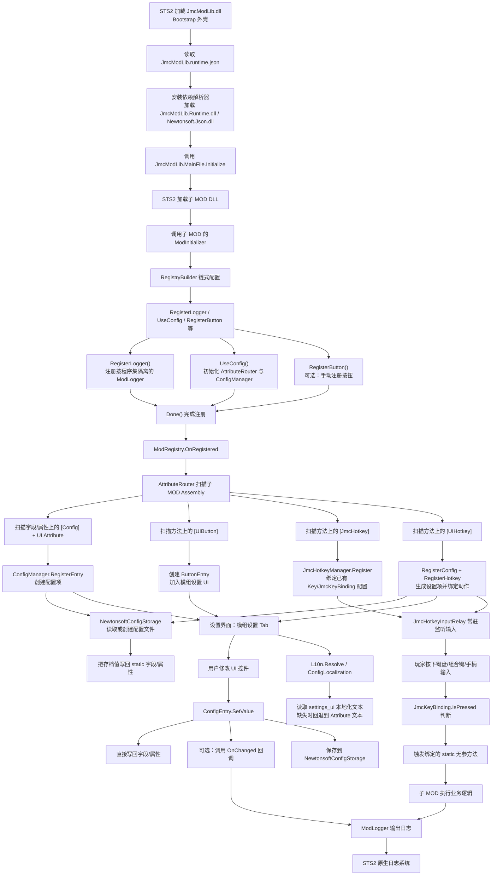

# JmcModLib STS2 Interface Guide

版本基准：JmcModLib 1.0.84

本文档面向使用 JmcModLib 开发《Slay the Spire 2》子 MOD 的场景，重点说明稳定入口、推荐写法、配置 UI Attribute、日志、热键、本地化、存储与扩展接口。

JmcModLib 的设计目标是让不同 C# 游戏的前置库尽量共享一套接入心智：子 MOD 入口负责注册，配置项通过 Attribute 自动扫描，运行期功能通过少量工具类访问。

## 目录

- 快速开始
- 注册入口
- 日志系统
- 配置系统
- 设置 UI Attribute
- 按钮与热键
- 预制件
- 本地化
- 配置存储
- 依赖检测
- 反射与访问器
- 运行时信息
- 工作流程图
- UML 结构图
- 常见模式与建议

## 工作流程图

下面这张图描述的是 STS2 先加载 JmcModLib Bootstrap、Bootstrap 按本地依赖表挂载 Runtime 和第三方 DLL 后，子 MOD 接入 JmcModLib 完成注册、扫描、配置 UI、热键、日志与存储实际生效的整体流程。



核心可以理解为两条主线：

- 启动线：`Register -> UseConfig -> Done -> Attribute 扫描 -> 注册配置/按钮/热键`。
- 运行线：`设置 UI 修改配置 -> 写回字段并保存`，以及 `输入中继捕获热键 -> 调用绑定方法`。

## UML 结构图

下面的 UML 类图只覆盖子 MOD 最常接触的稳定接口，以及它们背后的核心协作关系；游戏 UI 桥接类、原生控件克隆器等内部实现没有放进图里，避免主线过载。

```mermaid
classDiagram
    direction LR

    class ModRegistry {
        +Register(modId, displayName, version, assembly) RegistryBuilder
        +Register(deferredCompletion, modId, displayName, version, assembly) RegistryBuilder?
        +Register(deferredCompletion, modInfo, displayName, version, assembly) RegistryBuilder?
        +GetContext(assembly) ModContext?
        +GetModId(assembly) string
        +GetDisplayName(assembly) string
        +GetVersion(assembly) string
        +Unregister(assembly) bool
    }

    class ModBootstrap {
        +Init~T~(modId, displayName, version) RegistryBuilder
        +Init(assembly, modId, displayName, version) RegistryBuilder
        +Init~T~() RegistryBuilder
    }

    class RegistryBuilder {
        +WithDisplayName(displayName) RegistryBuilder
        +WithVersion(version) RegistryBuilder
        +RegisterLogger(...) RegistryBuilder
        +UseAttributeRouting() RegistryBuilder
        +UseConfig(storage) RegistryBuilder
        +RegisterButton(...) RegistryBuilder
        +Done() ModContext
    }

    class ModContext {
        +Assembly Assembly
        +ModId string
        +DisplayName string
        +Version string
        +LoggerContext string
        +Tag string
    }

    class AttributeRouter {
        +RegisterHandler~TAttribute~(handler)
        +ScanAssembly(assembly)
        +UnscanAssembly(assembly)
    }

    class ConfigManager {
        +Init()
        +RegisterConfig~TValue~(...) string
        +RegisterButton(...) string
        +GetEntries(assembly) IReadOnlyCollection
        +GetGroups(assembly) IEnumerable
        +GetValue(key, assembly) object?
        +SetValue(key, value, assembly) bool
        +ResetAssembly(assembly)
        +SetStorage(storage, assembly)
        +Flush(assembly)
    }

    class ConfigEntry {
        <<abstract>>
        +Assembly Assembly
        +StorageKey string
        +Group string
        +DisplayName string
        +Key string
        +SourceDeclaringType Type?
        +SourceMemberName string?
        +ValueType Type
        +DefaultValue object?
        +GetValue() object?
        +SetValue(value)
        +Reset() bool
    }

    class ConfigEntryT {
        +GetTypedValue() TValue
        +SetTypedValue(value)
    }

    class ButtonEntry {
        +ButtonText string
        +Color UIButtonColor
        +Invoke()
    }

    class ConfigAttribute {
        <<attribute>>
        +DisplayName string
        +OnChanged string?
        +Group string
        +Key string?
        +Description string?
        +LocTable string?
        +DisplayNameKey string?
        +DescriptionKey string?
        +GroupKey string?
        +Order int
        +RestartRequired bool
    }

    class UIConfigAttribute {
        <<abstract attribute>>
        +IsValid(valueType, defaultValue, errorMessage) bool
    }

    class UIToggleAttribute {
        <<attribute>>
    }

    class UISliderAttribute {
        <<attribute>>
        +Min double
        +Max double
        +Step double
    }

    class UIIntSliderAttribute {
        <<attribute>>
        +Min double
        +Max double
        +Step double
    }

    class UIFloatSliderAttribute {
        <<attribute>>
        +Min double
        +Max double
        +DecimalPlaces int
    }

    class UIDropdownAttribute {
        <<attribute>>
        +Options IReadOnlyList
        +Exclude IReadOnlyList
    }

    class UIInputAttribute {
        <<attribute>>
        +CharacterLimit int
        +Multiline bool
    }

    class UIKeybindAttribute {
        <<attribute>>
        +AllowKeyboard bool
        +AllowController bool
    }

    class UIButtonAttribute {
        <<attribute>>
        +Description string
        +ButtonText string
        +Group string
        +Color UIButtonColor
        +Order int
        +HelpText string?
    }

    class JmcHotkeyAttribute {
        <<attribute>>
        +BindingMember string
        +ConsumeInput bool
        +ExactModifiers bool
        +AllowEcho bool
        +DebounceMs ulong
    }

    class UIHotkeyAttribute {
        <<attribute>>
        +DisplayName string
        +Group string
        +DefaultKeyboard Key
        +DefaultModifiers JmcKeyModifiers
        +DefaultController string
        +AllowKeyboard bool
        +AllowController bool
    }

    class JmcHotkeyManager {
        +Register(key, bindingGetter, action, ...) void
        +Register(key, keyGetter, action, ...) void
        +Unregister(key, assembly) bool
        +UnregisterAssembly(assembly) void
    }

    class JmcKeyBinding {
        <<record struct>>
        +Keyboard Key
        +Controller string
        +Modifiers JmcKeyModifiers
        +HasKeyboard bool
        +HasController bool
        +WithKeyboard(key, modifiers) JmcKeyBinding
        +WithController(controller) JmcKeyBinding
        +IsPressed(inputEvent, allowEcho, exactModifiers) bool
        +IsReleased(inputEvent) bool
    }

    class ModLogger {
        +RegisterAssembly(...) void
        +Trace(message)
        +Debug(message)
        +Info(message)
        +Warn(message)
        +Error(message)
        +Fatal(exception, message)
        +SetLogLevel(level)
        +GetSnapshot() LoggerSnapshot
    }

    class L10n {
        +SupportedLanguages IReadOnlyList
        +CurrentLanguage string
        +Resolve(key, fallback, table, assembly) string
        +ResolveAny(keys, fallback, table, assembly) string
        +Exists(table, key) bool
        +GetFormattedText(table, key) string
    }

    class JmcConfirmationPopup {
        +IsAvailable bool
        +ShowConfirmationAsync(title, body, confirmText, cancelText) Task<bool>
        +ShowConfirmationAsync(LocString title, LocString body, LocString confirmText, LocString cancelText) Task<bool>
        +ShowMessageAsync(title, body, okText) Task<bool>
    }

    class IConfigStorage {
        <<interface>>
        +GetFileName(assembly) string
        +GetFilePath(assembly) string
        +Exists(assembly) bool
        +Save(key, group, value, assembly) void
        +TryLoad(key, group, valueType, value, assembly) bool
        +Flush(assembly) void
    }

    class NewtonsoftConfigStorage {
        +GetFileName(assembly) string
        +GetFilePath(assembly) string
        +Exists(assembly) bool
        +Save(key, group, value, assembly) void
        +TryLoad(key, group, valueType, value, assembly) bool
        +Flush(assembly) void
    }

    class JsonConfigStorage {
        +GetFileName(assembly) string
        +GetFilePath(assembly) string
        +Exists(assembly) bool
        +Save(key, group, value, assembly) void
        +TryLoad(key, group, valueType, value, assembly) bool
        +Flush(assembly) void
    }

    class ModDependencyChecker {
        +RequireMethod(methodName, parameterTypes) ModDependencyChecker
        +Check() ModDependencyResult
        +IsAvailable() bool
        +TryInvoke(methodName, instance, result, args) bool
        +TryInvokeVoid(methodName, instance, args) bool
    }

    class MemberAccessor {
        +Get(type, memberName) MemberAccessor
        +GetAll(type) IEnumerable
        +GetValue(target) object?
        +SetValue(target, value) void
    }

    class MethodAccessor {
        +Get(type, methodName, parameterTypes) MethodAccessor
        +GetAll(type) IEnumerable
        +Invoke(instance, args) object?
        +InvokeStaticVoid() void
    }

    ModBootstrap --> ModRegistry : wraps
    ModRegistry --> RegistryBuilder : creates
    RegistryBuilder --> ModContext : Done()
    ModRegistry --> ModContext : stores
    RegistryBuilder --> ModLogger : RegisterLogger()
    RegistryBuilder --> ConfigManager : UseConfig()
    RegistryBuilder --> ConfigManager : RegisterButton()
    ConfigManager --> AttributeRouter : initializes
    AttributeRouter --> ConfigAttribute : scans
    AttributeRouter --> UIButtonAttribute : scans
    AttributeRouter --> JmcHotkeyAttribute : scans
    AttributeRouter --> UIHotkeyAttribute : scans

    ConfigManager --> ConfigEntry : registers
    ConfigEntry <|-- ConfigEntryT
    ConfigEntry <|-- ButtonEntry
    ConfigEntry --> ConfigAttribute : metadata
    ConfigEntry --> UIConfigAttribute : optional UI metadata
    UIConfigAttribute <|-- UIToggleAttribute
    UIConfigAttribute <|-- UISliderAttribute
    UIConfigAttribute <|-- UIIntSliderAttribute
    UIConfigAttribute <|-- UIFloatSliderAttribute
    UIConfigAttribute <|-- UIDropdownAttribute
    UIConfigAttribute <|-- UIInputAttribute
    UIConfigAttribute <|-- UIKeybindAttribute

    ConfigManager --> IConfigStorage : persists through
    IConfigStorage <|.. NewtonsoftConfigStorage
    IConfigStorage <|.. JsonConfigStorage
    ConfigManager --> L10n : resolves UI text

    JmcHotkeyAttribute --> JmcHotkeyManager : registers action
    UIHotkeyAttribute --> ConfigManager : creates config entry
    UIHotkeyAttribute --> JmcHotkeyManager : registers action
    JmcHotkeyManager --> JmcKeyBinding : matches input

    ModDependencyChecker --> MethodAccessor : caches methods
    ConfigManager --> MemberAccessor : reads and writes config members
    ConfigManager --> MethodAccessor : invokes OnChanged
    ButtonEntry --> MethodAccessor : invokes button method
    JmcConfirmationPopup --> NModalContainer : opens native modal
    JmcConfirmationPopup --> NGenericPopup : creates native popup

    ModLogger --> ModContext : logger context
```



## 快速开始

### 最小入口

```csharp
using Godot;
using JmcModLib.Config;
using JmcModLib.Config.UI;
using JmcModLib.Utils;
using MegaCrit.Sts2.Core.Modding;

namespace MyMod;

[ModInitializer(nameof(Initialize))]
public partial class MainFile : Node
{
    public static void Initialize()
    {
        ModRegistry.Register(true, "MyMod", "My Mod", "1.0.0")?
            .RegisterLogger(uIFlags: LogConfigUIFlags.All)
            .UseConfig()
            .Done();

        ModLogger.Info("MyMod initialized.");
    }
}
```

### 推荐入口风格

为了贴近旧版 JmcModLib/Duckov 的使用习惯，推荐子 MOD 使用 `ModRegistry.Register(...)?....Done()` 链式入口。

```csharp
ModRegistry.Register(true, VersionInfo.Name, VersionInfo.Name, VersionInfo.Version)?
    .RegisterLogger(uIFlags: LogConfigUIFlags.All)
    .UseConfig()
    .Done();
```

如果不想显式传版本号，也可以让 JML 从 STS2 的 manifest/assembly 元数据回退读取：

```csharp
ModBootstrap.Init<MainFile>()
    .RegisterLogger()
    .UseConfig()
    .Done();
```

当前 STS2 的 manifest 是必填文件，因此后续更推荐逐步走“少传参数，自动从 manifest 构造上下文”的方向。但为保持跨游戏统一接口，`ModRegistry.Register` 仍是主入口。

## 注册入口

命名空间：`JmcModLib.Core`

全局 using 已包含：

```csharp
global using JmcModLib.Core;
global using JmcModLib.Utils;
```

因此多数子 MOD 可以直接调用 `ModRegistry` 和 `ModLogger`。

### ModRegistry.Register

```csharp
public static RegistryBuilder Register(
    string modId,
    string? displayName = null,
    string? version = null,
    Assembly? assembly = null)
```

立即返回 `RegistryBuilder`，最后需要 `.Done()` 完成注册并触发 Attribute 扫描。

```csharp
ModRegistry.Register("BetterMap", "BetterMap", "1.2.0")
    .RegisterLogger()
    .UseConfig()
    .Done();
```

### 延迟完成注册

```csharp
public static RegistryBuilder? Register(
    bool deferredCompletion,
    string modId,
    string? displayName = null,
    string? version = null,
    Assembly? assembly = null)
```

当 `deferredCompletion` 为 `true` 时，返回 builder，允许继续链式注册；为 `false` 时会自动 `.Done()`，返回 `null`。

```csharp
ModRegistry.Register(true, VersionInfo.Name, VersionInfo.Name, VersionInfo.Version)?
    .RegisterLogger()
    .UseConfig()
    .Done();
```

### 通过 modInfo 注册

```csharp
public static RegistryBuilder? Register(
    bool deferredCompletion,
    object? modInfo,
    string? displayName = null,
    string? version = null,
    Assembly? assembly = null)
```

JML 会尝试从 `modInfo` 中读取这些字段或属性：

- `id` / `Id` / `modId` / `ModId`
- `displayName` / `DisplayName` / `name` / `Name`
- `version` / `Version`

这用于兼容不同游戏或旧版 JML 的 `VersionInfo.modInfo` 风格。

### ModBootstrap

```csharp
ModBootstrap.Init<T>(string modId, string? displayName = null, string? version = null)
ModBootstrap.Init(Assembly assembly, string modId, string? displayName = null, string? version = null)
ModBootstrap.Init<T>()
```

`ModBootstrap` 是更自动化的入口包装。当前可用，但从跨游戏统一心智看，建议子 MOD 优先保留 `ModRegistry.Register(...)?` 风格。

### RegistryBuilder

常用方法：

```csharp
WithDisplayName(string displayName)
WithVersion(string version)
RegisterLogger(...)
UseAttributeRouting()
UseConfig(IConfigStorage? storage = null)
RegisterButton(...)
Done()
```

`UseConfig()` 会同时初始化 AttributeRouter、ConfigManager，并注册配置、按钮、热键相关 Attribute 处理器。

`Done()` 会触发 `ModRegistry.OnRegistered`，AttributeRouter 也会在这里扫描子 MOD assembly。

## 日志系统

命名空间：`JmcModLib.Utils`

JML 日志是对 STS2 原生 `MegaCrit.Sts2.Core.Logging.Logger` 的按程序集封装。子 MOD 可以直接调用 `ModLogger`，不需要自己包一层 logger。

### 注册日志

```csharp
.RegisterLogger(
    minimumLevel: LogLevel.Info,
    prefixFlags: LogPrefixFlags.Default,
    throwOnFatal: true,
    logType: LogType.Generic,
    includeExceptionDetails: true,
    uIFlags: LogConfigUIFlags.None)
```

常用写法：

```csharp
.RegisterLogger(uIFlags: LogConfigUIFlags.All)
```

### 输出日志

```csharp
ModLogger.Trace("trace");
ModLogger.Debug("debug");
ModLogger.Info("info");
ModLogger.Warn("warn");
ModLogger.Warn("warn", exception);
ModLogger.Error("error");
ModLogger.Error("error", exception);
ModLogger.Fatal(exception, "fatal");
```

默认会自动解析调用方 assembly，并使用该 MOD 的注册上下文作为 logger context。

如果在跨程序集工具中调用，可以显式传 assembly：

```csharp
ModLogger.Info("message", typeof(MainFile).Assembly);
```

### 日志配置

```csharp
ModLogger.GetLogLevel();
ModLogger.SetLogLevel(LogLevel.Debug);
ModLogger.GetLogType();
ModLogger.SetLogType(LogType.Generic);
ModLogger.GetPrefixFlags();
ModLogger.SetPrefixFlags(LogPrefixFlags.Timestamp);
ModLogger.TogglePrefixFlag(LogPrefixFlags.Timestamp);
ModLogger.GetSnapshot();
```

### LogPrefixFlags

```csharp
[Flags]
public enum LogPrefixFlags
{
    None = 0,
    Timestamp = 1 << 0,
    Default = Timestamp,
}
```

### LogConfigUIFlags

```csharp
[Flags]
public enum LogConfigUIFlags
{
    None = 0,
    LogLevel = 1 << 0,
    PrefixFlags = 1 << 1,
    TestButtons = 1 << 2,
    Default = LogLevel | PrefixFlags,
    All = LogLevel | PrefixFlags | TestButtons,
}
```

当前 logger UI 构造入口已保留，后续可以继续接到游戏内设置界面。

## 配置系统

命名空间：`JmcModLib.Config`

JML 的配置系统以 `ConfigAttribute` 标记静态字段或静态属性，通过 `UseConfig()` 自动扫描并注册。

配置值变化时默认会：

- 直接写回字段或属性
- 保存到 JSON 配置文件
- 通知设置 UI 更新
- 如果设置了 `OnChanged`，调用回调

### 基础写法

```csharp
[UIToggle]
[Config(
    "启用功能",
    group: "general",
    Description = "关闭后不再执行该功能。",
    Key = "general.enabled",
    Order = 10)]
public static bool Enabled = true;
```

无需 `OnChanged` 的情况下，UI 修改会直接写回 `Enabled`。

### 属性写法

```csharp
private static int backingValue = 3;

[UIIntSlider(0, 10)]
[Config("等级", group: "general", Key = "general.level")]
public static int Level
{
    get => backingValue;
    set
    {
        backingValue = value;
        ModLogger.Info($"Level changed to {value}");
    }
}
```

属性必须可读可写。字段或属性必须是 static。

### OnChanged 回调

只有当修改配置后需要刷新缓存、重建 UI、重算运行时状态时才需要 `OnChanged`。

```csharp
[UIFloatSlider(0f, 1f, decimalPlaces: 2)]
[Config(
    "透明度",
    onChanged: nameof(OnAlphaChanged),
    group: "visual",
    Key = "visual.alpha")]
public static float Alpha = 0.8f;

private static void OnAlphaChanged(float value)
{
    ModLogger.Info($"Alpha => {value}");
}
```

回调要求：

- static
- 一个参数
- 参数类型与配置项类型完全一致
- 建议返回 void

### ConfigAttribute 参数

构造参数：

```csharp
ConfigAttribute(string displayName, string? onChanged = null, string group = ConfigAttribute.DefaultGroup)
```

属性：

```csharp
Key              // 存储 key；不填则使用 DeclaringType.FullName.MemberName
Description      // 描述文本；会进入 HoverTip
LocTable         // 本地化表；默认 settings_ui
DisplayNameKey   // 显示名本地化 key
DescriptionKey   // 描述本地化 key
GroupKey         // 分组本地化 key
Order            // 排序，越小越靠前
RestartRequired  // 是否显示重启提示
```

### 分组

`group` 用于把配置项放进同一组。当前每个子 MOD 本身可折叠，MOD 内分组也可以作为独立配置分组显示。

```csharp
internal const string MapGroup = "map_overview";

[UIIntSlider(0, 500)]
[Config("小地图左边距", group: MapGroup, Key = "map.left", Order = 10)]
public static int MapLeft = 100;
```

### ConfigManager 运行时 API

```csharp
ConfigManager.Init();
ConfigManager.SetStorage(IConfigStorage storage, Assembly? assembly = null);
ConfigManager.GetStorage(Assembly? assembly = null);
ConfigManager.Flush(Assembly? assembly = null);
ConfigManager.GetEntries(Assembly? assembly = null);
ConfigManager.GetEntries(string group, Assembly? assembly = null);
ConfigManager.GetGroups(Assembly? assembly = null);
ConfigManager.TryGetEntry(string key, out ConfigEntry? entry, Assembly? assembly = null);
ConfigManager.GetValue(string key, Assembly? assembly = null);
ConfigManager.SetValue(string key, object? value, Assembly? assembly = null);
ConfigManager.ResetAssembly(Assembly? assembly = null);
ConfigManager.Unregister(Assembly? assembly = null);
```

手动注册配置：

```csharp
string key = ConfigManager.RegisterConfig(
    "运行时配置",
    getter: () => MyValue,
    setter: value => MyValue = value,
    group: "general",
    uiAttribute: new UIIntSliderAttribute(0, 100),
    storageKey: "general.runtime_value");
```

一般子 MOD 优先使用 Attribute，手动注册适合动态生成配置项。

## 设置 UI Attribute

命名空间：`JmcModLib.Config.UI`

JML 会将配置项接入 STS2 设置界面的“模组设置”标签页，并尽量复用游戏原生 UI 风格。每个子 MOD 在该页面中的折叠状态会保存到 JML 自己的 UI 状态文件，下次启动游戏后自动恢复。

### UIToggle

类型：`bool`

```csharp
[UIToggle]
[Config("启用功能")]
public static bool Enabled = true;
```

### UIInput

类型：`string`

```csharp
[UIInput(characterLimit: 32)]
[Config("玩家昵称")]
public static string PlayerName = "JMC";
```

参数：

```csharp
UIInputAttribute(int characterLimit = 0, bool multiline = false)
```

当前 multiline 是元数据声明，具体 UI 承载仍取决于 STS2 原生控件桥接。

### UIDropdown

类型：`string` 或 enum。

Enum：

```csharp
public enum Theme
{
    Classic,
    Gold,
    Emerald,
}

[UIDropdown]
[Config("主题")]
public static Theme CurrentTheme = Theme.Gold;
```

String：

```csharp
[UIDropdown("Compact", "Normal", "Large")]
[Config("界面大小")]
public static string UiSize = "Normal";
```

动态 String：

```csharp
[UIDropdown]
[Config("默认打开显示器", Key = "ui.default_open_screen")]
public static string DefaultOpenScreen = "跟随游戏窗口";

public static IReadOnlyList<string> GetDefaultOpenScreenOptions()
{
    var options = new List<string>
    {
        "跟随游戏窗口",
        "主显示器"
    };

    for (int screen = 0; screen < DisplayServer.GetScreenCount(); screen++)
    {
        Vector2I size = DisplayServer.ScreenGetSize(screen);
        Vector2I position = DisplayServer.ScreenGetPosition(screen);
        options.Add($"显示器 {screen + 1} ({size.X}x{size.Y} @ {position.X},{position.Y})");
    }

    return options;
}
```

当 `string` 类型的 `[UIDropdown]` 没有写静态候选项时，JML 会在同一个配置类里按以下顺序查找静态无参数 provider。provider 跟配置字段/属性名绑定，不跟 `ConfigAttribute.Key` 绑定，所以即使配置使用显式保存 key 也能生效：

- `{字段名或属性名}Options`
- `Get{字段名或属性名}Options`
- `Build{字段名或属性名}Options`

provider 可以是静态方法或静态属性，返回 `string`、`IEnumerable<string>`、其他 `IEnumerable`，或任意可 `ToString()` 的对象。空白项会被丢弃，重复项会去重。若没有找到 provider 或 provider 返回空列表，则回退为当前配置值。

注意：当前 `UIDropdownAttribute` 的参数命名为 `exclude`，但对 string 下拉实际被当作静态候选项；对 enum 下拉可用作排除项。动态 provider 只在 string 下拉且未提供静态候选项时生效。

### UISlider

通用数字滑条，支持常见数字类型。

```csharp
[UISlider(0.0, 1.0, 0.05)]
[Config("缩放")]
public static double Scale = 0.5;
```

### UIIntSlider

类型：`int`

```csharp
[UIIntSlider(0, 500)]
[Config("小地图左边距")]
public static int BaseLeft = 100;
```

参数：

```csharp
UIIntSliderAttribute(int min, int max, int characterLimit = 5)
```

### UIFloatSlider

类型：`float`

```csharp
[UIFloatSlider(0f, 1f, decimalPlaces: 2)]
[Config("背景透明度")]
public static float Alpha = 0.88f;
```

参数：

```csharp
UIFloatSliderAttribute(float min, float max, int decimalPlaces = 1, int characterLimit = 5)
```

### UIKeybind

类型：`Godot.Key` 或 `JmcKeyBinding`。

键盘单键：

```csharp
[UIKeybind]
[Config("打开面板热键", group: "keybinds", Key = "keybind.open_panel")]
public static Key OpenPanelKey = Key.F8;
```

键盘组合键 + 手柄：

```csharp
[UIKeybind(allowController: true)]
[Config("打开面板热键", group: "keybinds", Key = "keybind.open_panel_combo")]
public static JmcKeyBinding OpenPanelBinding = new(
    Key.F9,
    Controller.leftTrigger.ToString(),
    JmcKeyModifiers.Ctrl);
```

`Godot.Key` 只支持键盘；如果 `allowController: true`，字段类型必须使用 `JmcKeyBinding`。

## 按钮与热键

### 输入模块文件结构

从 `1.0.84` 开始，JML 的热键相关源文件物理上移动到顶层 `Input/Hotkeys/`，后续 Steam Input 与更多输入后端会放在 `Input/Backends/` 和 `Input/Steam/` 下。

这只是内部结构整理，不改变子 MOD 调用方式：

```csharp
using JmcModLib.Config.UI;
```

`[UIHotkey]`、`[JmcHotkey]`、`JmcKeyBinding`、`JmcHotkeyManager` 仍然保持在 `JmcModLib.Config.UI` 命名空间。当前版本没有写入 Steam Input manifest，也没有要求子 MOD 迁移到新的 `JmcModLib.Input` 命名空间。

### UIButton

命名空间：`JmcModLib.Config.UI`

用于在设置 UI 中创建按钮行。方法必须 static 且无参数。

```csharp
[UIButton(
    "重建缓存",
    "执行",
    "debug",
    Key = "button.rebuild_cache",
    HelpText = "清空并重建本 MOD 的运行时缓存。",
    Color = UIButtonColor.Gold,
    Order = 10)]
public static void RebuildCache()
{
    ModLogger.Info("Cache rebuilt.");
}
```

构造参数：

```csharp
UIButtonAttribute(string description, string buttonText = "按钮", string group = ConfigAttribute.DefaultGroup)
```

属性：

```csharp
Key
LocTable
DisplayNameKey
DescriptionKey
ButtonTextKey
GroupKey
Color
Order
HelpText
```

`Description` 是按钮行标题，`HelpText` 是悬浮说明。

### UIButtonColor

```csharp
public enum UIButtonColor
{
    Default,
    Green,
    Red,
    Gold,
    Blue,
    Reset,
}
```

### 手动注册按钮

```csharp
.RegisterButton(
    out string key,
    "手动按钮",
    DoSomething,
    "执行",
    group: "debug",
    storageKey: "button.manual",
    helpText: "这个按钮通过 RegisterButton 手动注册。",
    order: 5)
```

### JmcKeyBinding

`JmcKeyBinding` 是 JML 自有热键值类型，不会注入游戏原生 InputMap 命令表。

```csharp
public readonly record struct JmcKeyBinding(
    Key Keyboard = Key.None,
    string Controller = "",
    JmcKeyModifiers Modifiers = JmcKeyModifiers.None)
```

常用属性：

```csharp
HasKeyboard
HasModifiers
HasController
```

常用方法：

```csharp
WithKeyboard(Key keyboard)
WithKeyboard(Key keyboard, JmcKeyModifiers modifiers)
WithController(string? controller)
IsPressed(InputEvent inputEvent, bool allowEcho = false, bool exactModifiers = true)
IsReleased(InputEvent inputEvent)
ToKeyboardText()
ToString()
```

### JmcKeyModifiers

```csharp
[Flags]
public enum JmcKeyModifiers
{
    None = 0,
    Ctrl = 1,
    Shift = 2,
    Alt = 4,
    Meta = 8,
}
```

组合键示例：

```csharp
public static JmcKeyBinding ConsoleHotkey = new(Key.F10, JmcKeyModifiers.Ctrl | JmcKeyModifiers.Shift);
```

### 运行时热键：JmcHotkey

`[JmcHotkey]` 绑定一个已有配置字段或属性。适合“设置 UI 里已有一个 Keybind 配置项，同时按下它要执行某个函数”。

```csharp
[UIKeybind]
[Config("打开面板", group: "keybinds", Key = "keybind.open_panel")]
public static Key OpenPanelKey = Key.F8;

[JmcHotkey(nameof(OpenPanelKey), ConsumeInput = true)]
public static void TogglePanel()
{
    ModLogger.Info("Toggle panel.");
}
```

绑定 `JmcKeyBinding`：

```csharp
[UIKeybind(allowController: true)]
[Config("打开面板", group: "keybinds", Key = "keybind.open_panel_combo")]
public static JmcKeyBinding OpenPanelBinding = new(Key.F9, "leftTrigger", JmcKeyModifiers.Ctrl);

[JmcHotkey(nameof(OpenPanelBinding), ConsumeInput = false)]
public static void TogglePanelWithCombo()
{
    ModLogger.Info("Toggle panel by combo.");
}
```

`JmcHotkeyAttribute` 属性：

```csharp
BindingMember    // 构造参数；字段或属性名
Key              // 运行时注册 key；一般不用填
ConsumeInput     // 触发后是否吃掉输入，默认 true
ExactModifiers   // 是否要求修饰键完全匹配，默认 true
AllowEcho        // 是否允许键盘 echo，默认 false
DebounceMs       // 防抖毫秒数，默认 150
```

被绑定成员要求：

- static
- 可读
- 类型为 `Godot.Key` 或 `JmcKeyBinding`

被触发方法要求：

- static
- 无参数
- 建议返回 void

### 一行生成配置 + 热键：UIHotkey

`[UIHotkey]` 会同时创建一个设置项和运行时热键绑定。适合不需要单独暴露字段、只想把某个函数挂到一个可配置热键上的场景。

```csharp
[UIHotkey(
    "打开调试窗口",
    group: "keybinds",
    Key = "keybind.open_debug",
    Description = "按下后切换调试窗口。",
    DefaultKeyboard = Key.F10,
    DefaultModifiers = JmcKeyModifiers.Ctrl,
    AllowController = true,
    DefaultController = "leftTrigger",
    Order = 10)]
public static void ToggleDebugWindow()
{
    ModLogger.Info("Debug window toggled.");
}
```

`UIHotkeyAttribute` 属性：

```csharp
DisplayName
Group
Key
Description
LocTable
DisplayNameKey
DescriptionKey
GroupKey
Order
RestartRequired
DefaultKeyboard
DefaultModifiers
DefaultController
AllowKeyboard
AllowController
ConsumeInput
ExactModifiers
AllowEcho
DebounceMs
```

### 手动注册运行时热键

```csharp
JmcHotkeyManager.Register(
    "debug.toggle",
    () => DebugHotkey,
    ToggleDebugWindow,
    consumeInput: true,
    exactModifiers: true);
```

也支持 `Func<Key>`：

```csharp
JmcHotkeyManager.Register(
    "debug.toggle.simple",
    () => SimpleKey,
    ToggleDebugWindow);
```

注销：

```csharp
JmcHotkeyManager.Unregister("debug.toggle");
JmcHotkeyManager.UnregisterAssembly();
```

通常不需要手动注销，JML 会在 MOD unregister 时清理。

## 预制件

命名空间：`JmcModLib.Prefabs`

预制件模块用于把游戏内已经存在、风格和手柄交互都比较完整的 UI 控件抽象成稳定 API。子 MOD 优先使用这些封装，避免重新手搓一套不一致的 UI。

### JmcConfirmationPopup

`JmcConfirmationPopup` 复用游戏原生的 `NGenericPopup`、`NVerticalPopup` 与 `NModalContainer`，也就是退出游戏确认框同一套底层控件。

最简单的字符串写法：

```csharp
using JmcModLib.Prefabs;

bool confirmed = await JmcConfirmationPopup.ShowConfirmationAsync(
    title: "确认操作",
    body: "确定要执行这个操作吗？",
    confirmText: "确认",
    cancelText: "取消");

if (confirmed)
{
    ModLogger.Info("玩家确认了操作。");
}
```

推荐的本地化写法：

```csharp
using JmcModLib.Prefabs;
using MegaCrit.Sts2.Core.Localization;

bool confirmed = await JmcConfirmationPopup.ShowConfirmationAsync(
    new LocString("settings_ui", "MY_MOD.CONFIRM.title"),
    new LocString("settings_ui", "MY_MOD.CONFIRM.body"),
    new LocString("settings_ui", "MY_MOD.CONFIRM.confirm"),
    new LocString("settings_ui", "MY_MOD.CONFIRM.cancel"));
```

只有确认按钮的提示框：

```csharp
await JmcConfirmationPopup.ShowMessageAsync(
    "提示",
    "操作已经完成。",
    okText: "好的");
```

按钮形态：

- `ShowConfirmationAsync`：标准确认框，固定显示确认 + 取消。
- `ShowMessageAsync`：只有确认按钮，是最常用的单按钮提示。
- JML 暂不暴露“只有取消按钮”或“两个按钮都没有”的弹窗，避免为了视觉上差异很小的边角场景增加 API 心智负担；如果后续需要无按钮弹窗，应另做自动关闭或可主动关闭的 handle 型 API。

可用性：

```csharp
if (JmcConfirmationPopup.IsAvailable)
{
    await JmcConfirmationPopup.ShowMessageAsync("JML", "当前可以弹出模态窗口。");
}
```

行为约定：

- 如果 `NModalContainer.Instance` 尚未创建，返回 `false` 并写入警告日志。
- 如果已有其他模态窗口打开，返回 `false` 并写入警告日志。
- 玩家按确认返回 `true`，按取消、关闭或弹窗被外部清理返回 `false`。
- 默认按钮文本来自游戏的 `main_menu_ui/GENERIC_POPUP.confirm` 与 `main_menu_ui/GENERIC_POPUP.cancel`。

富文本支持：

- `body` 正文使用游戏原生 `MegaRichTextLabel`，支持游戏富文本/BBCode，例如 `[gold]`、`[red]`、`[green]`、`[b]`、`[i]` 和换行。
- `title` 标题使用 `MegaLabel`，按普通文本处理，不建议写富文本标签。
- `confirmText` / `cancelText` 按钮文字使用普通按钮标签，不建议写富文本标签。

```csharp
await JmcConfirmationPopup.ShowConfirmationAsync(
    "危险操作",
    "[gold]这个操作不可撤销。[/gold]\n[color=#ff8f8f]确认后会立即生效。[/color]",
    confirmText: "确认",
    cancelText: "取消");
```

## 本地化

命名空间：`JmcModLib.Utils`

STS2 会从 PCK 中自动发现 MOD 本地化文件，因此 JML 不再提供也不推荐 `RegisterL10n()` 入口。

### 文件约定

推荐将配置 UI 文本放在子 MOD PCK 内：

```text
res://<PckName>/localization/<language>/settings_ui.json
```

例如：

```text
res://BetterMap/localization/zhs/settings_ui.json
res://BetterMap/localization/eng/settings_ui.json
```

当前 JML 默认表名：

```csharp
L10n.DefaultTable == "settings_ui"
```

### 支持语言

JML 从 `LocManager.Languages` 读取当前游戏支持语言。当前讨论过的语言包括：

- `zhs` 简体中文
- `eng` 英语
- `fra` 法语
- `ita` 意大利语
- `deu` 德语
- `spa` 西班牙语 - 西班牙
- `jpn` 日语
- `kor` 韩语
- `pol` 波兰语
- `ptb` 葡萄牙语 - 巴西
- `rus` 俄语
- `esp` 西班牙语 - 拉丁美洲
- `tha` 泰语
- `tur` 土耳其语

### 配置项本地化 key 约定

如果不显式指定 `DisplayNameKey` / `DescriptionKey` / `GroupKey`，JML 会按约定生成 key。

前缀：

```text
EXTENSION.JMCMODLIB.CONFIG
```

配置项显示名：

```text
EXTENSION.JMCMODLIB.CONFIG.<ModId>.<StorageKey>.NAME
```

配置项描述：

```text
EXTENSION.JMCMODLIB.CONFIG.<ModId>.<StorageKey>.DESCRIPTION
```

按钮文本：

```text
EXTENSION.JMCMODLIB.CONFIG.<ModId>.<StorageKey>.BUTTON
```

下拉选项：

```text
EXTENSION.JMCMODLIB.CONFIG.<ModId>.<StorageKey>.OPTION.<OptionName>
```

分组名：

```text
EXTENSION.JMCMODLIB.CONFIG.<ModId>.GROUP.<GroupName>
```

`StorageKey` 中的 `/`、`\` 会转为 `.`，空白会合并为 `_`。

### 示例 settings_ui.json

```json
{
  "EXTENSION.JMCMODLIB.CONFIG.BetterMap.map.left.NAME": "小地图左边距",
  "EXTENSION.JMCMODLIB.CONFIG.BetterMap.map.left.DESCRIPTION": "控制小地图距离屏幕左侧的像素偏移。",
  "EXTENSION.JMCMODLIB.CONFIG.BetterMap.GROUP.map_overview": "地图概览"
}
```

### 显式指定 key

```csharp
[UIIntSlider(0, 500)]
[Config(
    "Fallback 名称",
    group: "map_overview",
    Key = "map.left",
    DisplayNameKey = "MYMOD.MAP_LEFT.NAME",
    DescriptionKey = "MYMOD.MAP_LEFT.DESCRIPTION",
    GroupKey = "MYMOD.GROUP.MAP")]
public static int MapLeft = 100;
```

### L10n API

```csharp
L10n.SupportedLanguages
L10n.CurrentLanguage
L10n.GetModLocalizationRoot(Assembly? assembly = null)
L10n.GetModLocalizationDirectory(string? language = null, Assembly? assembly = null)
L10n.GetModTablePath(string fileName, string? language = null, Assembly? assembly = null)
L10n.HasModTable(string fileName, string? language = null, Assembly? assembly = null)
L10n.EnumerateExistingModTablePaths(string fileName, Assembly? assembly = null)
L10n.Create(string table, string key, Action<LocString>? configure = null)
L10n.CreateIfExists(string table, string key, Action<LocString>? configure = null)
L10n.Exists(string table, string key)
L10n.Resolve(string? key, string? fallback = null, string? table = null, Assembly? assembly = null, Action<LocString>? configure = null)
L10n.ResolveAny(IEnumerable<string?> keys, string? fallback = null, string? table = null, Assembly? assembly = null, Action<LocString>? configure = null)
L10n.ResolvePath(string? path, string? fallback = null, Assembly? assembly = null, Action<LocString>? configure = null)
L10n.TryResolve(string? key, out string text, string? table = null, Assembly? assembly = null, Action<LocString>? configure = null)
L10n.GetFormattedText(string table, string key, Action<LocString>? configure = null)
L10n.GetRawText(string table, string key)
L10n.SubscribeToLocaleChange(LocManager.LocaleChangeCallback callback)
L10n.UnsubscribeToLocaleChange(LocManager.LocaleChangeCallback callback)
```

`Resolve` 支持 `table/key` 形式：

```csharp
string text = L10n.Resolve("settings_ui/MY_KEY", fallback: "Fallback");
```

## 配置存储

命名空间：`JmcModLib.Config.Storage`

默认后端：`NewtonsoftConfigStorage`。

`JsonConfigStorage` 仍保留为无第三方依赖的轻量后端；默认选择 Newtonsoft 是因为它对复杂对象、旧配置兼容和 converter 生态更宽松。

### 默认保存位置

默认优先使用 Godot 用户目录：

```text
OS.GetUserDataDir()/mods/config/<ModId>.json
```

在 STS2 中通常落在类似：

```text
C:\Users\<User>\AppData\Roaming\SlayTheSpire2\mods\config\<ModId>.json
```

如果 Godot 目录不可用，会回退到 LocalAppData 或 AppContext BaseDirectory。

### JSON 格式

JML 按 group 分组保存：

```json
{
  "Groups": {
    "map_overview": {
      "map.left": 100,
      "map.top": 150
    }
  }
}
```

`Newtonsoft.Json` 设置：

- enum 使用字符串
- 缩进输出
- `TypeNameHandling.None`，避免把 CLR 类型名写进配置文件
- `Godot.Color` 默认保存为 `#RRGGBBAA`

### 自定义存储后端

实现接口：

```csharp
public interface IConfigStorage
{
    string GetFileName(Assembly? assembly = null);
    string GetFilePath(Assembly? assembly = null);
    bool Exists(Assembly? assembly = null);
    void Save(string key, string group, object? value, Assembly? assembly = null);
    bool TryLoad(string key, string group, Type valueType, out object? value, Assembly? assembly = null);
    void Flush(Assembly? assembly = null);
}
```

注册：

```csharp
ModRegistry.Register(true, "MyMod")?
    .RegisterLogger()
    .UseConfig(new MyConfigStorage())
    .Done();
```

或运行时：

```csharp
ConfigManager.SetStorage(new NewtonsoftConfigStorage(customRoot));
```

## 依赖检测

命名空间：`JmcModLib.Utils`

JML 提供 `ModDependencyChecker` 用于检查另一个 MOD 是否加载、版本是否满足、某些公开方法是否存在。

### 基础示例

```csharp
var checker = ModDependencyExtensions
    .ForMod("OtherMod", "OtherMod.Api", "1.2.0")
    .RequireMethod("DoSomething", [typeof(int)]);

ModDependencyResult result = checker.Check();
if (!result.IsFullyAvailable)
{
    ModLogger.Warn(result.GetSummary());
    return;
}

checker.TryInvokeVoid("DoSomething", instance: null, 42);
```

### ModDependencyChecker API

```csharp
new ModDependencyChecker(string modId, string typeName, Version? requiredVersion = null)
RequireMethod(string methodName, Type[]? parameterTypes = null)
RequireMethods(params MethodSignature[] methods)
Check()
IsAvailable()
GetMethod(string methodName)
TryInvoke(string methodName, object? instance, out object? result, params object?[] args)
TryInvokeVoid(string methodName, object? instance, params object?[] args)
ResetCache()
```

### ModDependencyResult

```csharp
IsLoaded
VersionMatch
AllMethodsAvailable
ActualVersion
MissingMethods
ModType
Assembly
Mod
Manifest
IsFullyAvailable
GetSummary()
```

## 反射与访问器

命名空间：`JmcModLib.Reflection`

JML 内部扫描器和热键/按钮注册都使用缓存过的反射访问器。子 MOD 一般不需要直接使用，但如果要做动态桥接，建议使用这些类而不是裸 `Type.GetMethod()` / `FieldInfo.GetValue()`。

### MemberAccessor

用于字段/属性访问。

常用 API：

```csharp
MemberAccessor.Get(Type type, string memberName)
MemberAccessor.Get(MemberInfo member)
MemberAccessor.GetAll(Type type)
MemberAccessor.GetAll<T>()
MemberAccessor.GetIndexer(Type type, params Type[] parameterTypes)
```

实例属性：

```csharp
Name
DeclaringType
IsStatic
CanRead
CanWrite
ValueType
MemberType
TypedGetter
TypedSetter
```

读写：

```csharp
object? value = accessor.GetValue(target);
accessor.SetValue(target, value);

TValue value = accessor.GetValue<TTarget, TValue>(target);
accessor.SetValue<TTarget, TValue>(target, value);

TValue staticValue = accessor.GetValue<TValue>();
accessor.SetValue<TValue>(value);
```

### MethodAccessor

用于方法访问。

常用 API：

```csharp
MethodAccessor.Get(MethodInfo method)
MethodAccessor.Get(Type type, string methodName)
MethodAccessor.Get(Type type, string methodName, Type[]? parameterTypes)
MethodAccessor.GetAll(Type type)
MethodAccessor.GetAll<T>()
```

调用：

```csharp
object? result = accessor.Invoke(instance, args);
accessor.InvokeStaticVoid();
accessor.InvokeStaticVoid<T1>(arg1);
accessor.InvokeStaticVoid<T1, T2>(arg1, arg2);
```

如果可生成强类型委托，可通过：

```csharp
accessor.TypedDelegate
accessor.GetTypedDelegate()
```

### TypeAccessor

用于类型级 Attribute 与元数据访问，主要供 AttributeRouter 内部使用。

### ExprHelper

通过表达式获取字段/属性 getter/setter，并带程序集级缓存。

```csharp
var (getter, setter) = ExprHelper.GetOrCreateAccessors(() => SomeStaticConfig.Value);
int value = getter();
setter(10);
```

可选访问后端：

```csharp
ExprHelper.AccessMode = ExprHelper.MemberAccessMode.Emit;
ExprHelper.AccessMode = ExprHelper.MemberAccessMode.ExpressionTree;
ExprHelper.AccessMode = ExprHelper.MemberAccessMode.Reflection;
```

默认使用 Emit。

## 运行时信息

### ModRuntime

命名空间：`JmcModLib.Core`

```csharp
ModRuntime.TryGetLoadedMod(Assembly? assembly = null)
ModRuntime.TryGetManifest(Assembly? assembly = null)
ModRuntime.GetManifestId(Assembly? assembly = null)
ModRuntime.GetPckName(Assembly? assembly = null)
ModRuntime.GetDisplayName(Assembly? assembly = null)
ModRuntime.GetLoadedVersion(Assembly? assembly = null)
ModRuntime.FindModById(string modId)
ModRuntime.FindLoadedMod(string modId)
```

### ModContext

```csharp
Assembly
ModId
DisplayName
Version
LoggerConfigured
IsCompleted
LoggerContext
Tag
```

获取当前 MOD 上下文：

```csharp
if (ModRegistry.TryGetContext(out ModContext? context))
{
    ModLogger.Info(context.Tag);
}
```

## Attribute 扫描机制

命名空间：`JmcModLib.Core.AttributeRouter`

`UseConfig()` 会自动初始化 AttributeRouter。通常子 MOD 不需要直接使用。

流程：

1. 子 MOD 调用 `.UseConfig().Done()`。
2. `Done()` 触发 `ModRegistry.OnRegistered`。
3. AttributeRouter 扫描该 assembly 的类型、方法、字段、属性。
4. 发现并分发 Attribute：
   - `[Config]`
   - `[UIButton]`
   - `[JmcHotkey]`
   - `[UIHotkey]`
5. ConfigManager 注册配置项，设置界面刷新。

扩展自定义 Attribute 时可以实现：

```csharp
public interface IAttributeHandler
{
    void Handle(Assembly assembly, ReflectionAccessorBase accessor, Attribute attribute);
    Action<Assembly, IReadOnlyList<ReflectionAccessorBase>>? Unregister { get; }
}
```

然后注册：

```csharp
AttributeRouter.RegisterHandler<MyAttribute>(new MyAttributeHandler());
```

## 常见模式与建议

### 1. 普通配置项不需要 OnChanged

推荐：

```csharp
[UIIntSlider(0, 500)]
[Config("左边距", group: "map", Key = "map.left")]
public static int Left = 100;
```

除非需要刷新运行时对象，否则不要为了“保存值”写回调。JML 会直接写字段并保存。

### 2. 热键建议拆成“配置值 + 行为方法”

推荐：

```csharp
[UIKeybind]
[Config("打开界面", group: "keybinds", Key = "keybind.open")]
public static Key OpenKey = Key.F8;

[JmcHotkey(nameof(OpenKey))]
public static void OpenUi()
{
    // action
}
```

如果不需要字段，才用 `[UIHotkey]` 一步生成。

### 3. 本地化优先用约定 key

推荐子 MOD 的 `settings_ui.json` 使用 JML 约定 key，这样 C# 代码可以保留 fallback 中文，缺本地化时也不至于空白。

```csharp
[Config("小地图左边距", Key = "map.left")]
```

对应：

```json
{
  "EXTENSION.JMCMODLIB.CONFIG.BetterMap.map.left.NAME": "小地图左边距"
}
```

### 4. 不再需要 RegisterL10n

STS2 会自动加载 PCK 里的本地化表，JML 的 L10n 层只负责路径、fallback 和 `LocString` 包装。

### 5. 手柄热键使用 JmcKeyBinding

`Godot.Key` 只能表达键盘。需要手柄时：

```csharp
[UIKeybind(allowController: true)]
public static JmcKeyBinding Hotkey = new(Key.F9, "leftTrigger", JmcKeyModifiers.Ctrl);
```

### 6. 组合键支持键盘修饰键

当前支持：Ctrl / Shift / Alt / Meta。

手柄组合键暂未抽象为多个输入同时按下；当前手柄部分保存一个游戏 Input Action 名称。

### 7. 设置 UI 内捕获按键时不会触发运行时热键

JML 的热键中继会避开正在监听键位输入的设置控件，避免“刚改键位就触发动作”。

## 当前限制与注意事项

- `UIButton` 和 `UIHotkey` 绑定的方法必须是 static 无参数方法。
- `[Config]` 只支持 static 字段或 static 属性。
- `UIKeybind(allowController: true)` 必须搭配 `JmcKeyBinding`，不能搭配 `Godot.Key`。
- 手柄热键当前保存单个 controller action，不支持手柄组合键语义。
- `UIDropdownAttribute` 当前构造参数名是 `exclude`，但 string 模式下实际作为静态候选项使用；string 下拉未提供静态候选项时，会按约定查找同配置类里的动态 options provider。
- Logger UI 的配置入口已预留，但完整游戏内 logger 配置 UI 仍可继续扩展。
- 子 MOD 如果没有调用 `.UseConfig()`，配置、按钮、热键 Attribute 都不会被扫描。

